Using Galaxy via the {SRC} allows researchers to start Galaxy instances on-demand and analyze their data in a secure environment following the {GDPR}. The instance provides secure authentication, where users must have a SURF Research account prior to this tutorial, have set the {SRAM} authentication method, and connect an SSH key to their accounts. In case you are not familiar with {SRC} and need help in setting up your accounts, please follow the instructions on the [SURF Knowledge Base](https://servicedesk.surf.nl/wiki/display/WIKI/SURF+Research+Cloud)

In this training the aim is to focus on:

- Understanding how to start Galaxy on {SRC}
- Attaching external volumes for storage

Galaxy instances can be started and stopped on demand, depending on personal cases and requirements. Inside the SRC members should have access to all publicly available catalog items. If you are not able to create a catalog item, please [contact SURF servicedesk](mailto:servicedesk@surf.nl).

> <agenda-title></agenda-title>
>
> 1. TOC
> {:toc}
>
{: .agenda}

# Prerequisites

This tutorial assumes you are member of a {CO} in {SRAM} that has access to {SRC} and a wallet with budget in SRC with enough sources to create Galaxy and Pulsar catalog items. (For more information please refer to the [SURF Knowledge Base](https://servicedesk.surf.nl/wiki/display/WIKI/Budgets%2C+wallets%2C+contracts).

You must have previous experience working with data inside Galaxy.

# Starting a Galaxy instance inside SRC step-by-step

> <hands-on-title>Access the SRC</hands-on-title>
> 1. The first and most important step is to have access to the SURF Research Cloud.
> 2. You will need to login to the [portal](https://portal.live.surfresearchcloud.nl).
>    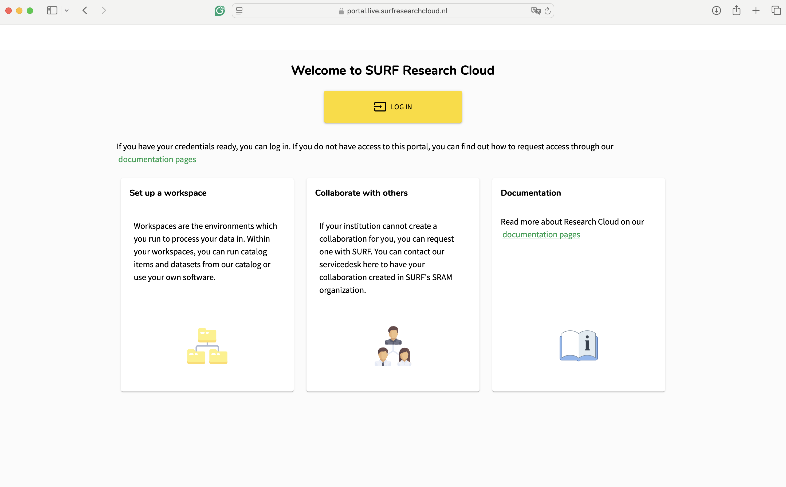
>
> 3. Assuming you are a Dutch researcher, you should expect to see your educational institution listed on the authentication provider screen.
>    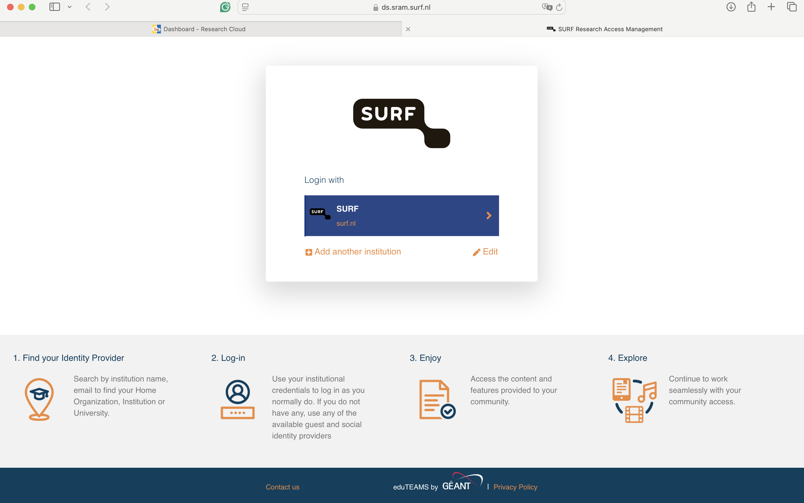
> 4. Log in with your institute credentials and follow the SRAM authentication on your phone. Inside the environment, you can see if there are any active virtual machines, the options to create a workspace, new storage or request new wallet for your projects.
>    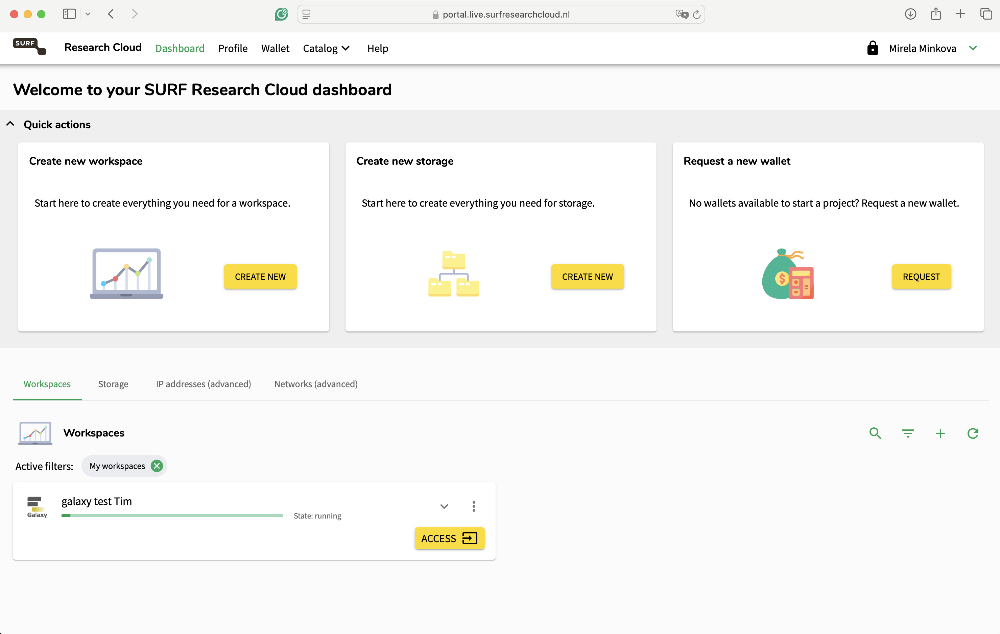
{: .hands_on}

With this, you're ready to get started launching resources within {SRC}.

## Create an external storage

The purpose of the storage is to attach it to your workspace, where you will save your data. This way, if the machine is deleted, your data will not be lost. We strongly advise anyone using the SRC to create storages and attach them to their machines!

> <hands-on-title>Create a Storage Volume</hands-on-title>
> 1. Locate the "Create new storage" option
>    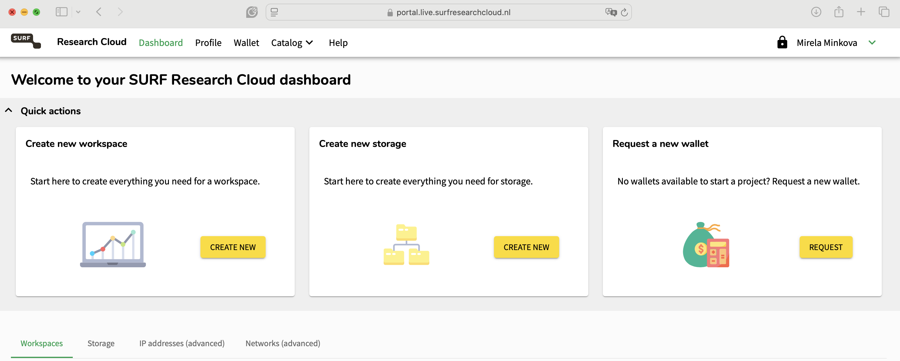
> 2. Click on "Create new".
> 3. Select the collaborative organisation you want the storage to be part of.
> 4. Select the desired cloud provider and the size of the volume you want to use.
>    > <tip-title>Unsure of the size required?</tip-title>
>    > If you are unsure about the size of the storage you need, contact your administrator. Consider also consulting [Galaxy from an Administrator's Point of View](#10)
>    {: .tip}
>
>    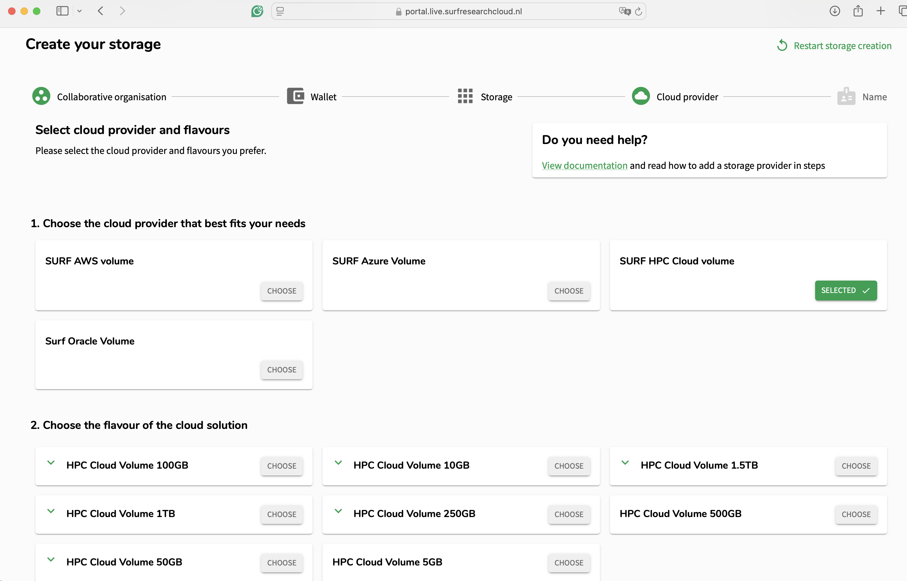
>
> 6. Name your storage however you like and press on submit.
>
>    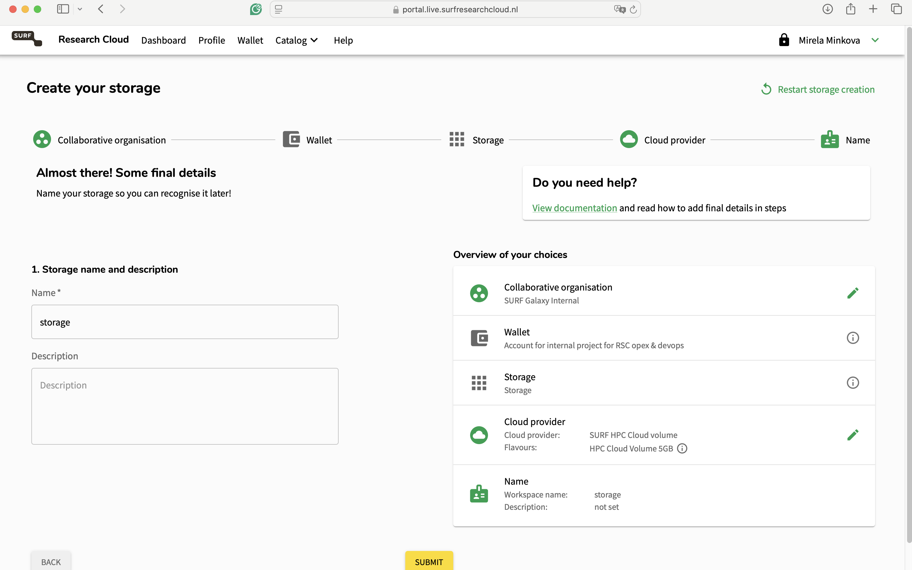
>
> 7. You will be redirected to the main page, where you will be able to track the status of the storage creation.
>
>    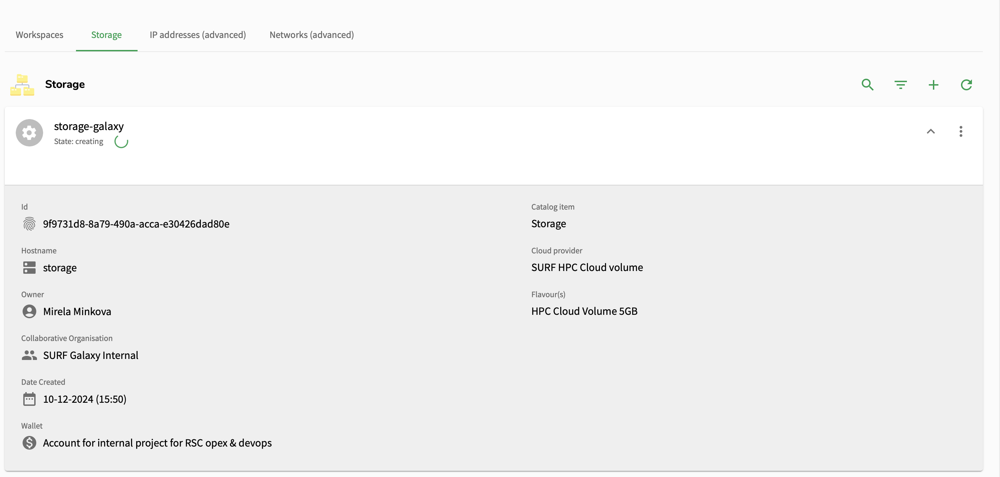
{: .hands_on}

Once the storage is deployed, you can attach it to any of your machines! 🎉

Be aware, that in order to attach an external storage to an existing machine, you would need to pause the workspace first! (If you are not sure how to do that please refer to [External storage volumes](https://servicedesk.surf.nl/wiki/display/WIKI/External+storage+volumes))

# Create a new workspace

Depending on user’s rights, you can create a new workspace for your collaboration.

> <tip-title>A Workspace?</tip-title>
> Workspaces may also be known as *Virtual Machines/VMs* or *Instances* in other cloud providers.
{: .tip}

> <hands-on-title>Create a Workspace</hands-on-title>
> 1. On the right side under the "Workspaces" click on the "Add" button.
>
>    
>
> 2. Then, you will be redirected to a new page, where you must first choose the collaborative organisation in which you want to create your workspace (in case you are a member of multiple organisations). Once chosen, you a new page will be loaded, where you will have access to all available catalog items.
>
>    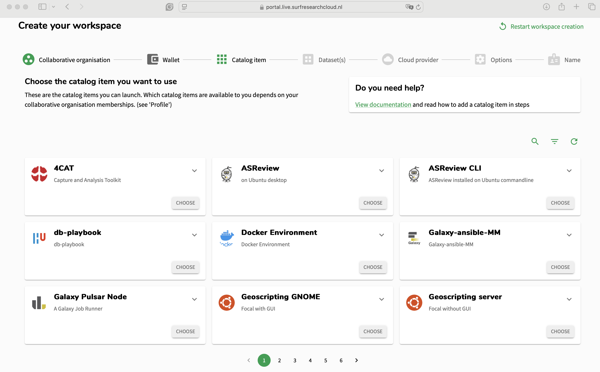
>
> 3. Use the magnifying glass on the right side of the panel and search for Galaxy. Two catalog items will appear - the Galaxy instance designed for SURF and a Galaxy Pulsar node that can be connected to the instance. Select "Galaxy at SURF".
>
>    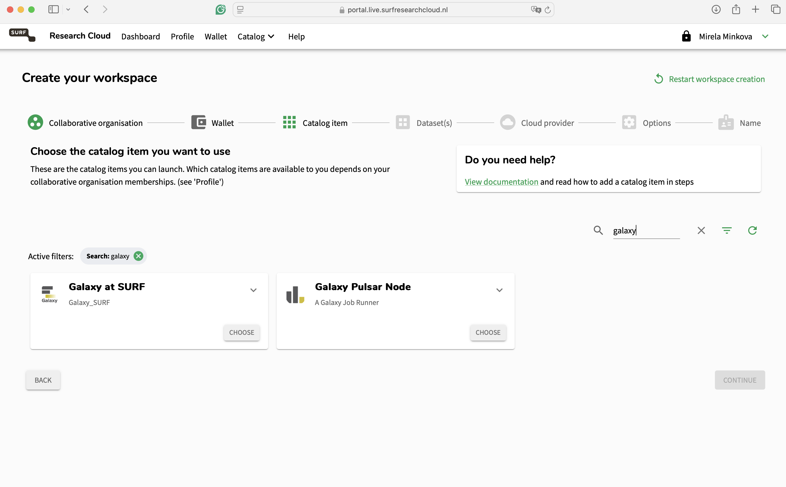
>
> 4. SURF Research Cloud allows researchers to host their catalog items on different cloud providers. The Galaxy catalog item is currently supported only on the HPC Cloud and for Ubuntu 22.04. On this page, users can select the number of cores and RAM that they want on their machine. More sizes can be added in the future, and on request. Choose wisely and in case you are not certain contact your administrator!
>
>    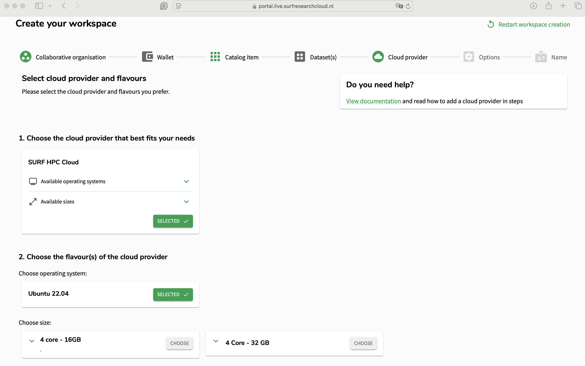
>
> 5. Select the storage you have created earlier so it is attached to the new workspace.
>
>    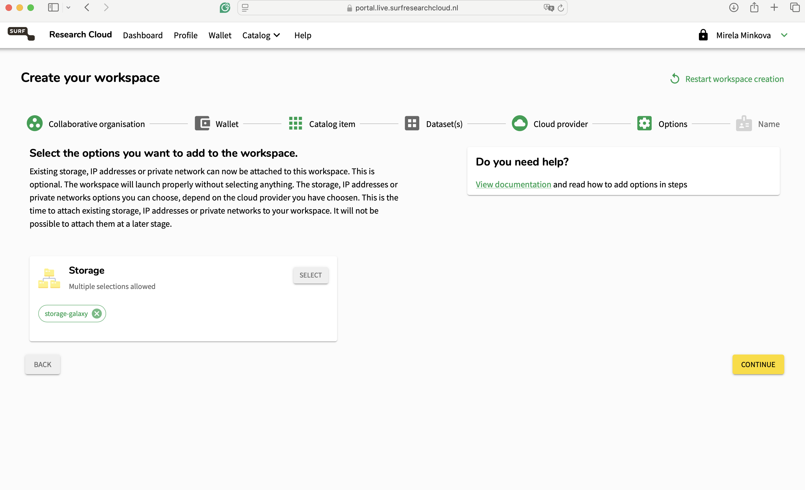
>
> 6. Lastly, before the workspace is deployed, you need to choose for how long the machine will run.
>
>    > <tip-title>Expiration Date</tip-title>
>    > The standard life-time of the VM is 5 days. If you need it for longer, this option can be changed once the machine is running.
>    > Note, that once the machine is expired and deleted it cannot be restored! Plan accordingly and migrate your data in time to prevent data loss!
>    >
>    > This is an incredibly useful feature as it saves you from forgetting to destroy a VM. Especially for GPU nodes it can help you ensure that they disappear after your computation is complete.
>    {:.tip}
>
> 7. In this form, you can also select how to name your workspace, add a description (if you want) and specify the hostname. Then, scroll down and submit the workspace creation.
>    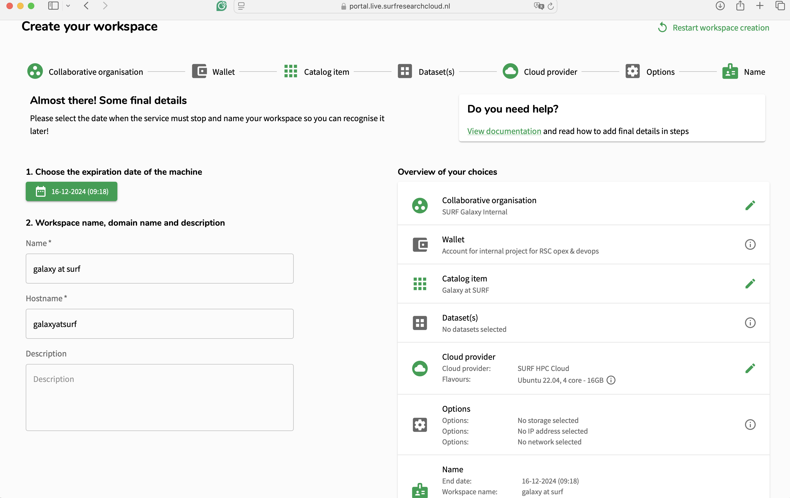
{: .hands_on}

With that, your workspace will start being created.

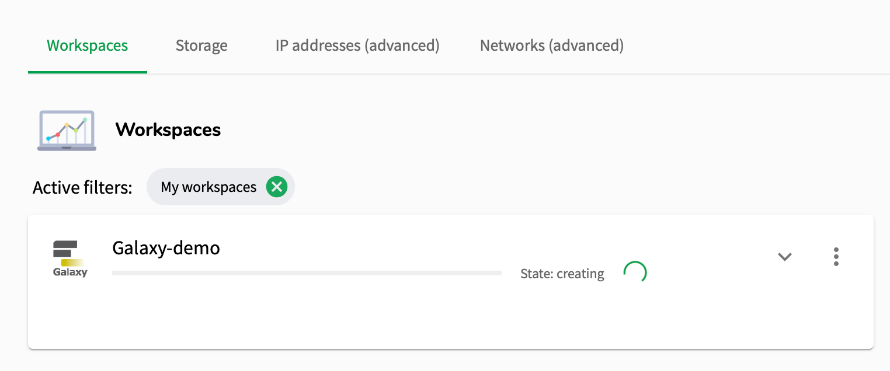

> <tip-title>Also launching Pulsar?</tip-title>
> While you are waiting, you can create your Galaxy Pulsar node simultaneously to save time.
{: .tip}

Once the workspace is running, press on the down arrow to check any information such as the ID, the owner of the workspace, the collaboration it is part of, when it is created and when it expires and the wallet it is using. Additionally, you can pause the workspace when you are not using it. Pressing on the storage option will display the storage that has been attached to the workspace.

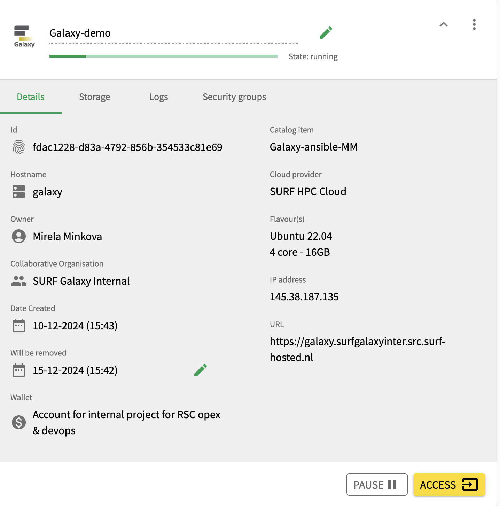

To access the Galaxy instance, press on the "Access" button. This will redirect you to a new webpage. The {SRAM} login will be displayed again, and after authenticating, you will be redirected to the Galaxy at SURF Research Cloud page!

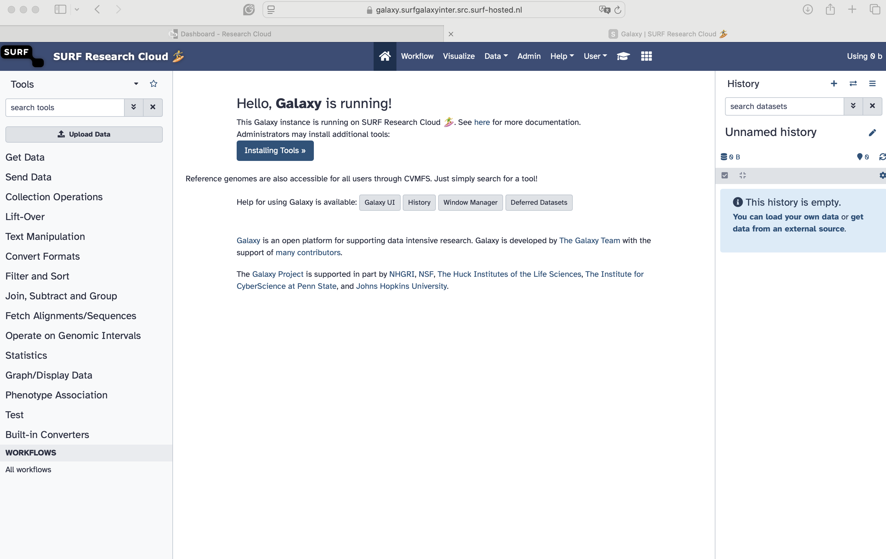

Congratulations! You have started a Galaxy instance inside the SURF Research Cloud! 🏄‍♀️🎉

If you have administrator rights, you can download tools that can be used by the members of the collaborative organisation. To obtain administrator rights you need to be part of the `src_co_admin` group inside the collaborative organisation. In case you are not sure how to download tools as a Galaxy administrator, please refer to [Installing Tools into Galaxy](https://galaxyproject.org/admin/tools/add-tool-from-toolshed-tutorial/).

## Going Further with Pulsar?

Another important step when starting a local Galaxy instance on {SRC} is connecting it to a Galaxy Pulsar Node, which you can do [in this Pulsar SRC tutorial](). The Pulsar is an useful component that is used to execute your tasks on remote servers/clusters. In this case, the Pulsar is started as a new workspace, allowing users to also run interactive tools.

In SRC, this can also enable you to save costs. By choosing a smaller Galaxy instance, and attaching a large Pulsar node when you need to do computations, you can be sure to optimise your budget expenditures.
