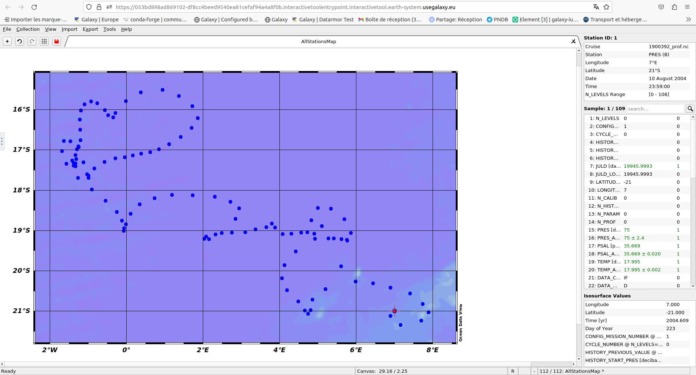
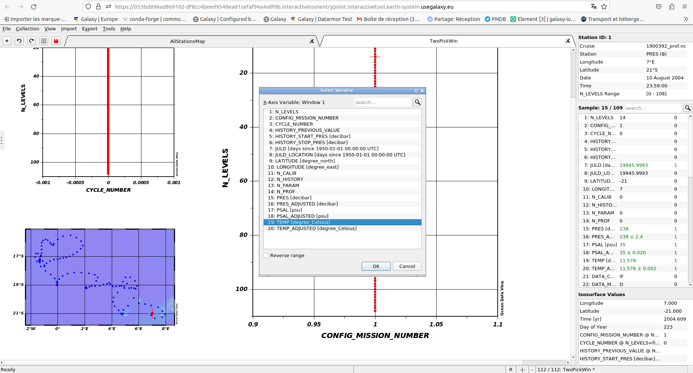
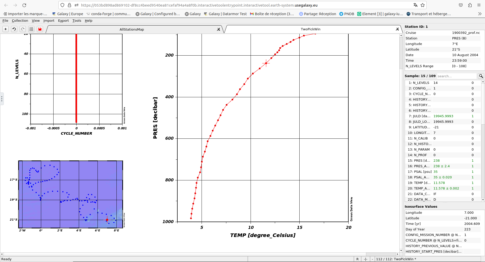
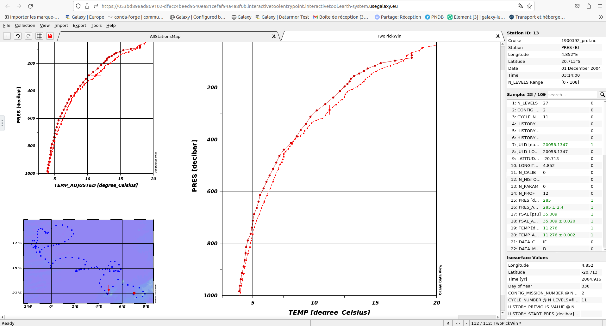
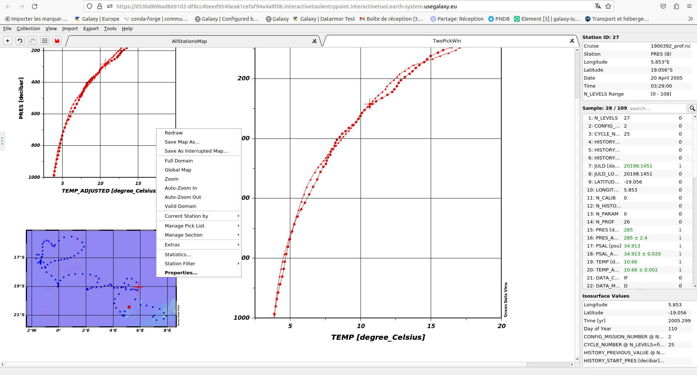
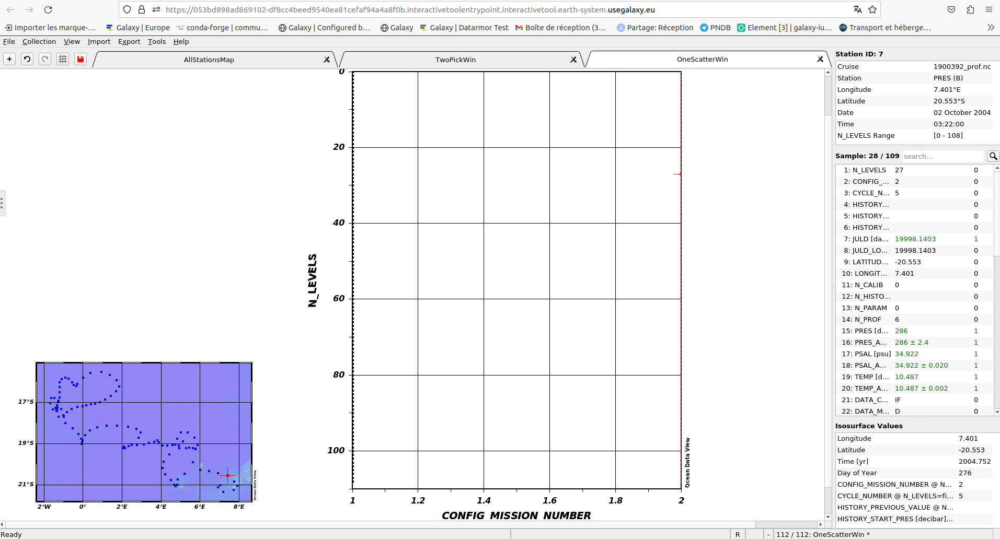
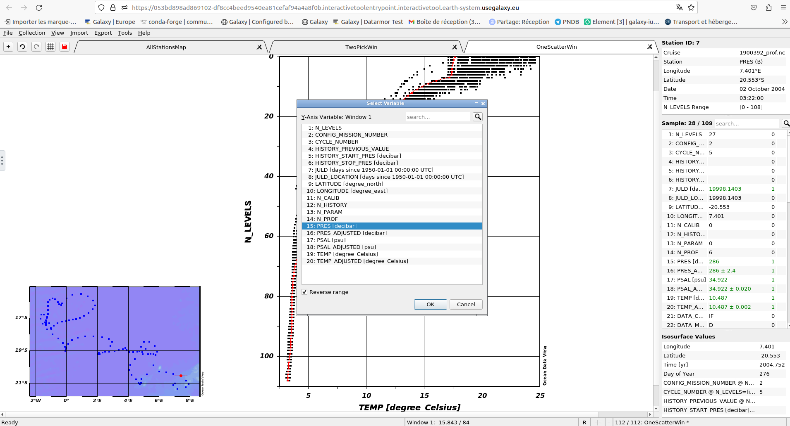
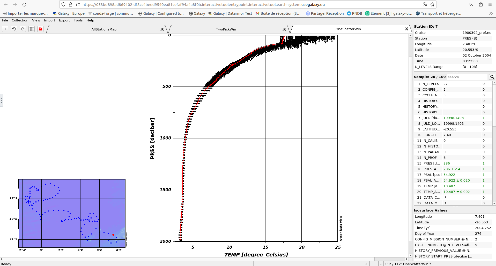
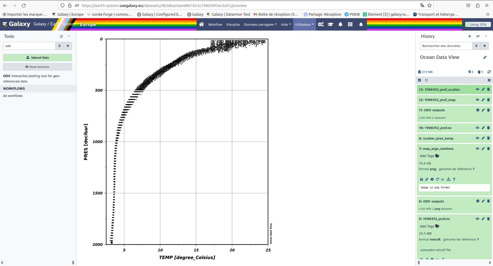

# Introduction


Through this tutorial you will learn here how to access, filter and import netCDF data through using ODV Galaxy interactive tool:

Ocean Data View (ODV) is a software package for the interactive exploration, analysis and visualization of oceanographic and other geo-referenced profile, time-series, trajectory or sequence data. To know more about ODV go check the [official page](https://odv.awi.de/)

> <agenda-title></agenda-title>
>
> In this tutorial, we will cover:
>
> 1. TOC
> {:toc}
>
{: .agenda}

# Managing ODV Galaxy interactive tool
ODV is now integrated in Galaxy as an interactive tool. This kind of tools is working differently than classical tools as it allows the user to interact with a dedicated graphical interface. This kind of tools is used to give access to Jupyter notebooks, RStudio or R Shiny apps for example. 

To use ODV, you need to use the , you can specify input datasets from your hisrtory you want to use in ODV, then press the **execute** button to launch a ODV instance. When the graphical user interface of ODV is ready to be used, a URL will be displayed at the top of the Galaxy center panel. If you don't see it, you can see and access it through the "Active InteractiveTools" space of the "User" menu or you can click on  on the tool in the history.

Once you finished your work on ODV, if you want to retrieve data and/or entire project, you need to save files in /output, then quit ODV properly through the "Project" Menu tab.

> <details-title>Short introduction on how Galaxy works</details-title>
>
> You can come back to where you left off the tutorial anytime by clicking .
>
> > <hands-on-title>Log in to Galaxy</hands-on-title>
> > 1. Open your favorite browser (Chrome, Safari or Firefox as your browser, not Internet Explorer!)
> > 2. Browse to your [Galaxy instance](https://earth-system.usegalaxy.eu/)
> > 3. On the top pannel go to **Login or Register**
> >
> >
> {: .hands_on}
>
> The Galaxy homepage is divided into three panels:
> * Tools on the left
> * Viewing panel in the middle
> * History of analysis and files on the right
>
> 
>
> The first time you use Galaxy, there will be no files in your history panel.
{: .details}


> <hands-on-title>Deploy your own ODV instance</hands-on-title>
>
> 1. Create a new history for this tutorial nd give it a name (example: “ODV for Argo”) for you to find it again later if needed.
>
>    
> 
> 2. Import netCDF data from amazonaws with this link an rename it "1900392_prof.nc" instead of "New File"
>
>    ```
>    https://argo-gdac-sandbox.s3-eu-west-3.amazonaws.com/pub/dac/coriolis/1900392/1900392_prof.nc
>    ```
>      
>  
> 3. Select your new data before deploying  by pressing **execute**
> 4. Access ODV 
>
> 
>
{: .hands_on}

> <details-title> Some complementary information about your data </details-title>
> Argo is an international program to observe the interior of the ocean with a fleet of profiling floats drifting in the deep ocean currents (check it [out on the argo site](https://argo.ucsd.edu)). Argo GDAC is a dataset of 5 billion in situ ocean observations from 18.000 profiling floats (4.000 active) which started 20 years ago. Argo GDAC dataset is a collection of 18.000 NetCDF files. It is a major asset for ocean and climate science, a contributor to IOCCP reports. 
>
> These data are available on AWS registry of Open Data. This registry exists to help people discover and share datasets that are available via AWS resources. [See recent additions and learn more about sharing data on AWS](https://registry.opendata.aws/).
{: .details}

# Ocean Data View
## Map your data

> <tip-title>Copy pasting between computer and ODV</tip-title>
> You can expand the ODV left panel (where there are 3 dots, vertically) to access the "clipboard" menu, and paste the content you want to paste on a ODV form. From there you can copy paste everything from one side to the other. Then, click outside of this panel to collapse it.
> 
> 
{: .tip}

> <tip-title>ODV - Disconnected</tip-title>
> If at one point your ODV interface becomes grey with a red panel "X ODV - Disconnected", do NOT panic ;) you just need to reload your tab (circular arrow top left)
{: .tip}

> <hands-on-title>Loading Argo data</hands-on-title>
>
> 1. Go to the top left of ODV and click on "Open..."
> 2. Click on "1900392_prof.nc" of the pop-up screen and on  **Open**
> 3. Press **Next >** for "Select Dimensions (Step 1 of 4)"
> 4. Press **Next >** for "Associate Meta Variables (Step 2 of 4)"
> 5. Press **Next >** for "Select Primary Variable (Step 3 of 4)"
> 6. Press **Finish** for "Subset Dimensions (Step 4 of 4)"
> 7. "Enter netCDF Setup Name:" write "argo_prof_data", then, press **OK**
{: .hands_on}


> <question-title></question-title>
>
> 1. What are the longitude and latitude of the red dot ?
>
> > <solution-title></solution-title>
> >
> > 1. On the to right window you can read Longitude 7°E and Latitude 21°S.
> >
> {: .solution}
>
{: .question}

## Create profiles curves

> <hands-on-title>Create a multiple windows view</hands-on-title>
> 1. On the top left press **+**
> 2. Click on **2 Station Windows**
>    
> 3. Two more slots appear follow the indication and press + on your keyboard (or SHIFT and +).
>
> Here you have created a multiple view on ODV
{: .hands_on}

> <hands-on-title>Create profiles</hands-on-title>
> 1. On the biggest window click on the right side of your mousse
> 2. Select **X-Variable**, press **TEMP [degree_Celsius]** and OK.
>    
> 3. Select **Y-Variable**, press **PRES [decibar]** and OK. Your profile is now uspide down. 
> 4. To correct that click right again go on **Y-Variable** and on the bottom of the pop-up screen check the box "Reverse range" and OK.
>    
> 5. For the smallest window do the same but for the abscisse select **TEMP_ADJUSTED [degree_Celsius]**. This can be usefull to compare the 2 curves.
>    
>
> You now know how to create multiple profiles curves on ODV from netCDF data.
{: .hands_on}

> <question-title></question-title>
>
> How do you do if you want to compare the profiles with another station ?
>
> > <solution-title></solution-title>
> >
> > With your keyboard you can use the arrows left and right and go through the different stations one-by-one.
> > 
> >
> {: .solution}
>
{: .question}

> <hands-on-title>Change the station of reference</hands-on-title>
> 1. Go on the map on the bottom left 
> 2. Click right and select **Station Filter**
> 
> 3. Then, select and click on **Customize**
> 4. In "Station ID" write the number of the new station of reference (both boxes)
> 
>    Everything has dissapeared !!! Don't panik it's totally normal ;)
>    - Press **+** on your keyboard (or SHIFT and +)
> 
>    The curves reapeared ! And they correspond to your knew station of reference !
> 
>    To make the other stations reapear, to allow you to navigate in the other stations while conserving your new station of reference, go on the map once again.
> 6. Click right and select **Station Filter**
> 7. This time select and click on **Relax**
> 
> And now you're back with all your stations visible !
{: .hands_on}

## Create one single sum-up profile curve 
> <hands-on-title>Create a scatter plot</hands-on-title>
> 1. On the top left press **+**
> 2. Select **1 SCATTER Window** another tab opens (you now have 3 of them)
> 
> 1. On the window click on the right side of your mousse
> 4. Select **X-Variable**, press **TEMP [degree_Celsius]** and OK.
> 5. Select **Y-Variable**, press **PRES [decibar]**, at the bottom of the pop-up check the box "Reverse range" and OK.
> 
> You now have the final image with all the curves for each stationside by side. You can navigate in them by using the arrows left/right on your keyboard with the red curve being the station you're on. 
> 
{: .hands_on}

> <hands-on-title>Save your analysis</hands-on-title>
> 1. Click right on the scatter image and select **Save plot as**
> 2. In the pop-up select and go in the **outputs** folder
> 
> 3. Once you're in the folder you can rename your scatter plot in "File Name:" by "1900392_prof_scatter"
> 4. You can also change the "Files of type:" by "PNG (*.png *.PNG) 
> 5. Click on **Save**, then OK and OK.
> 6. On the map click right and then **Save Map As...**
> 7. Still in the outputs folder, rename it "1900392_prof_map" check that the "Files of type:" is "PNG (*.png *.PNG) 
> 8. Click on **Save**, then OK and OK
>
> Now, if you have finished with your analysis you can exit ODV. To do so you need to do it properly. 
>
> 9. On th top left click on **File** select **Exit**
> 10. If you want to save the other window also click on **Yes**. Here we don't need it so click **No**.
>
> You can now go back on your Galaxy instance.
{: .hands_on}

Now, after waiting for everything to turn green in your history, you can see 2 new outputs "1900392_prof_scatter" and "1900392_prof_map"

> <hands-on-title>View in Galaxy</hands-on-title>
> In the history panel click on the  (eye) icon of your output.
>
> You can now visualize the outputs in galaxy middle pannel. 
{: .hands_on}




# Conclusion

Great you now know how to use argo floater data to create profiles curves in Ocean Data View (ODV) within Galaxy.

# Extra information
Coming up soon follow ups tutorials on Coastal Water Dynamics workflow (and other Earth-System related trainings). Keep an  open if you are interested !

