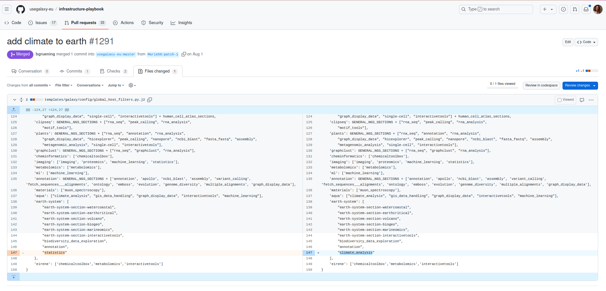
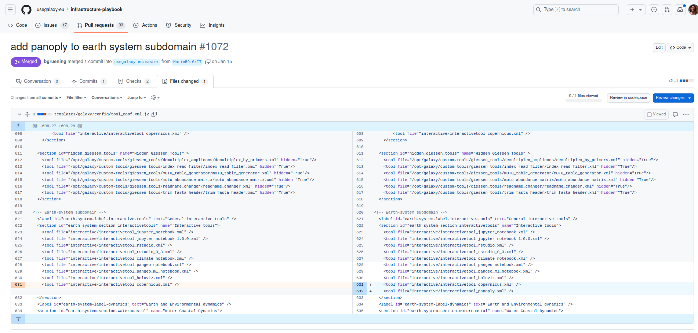

This tutorial explains how to make your brand new tools, once they're published through a Pull Request ([check this tutorial]() on how to build your tool from scracth), visible on your subdomain. Here we'll follow the example on how to make the tools visible on [Galaxy for earth System](https://earth-system.usegalaxy.eu/).

> <agenda-title></agenda-title>
>
> In this tutorial, we will cover:
>
> 1. TOC
> {:toc}
>
{: .agenda}

# Add your batch tool to the right section

> <hands-on-title>Tool sections (for batch tools) </hands-on-title>
>    - Clone the Github repository of the Galaxy server (of where your subdomain to be attached)
>    - For Galaxy europe clone the [usegalaxy-eu-tools repo](https://github.com/usegalaxy-eu/usegalaxy-eu-tools/tree/master)
>    - Create a branch on your fork
>    - Browse through the different yaml files and select the one that correspond to your subdomain for earth system everything is made under the ecology owner. 
>    - Once in the yaml you can add the section for your tool (you want to know what are the existing tool sections ? Go check the [ToolShed's categories](https://toolshed.g2.bx.psu.edu/)) 
> 
> An example on how to fill in the yaml file
> ```
> - name: id_of_your_tool
>   owner: choose_the_owner_relative_to_a_github_repo
>   tool_panel_section_label: 'Choose the section where your tool belongs'
> ```
> 
> 
>
>   - Then commit your changes and write a nice message for the admin when you open your Pull Request.
{: .hands_on}

This part is only to make batch tool visible in your subdomain.

# Add a section of tools to your subdomain
> <hands-on-title>Sections for your subdomain</hands-on-title>
>    - If not already done clone the Galaxy europe [Infrastructure-playbook repo](https://github.com/usegalaxy-eu/infrastructure-playbook/tree/master)
>    - Create a branch on your fork
>    - Go to the file **global_host_filters.py.j2** in **templates/galaxy/config/**
>    - Open it and edit it the "DOMAIN_SECTIONS" part go to your subdomain line and in the list of section add the one you need for instance `"climate_analysis"`
>
> 
>
>   - Then commit your changes and write a nice message for the admin when you open your Pull Request.
{: .hands_on}


# Add you interactive tool to the right section
> <hands-on-title>Interactive tool sections</hands-on-title>
>    - If not already done clone the Galaxy europe [Infrastructure-playbook repo](https://github.com/usegalaxy-eu/infrastructure-playbook/tree/master)
>    - Create a branch on your fork
>    - Go to the file **tool_conf.xml.j2** in **templates/galaxy/config/**
>    - Open it and edit it by adding the xml file of the interactive tool to the section interactive tool or any other interactive tool section (to know more on how to create your interactive tool section folow [this tutorial]())
>    - Below an example of how to add the interactive tool panoply to the earth system subdomain.
>
> 
>
>   - Then, commit your changes and write a nice message for the admin when you open your Pull Request.
{: .hands_on}

If you choose to create a new section for your interactive tool don't forget add this section to your subdomain ! 

# Conclusion

You can now start to build your workflow on your subdomain !
