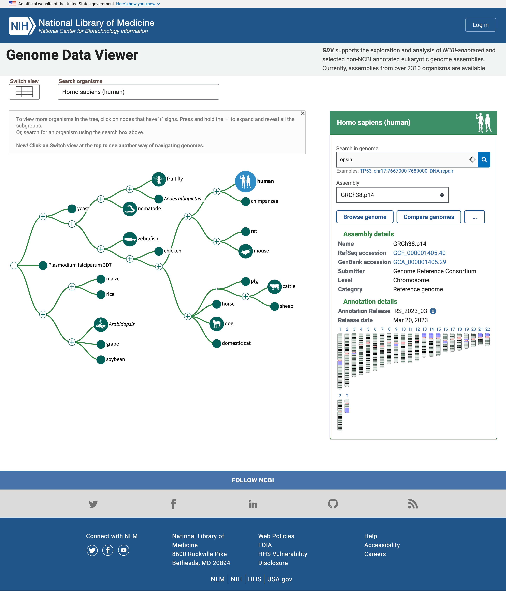
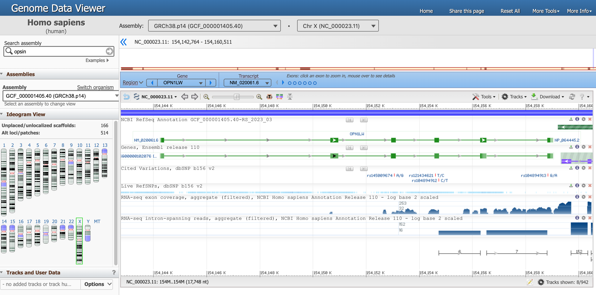
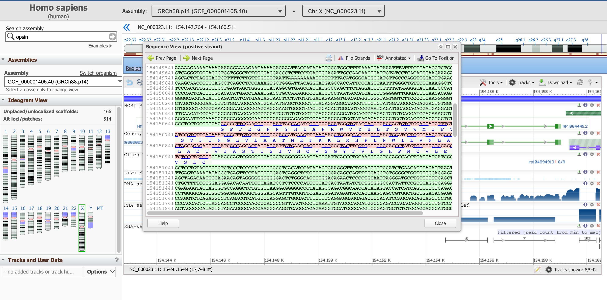
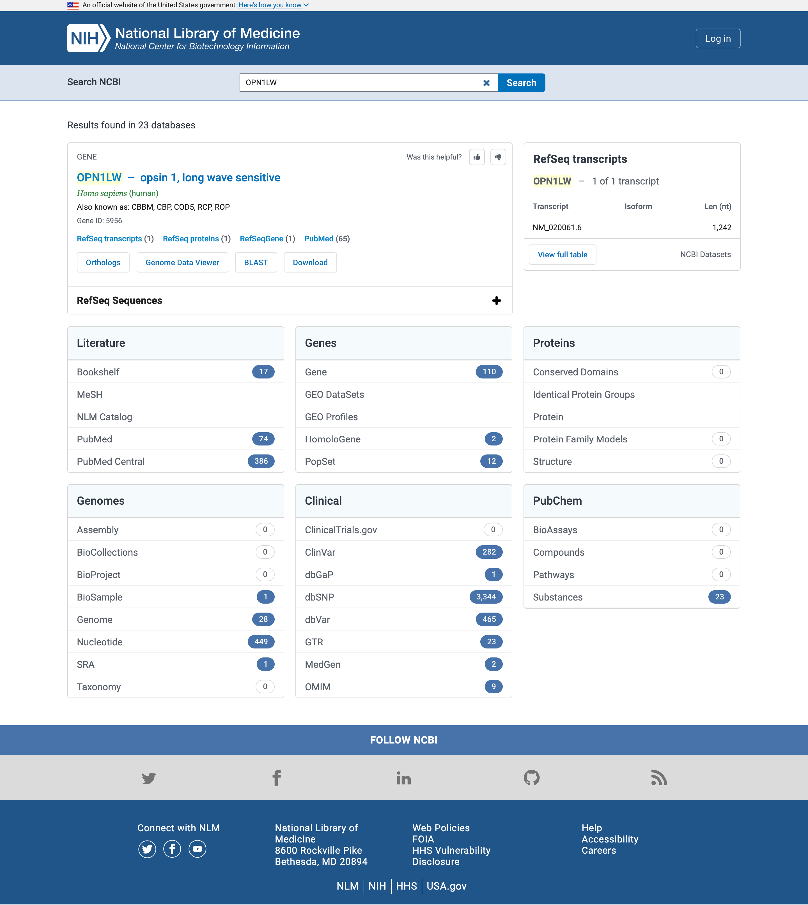
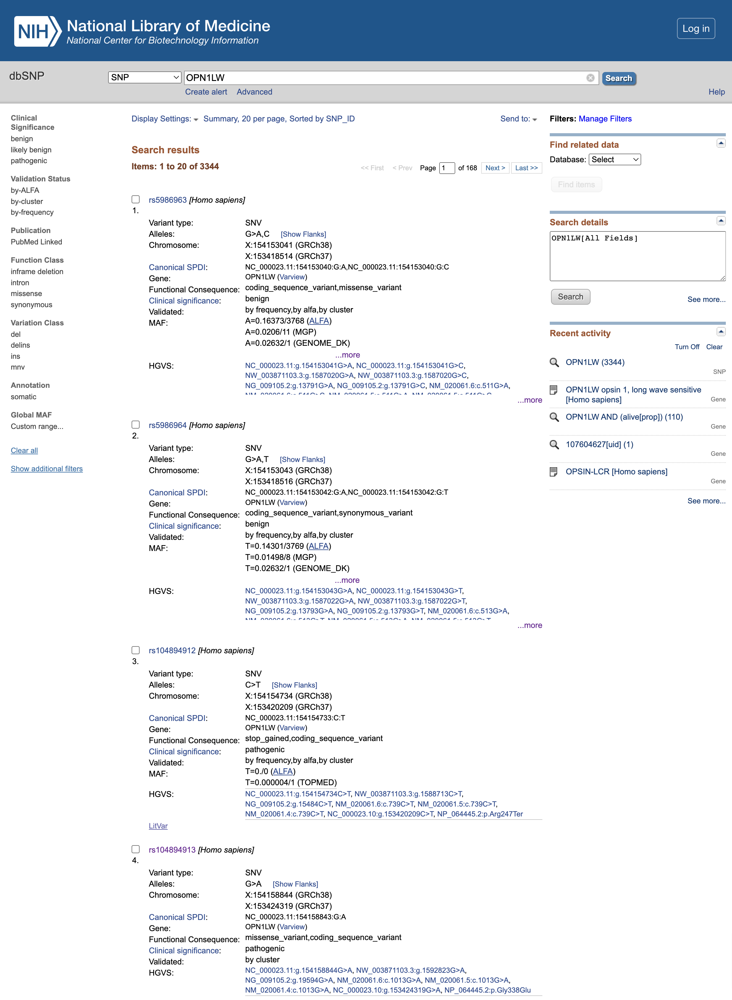
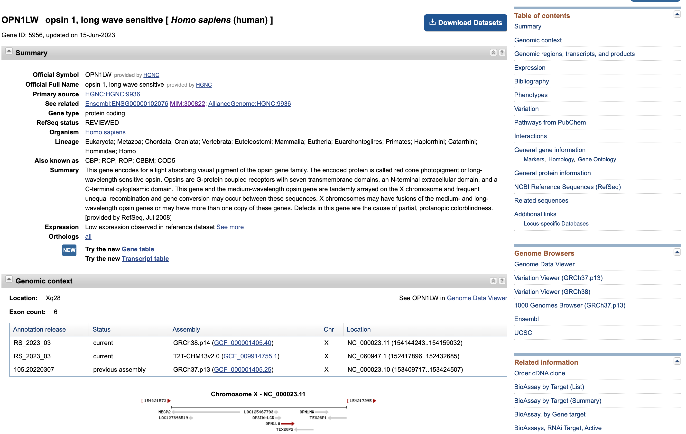
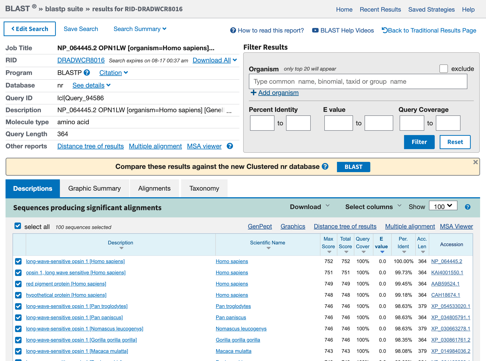

This tutorial is a bit atypical: we will not work in Galaxy but mostly outside of it, navigating databases and tools through their own web interfaces. The scope of this tutorial is to illustrate several sources of biological data in different file formats, and representing different information.

> <agenda-title></agenda-title>
>
> In this tutorial we will deal with:
>
> 1. TOC
> {:toc}

# Searching Human Opsins

The subject of this tutorial is human opsins, which are found in the cells of your retina. Opsins catch light and begin the sequence of signals that result in vision. We will proceed by asking questions about opsins and opsin genes, and then using bioinformatics to answer them.

Go to the Genome Data Viewer, [www.ncbi.nlm.nih.gov/genome/gdv](https://www.ncbi.nlm.nih.gov/genome/gdv/). This page includes a simple "tree of life" where the human node is highlighted because it is the default organism to search. Leave the value `Homo sapiens (human)` in the  *Search organisms* box. Now check the panel on the right: it reports multiple assemblies of the genome of interest, and a map of the chromosomes in that genome. Let's use the  *Search in genome* box, search for value `opsin`. 

In the list of genes related to the search term opsin, there are the rhodopsin gene (RHO), and three cone pigments, short-, medium-, and long-wavelength sensitive opsins (for blue, green, and red light detection). There are other entities, e.g. a -LCR (Locus Control region), putative genes and receptors. The column *Location* reports the chromosome number, as well ass the start and end position. Note that multiple hits are on the X chromosome, one of the sex-determining chromosomes.

> <question-title></question-title>
>
> 1. How many protein coding genes do you find in Chromosome X?
>
> > <solution-title></solution-title>
> >
> > The hits in ChrX are: OPSIN-LCR, OPN1LW, OP1MW, OPN1MW2, OPN1MW3.
> > Because the first (OPSIN-LCR) is not protein coding but a gene regulatory region, the answer is 4. In particular, Chromosome X includes one red pigment gene (OPN1LW) and three green pigment genes (OPN1MW, OPN1MW2 and OPN1MW3 in the reference genome assembly).
> >
> {: .solution}
{: .question}

Let's now focus on one specific opsin, the gene OPN1LW. Click on the blue arrow that happears in the results table when you hover your mouse on the OPN1LW row, to be redirected to a different page. 

You should have landed in [this page](https://www.ncbi.nlm.nih.gov/genome/gdv/browser/genome/?id=GCF_000001405.40), that is the genome view of gene OPN1LW. There is a lot of information in this page, let's focus on one section at the time. 

1. The Genome Data Viewer, on the top, tells us that we are looking at the data from the organism `Homo sapiens`, assembly `GRCh38.p14` and in particular at `Chr X` (Chromosome X). Each of these information has a unique ID.
2. The entire Chromosome is represented directly below, and the positions along the short (`p`) and long (`q`) arms are highlihgted.
3. Below, a blue box highlights that we are now focusing on the Region corresponding to the Gene `OPN1LW`. There are multiple ways to interact with the viewer below. Try for example to hover with the mouse on the dots representing exons in the blue box. 
4. In the graph below, the gene requence is a green line with the exons (protein coding fragments) represented by green rectangles. 

> <comment-title></comment-title>
> Hover with the mouse on the green line corresponding to `NM_020061.6` (our gene of interest) to get more detailed information.
> This diagram gives a closer look at the OPN1LW segment, representing positions 154,144,243 to 154,159,032 (14790 nt, nucleotides). Eucaryotic genes are often interrupted by non-coding regions called intervening sequences or introns. The coding regions are called exons. From this diagram, you can see that the OPN1LW gene consists of 6 exons and 5 introns, and that the introns are far larger than the exons. Of the 14790 nt in the gene, only 1095 nt code for protein, which means that less than 8% of the base pairs contain the code. When this gene is expressed in cells in the human retina, an RNA copy of the entire gene is synthesized. Then the intron regions are cut out, and the exon regions joined together to produce the mature mRNA (a process called splicing). which will be translated by ribosomes as they make the red opsin protein. In this case, 92% of the initial RNA transcript is tossed out, leaving the pure protein code. This box reports also the length of the resulting protein: 364 aa, amino acids.
{: .comment} 

But what is the sequence of this gene? There are multiple ways to retrieve this information, we will go through what we think is one of the most intituitive. Select the  *Tools* section on the top right of the box showing the gene, and open the *Sequence Text View*. 

This panel reports the DNA sequence of the introns (in green), as well as the one of the exons (in pink, including the translated protein sequence below). 

> <warning-title>Danger: Don't stop at the first page!</warning-title>
> This sequence box is not showing the entire gene at the moment, but a subsequence of it. You can move upstream and downstream the genetic code with the arrows  *Prev Page* and *Next Page*, or start from a specific position with the  *Go To Position* button. We suggest to start with the start of the coding part of the gene, which as we learned earlier is at position 154,144,243. We will need to remove the commas to validate the value `154144243`. The sequence highlighted in purple here signals a regulatory region. 
{: .warning}

> <question-title></question-title>
>
> 1. What is the first amino acid of the resulting protein product?
> 2. What is the last one?
> 3. Can you keep a note of the first three and last three AAs of this protein?
>
> > <solution-title></solution-title>
> >
> > 1. The correspondent protein starts with Methionine, M (they all do).
> > 2. It ends with the last AA of the last intron, hence Alanine, A. After that, the stop codon TGA.
> > 3. The first three AAs are: M,A,Q; the last three: S,P,A.
> >
> {: .solution}
{: .question}

From this resource we can get multiple file formats describing the gene. Check the  *Download* section. 

1. *Download FASTA* will allow us to download the simplest file format to represent the nucleotide sequence of all the visible range of the genome (longer than the gene only).
2. *Download GenBank flat file* will allow us to access the annotation avaible on this page (and beyond) in a flat text format.
3. *Download Track Data* allows us to inpect two of the file formats we presented in the slides: the GFF (GFF3) and BED formats. If you change the tracks, each one may or may not be available. 

# More information about our gene

Go to [www.ncbi.nlm.nih.gov/search](https://www.ncbi.nlm.nih.gov/search/) to get an overview of the information we have (in the literature) for `OPN1LW` (to be typed in the  *Search NCBI* search box). 

Start from the *Literature* box, and focus on the *PubMed* or *PubMed Central* results. 

> <details-title>More details on the difference between the two</details-title>
>
> What's the difference between PubMed and PubMed Central? PubMed is a biomedical literature database which contains the abstracts of publications in the database. PubMed Central is a full text repository, which contains the full text of publications in the database.
> While the exact number of hits may vary in time from the screenshot above, any gene name should have more hits in PubMed Central (searched in the full texts of publications) than in PubMed (searched only in the abstracts).  
>
{: .details}

You have entered PubMed, a free database of scientific literature, to the results of a complete search for articles directly associated with this gene locus. By clicking on the authors of each article, you can see abstracts of the article. If you are on a university campus where there is online access to specific journals, you might also see links to full articles. PubMed is your entry point to a wide variety of scientfic literature in the life sciences. On the left side of any PubMed page, you will find links to a description of the database, help, and tutorials on searching. Through this quick scan of the literature, can you guess which type of conditions are associated to this human gene? (We will answer this question later)

Now go back to our gene in the [NIH page](https://www.ncbi.nlm.nih.gov/search/all/?term=OPN1LW) and focus on the *Clinical* box. 

To have a specific overview of all the conditions associated to this gene, select *OMIM*. OMIM, the Online Mendeliam Inheritance in Man (and woman!), is a catalog of human genes and genetic disorders. 

Each OMIM entry is a genetic disorder (moslty types of colorblindness) associated with mutations in this gene. Read as much as your interest dictates. Follow links to other information. For more information about OMIM itself, click the OMIM logo at the top of the page. Through OMIM, a wealth of information is available for countless genes in the human genome, and all information is backed up by references to the latest research articles.

How do variations in the gene affect the protein product, and its functions? Go back to the NIH page and click on *dbSNP* (also in the *Clinical* box) to access the list of Single Nucleotide Polymorphisms (SNPs) that were detected by genetics studies in the gene. 

At the time of creation of this tutorial, the first two variants listed have no effect on the final protein product (*Clinical significance*: `benign`). The following two are, respectively: a (*Functional consequence*) `stop_gained` variant, which truncates the resulting protein too early and is therefore `pathogenic`, and a `missense_variant`, also `pathogenic`.

> <question-title></question-title>
>
> Can you find what type of condition is associated with the missense variant `rs104894913`? Open the [relative page](https://www.ncbi.nlm.nih.gov/snp/rs104894913) to explore.
>
> > <solution-title></solution-title>
> >
> > In this page, open the *Clinical Significance* tab to discover that the name of the associated disease is "Protan defect". A quick internet search with your search engine will clarify that this is a type of color blindness.
> >
> {: .solution}
{: .question}

Check the variant `rs104894913` (missense) by opening the [relative page](https://www.ncbi.nlm.nih.gov/snp/rs104894913). Open the *Variant details* tab to discover that this substitution `NC_000023.10:g.153424319G>A` (a Guanine with an Adenine) results in a change in codons `G [GGG] > E [GAG]`, a Glycine becomes a Glutathione at position 338 of the protein (`p.Gly338Glu`). What does this mean? Let's have a deeper look at this protein. 

Once again, go back to our gene in the [NIH page](https://www.ncbi.nlm.nih.gov/search/all/?term=OPN1LW) and this time focus on the *Proteins* box, click on *Protein*. The page highlights with a box on top the result `OPN1LW – opsin 1, long wave sensitive`, click it.

This page presents once again some data that we are familiar with (e.g. distribution of the exons along the gene sequence). Focus on the button on top  *Download Datasets* to be able to download the gene, transcript and protein FASTA sequence of this entry. 

Download the gene, transcript and protein sequences together. This will generate a *zipped* file. Open it and check the content. 

> <question-title></question-title>
>
> What does the folder contain? Do you think they implemented good data practices?
>
> > <solution-title></solution-title>
> >
> > The folder includes some data files (multiple formats), but even before that it includes a README.md (a Markdown file). This README is designed to "travel" together with the data and explain how was the data retreived, what is the structure of the data containing subfolder, and where to find extensive documentation. 
> > It is definitely a good data management practice to guide users (not only your collaborators, but also yourself in the not-so-far future, when you will forget where does that file in your Downloads folder come from) to the data source and the data structure.
> >
> {: .solution}
{: .question}

# Searching by sequence

What could we do with these sequences that we just downloaded? Let's assume that we just sequenced the transcripts that we isolated through an experiment - so we know the sequence of our entity of interest, but don't know what is it. What we need to do in this case is to search the entire database of sequences known to science and match our unknown entity with an entry that has some annotation. Let's do it. 

Open (with the simplest text editor you have installed) the `protein.faa` file that you jsut downloaded. Copy its content, and then navigate to  BLAST, [blast.ncbi.nlm.nih.gov](https://blast.ncbi.nlm.nih.gov/Blast.cgi). There are some alternatives available now, click on the `Protein BLAST, protein > protein`. The will indeed use a protein sequence to search against a database of proteins. 

Paste our protein sequence into the bix text box. Leave all the rest of the parameters as they are, but maybe take some time to read what you are doing. Then, click the blue button `BLAST`. This phase will take some time, there is afterall some server somewhere that is comparing the entirety of known sequences to your target. 

When the search is complete, the result should look similar to the one above. Clicking the tab *Graphic Summary*, you'll access a box containing lots of colored lines. Each line represents a hit from your blast search. If you pass your mouse cursor over a red line, the narrow box just above the box gives a brief description of the hit. 

Back to the *Descriptipns* tab, you'll find that the first hit is our red opsin. That's encouraging, because the best match should be to the query sequence itself, and you got this sequence from that gene entry. Other hits are other opsins, but you'll notice also that this series of results includes entries from other apes and other animals. If this is what we wanted (maybe you want to use this data to build a phylogenetic tree), good. If we instead are pretty sure that our sequence of interest is human, we could also have filtered the search only in human sequences.

If you do that by going back to the input form and relaunching the search, you'll notice that we find the other opsins (green, blue, rod-cell pigment) in the list. Other hits have lower numbers of matching residues. If you click on any of the colored lines in the *Graphic Summary*, you'll open more information about that hit, and you can see how much similarity each one has to the red opsin, your original query sequence. As you go down the list, each succeeding sequence has less in common with red opsin. Each sequence is shown in comparison with red opsin in what is called a pairwise sequence alignment. Later, you'll make multiple sequence alignments from which you can discern relationships among genes.

> <details-title>More details on BLAST scores</details-title>
>
> The displays contain two prominent measures of the significance of the hit, 1) the BLAST Score - lableled Score (bits), and 2) the Expectation Value (labeled Expect or E).
> The BLAST Score indicates the quality of the best alignment between the query sequence and the found sequence (hit). The higher the score, the better the alignment. Scores are reduced by mismatches and gaps in the best alignment. Calculation of the score is complex, involving a substituion matrix, which is a table that assigns a score to each pair of residues aligned. The most widely used matrix for protein alignment is known as BLOSUM62.
> The expectation value E of a hit tells whether the hit is likely be result from chance likeness between hit and query, or from common ancestry of hit and query. (If E is smaller than 10-100, it is sometimes given as 0.0.) The expectation value is the number of hits you would expect to occur purely by chance if you searched for your sequence in a random genome the size of the human genome. E = 25 means that you could expect to find 25 matches in a genome of this size, purely by chance. So a hit with E = 25 is probably a chance match, and does not imply that the hit sequence shares common ancestry with your search sequence. Expectation values of around 0.1 may or may not be biologically significant (other tests would be needed to decide). But very small values of E mean that the hit is biologically significant; that is, the correspondence between your search sequence and this hit must arise from common ancestry of the sequences, because the odds are are simply too low that the match could arise by chance. For example, E = 10-18 for a hit in the human genome means that you would expect only one chance match in one billion billion different genomes the same size of the human genome.
> The reason we believe that we all come from common ancestors is that massive sequence similarity in all organisms is simply too unlikely to be a chance occurrence. Any family of similar sequences across many organisms must have evolved from a common sequence in a remote ancestor.
>
{: .details}

While in the other chapters of this tutorial we extensively used the web interfaces of the tools (genomic viewers, quick literature scanning, reading annotations, etc.), this BLAST search is an example of a step that you could fully automate with Galaxy. 

> <hands-on-title> Similarity search against with BLAST </hands-on-title>
>
> 1.  with the following parameters:
>    - _"Protein query sequence(s)"_: Amino acid input sequence: you can upload the `protein.faa` file we downloaded previously 
>    - _"Subject database/sequences"_: `Locally installed BLAST database`
>    - _"Protein BLAST database"_: If you want to search against only annotated sequences in UniProt, select the latest release of `SwissProt`
>    - _"Set expectation value cutoff"_: `0.001`
>    - _"Output format"_: `Tabular (extended 25 columns)` 
>
{: .hands_on}

> <question-title></question-title>
>
> Do you think we are looking at exactly the same results than our original search for `opsin` in [www.ncbi.nlm.nih.gov/genome/gdv](https://www.ncbi.nlm.nih.gov/genome/gdv/)? Why?
>
> > <solution-title></solution-title>
> >
> > The results might be similar, but there are definitely some differences. Indeed, not only a text search is different than a sequence search in terms of method, but also this second round we started from the sequence of one specific opsin, so one branch of the entire protein family tree. Some of the family members are more similar between each other, so this type of search looks at the whole family from a quite biased perspective. 
> >
> {: .solution}
{: .question}

If you click at any sequence hit in the *Descriptions* tab, you'll be able to Download a new, slightly different, type of file: an aligned FASTA. If you want, explore it before the next section. 

# More information about our protein

So far, we explored this information about opsins:
- how to know which proteins of a certain type exist in a genome,
- how to know where they are along the genome,
- how to get more information about a gene of interest,
- how to download their sequences in different formats,
- how to use these files to perform a similarity search.

You might be curious about how to know more about the proteins they code for, now. We have already collected some information (e.g. diseases associated), but in the next steps we will cross it with data about the protein structure, localisation, interactors, functions, etc.

The portal to visit to obtain all information about a protein is [UniProt](https://www.uniprot.org/). We can search it using a text search, or the gene or protein name. Let's go for our usual `OPN1LW` keyword. 

The first hit should be `P04000 · OPSR_HUMAN`. Before opening the page, two things to notice: 

1. The name of the protein `OPSR_HUMAN` is different than the gene name, as well as their IDs are. 
2. This entry has a golden star, which means that was manually annotated and curated. 

Click on the entry link. 

This is a long page with a lot of information, we designed an entire tutorial to go through it.  
