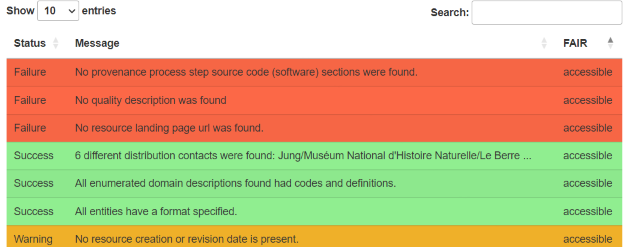
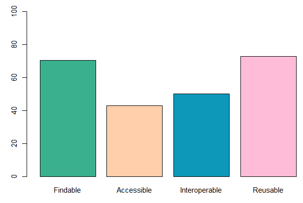

This tutorial aims to teach how to use the interactive tool MetaShRIMPS, available on Galaxy Ecology,
to produce Data Papers drafts and FAIR quality assessment reports from metadata using EML
standard.
This tutorial purpose is also to explain why it is needed to improve the overall FAIR quality
of metadata and how this tool responds to this necessity.

> <comment-title>What does FAIR mean?</comment-title>
> [FAIR](https://www.go-fair.org/fair-principles/) stand for **Findable, Accessible, Interoperable, Reusable**. 
>
>{:width="500"}
>These principles were to improve the access and usabiliy of data by the machine and to help making data reusable and shareable for users.
>Metadata is the data used to describe and explain all the context behind the production of data. It is necessary to produce a rich and FAIR metadata in order 
>to permit external users to understand and reuse data for their own studies.
{:  .comment}
> <agenda-title></agenda-title>
>
> In this tutorial, we will cover:
>
> 1. TOC
> {:toc}
>
{: .agenda}


# How can this tool improve the metadata quality?

The purpose of this tool is to help the user improve their metadata quality in order to increase its value to the scientific community and to help highlighting
the work of all the producers of the data.
To respond to this objective, this tool aims to give an easy access to a quality assessment report of EML metadata which could guide the producers of
data/metadata to the production of a metadata with high degree of FAIRness.
The other objective of this tool is to highlight the work of all of the people that helped in producing this data by giving the access of a draft of Data Paper
that is reuseable either in a non editable HTML file, that can represent the metadata in a more ergonomic way facilitating its understanding and shareability,
or in an editable docx file. Having an editable Data Paper draft will allow the producer to complete/modify the draft of Data Paper so that it could become
publishable as a real Data Paper giving recognition to all the people that helped producing the data.

> <comment-title>What is a Data Paper?</comment-title>
> According to the [GBIF](https://www.gbif.org/data-papers) (Global Biodiversity Information Facility), 
>A data paper is a peer reviewed document describing a dataset, published in a peer reviewed journal. It takes effort to prepare, curate and describe data. 
>Data papers provide recognition for this effort by means of a scholarly article.
{:  .comment}
# Get data

> <hands-on-title> Data Upload </hands-on-title>
>
> 1. Create a new history for this tutorial
> 2.Import this metadata file from [Zenodo]({{ page.zenodo_link }}) to test it
>     -> Training Data for "Creating Quality FAIR assessment reports and draft of Data Papers from EML metadata with MetaShRIMPS"):
>    ```
>    https://zenodo.org/record/8130567/files/Kakila_database_marine_mammal.xml
>    ```
>
>    
{: .hands_on}


# Upload Data in MetaShRIMPS

When oppening MetaShRIMPS, you will have an interface looking like this :

{:width="500"}

To upload data on MetaShRIMPS, if you was selecting the xml file as input of the tool, it is already launched, if not, you have to click on the browse button and select in your local folders, the file
you want to use. 
> <warning-title>Select the right format</warning-title>
> The file uploaded in this tool must be a metadata in XML format using EML metadata standard.
{: .warning}

{:width="500"}

After uploading the file, or if you have indicate it as input data if the tool, you just have to click on **Execute** to launch the tool with the file.

# Outputs

After clicking the **Execute** button, 2 new tabs called "Draft of Data Paper" and "Fair Assessment"  will appear.
You can access all of the tool outputs by clicking on each tab (it can take a little time for your results to be displayed).

## Draft of Data Paper

By clicking on the "Draft of Data Paper" tab, you will have access to the draft of Data Paper presented in an HTML format.
You can either navigate through the Data Paper with the tabs or with the scrollbar on the right and access different elements.

You can at the top of the page download the draft in either an HTML format or an editable docx format.


## Fair Quality Assessment report

By clicking on the "Fair Assessment" tab, you will access the FAIR Quality report of the metadata uploaded.
You will have access to different figures such as a table displaying the results of all checks tested for your metadata.


You will also have acces to a graph presenting scores of Quality for each of the FAIR principles tested (Findable,
Acessible, Interoperable, Reusable) on a 100 point scale.



# Conclusion

Here is the end of this short tutorial aiming in explaining the purpose of MetaShRIMPS and how to use it.
Don't hesitate to contact us if you have any questions :)
