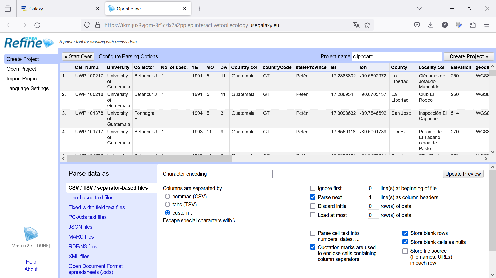
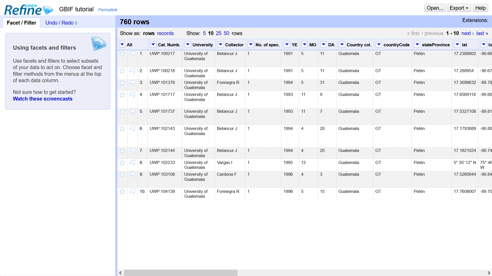
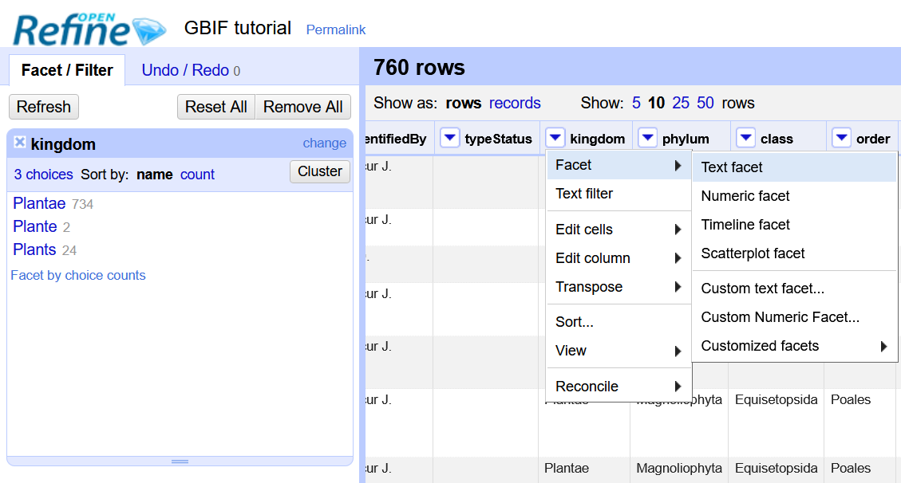

# Introduction
{:.no_toc}

<!-- This is a comment. -->

In this tutorial we will use OpenRefine tool to clean occurence records retrieved from GBIF.

This tutorial is based on the GBIF  "Biodiversity data mobilization course" accessible [here](https://docs.gbif.org/course-data-mobilization/en/) on Use case 1 ["Herbarium Specimens"](https://docs.gbif.org/course-data-mobilization/en/exercise-3a-c.html).

> ### Agenda
>
> In this tutorial, we will cover:
>
> 1. Import data to OpenRefine
> 2. Faceting
> 3. Filtering
> 4. Clustering
> 5. API use
> {:toc}
>
{: .agenda}

# Retrieve data from GBIF "Biodiversity data mobilization course"

## Get data

> ###  Hands-on: Data import and project creation
>
> 1. Create a new history for this tutorial, you can for example name it "OpenRefine tutorial"
> 
> 3. Deploy an OpenRefine instance clicking Execute on the   without specifying any input dataset for now
> 4. Import content of the file directly on OpenRefine using "Clipboard" on "Create Project" space. Open the file locally, with notepad++ or any other software allowing reading raw content of text files, and then copy the content, and paste it on the "OpenRefine Clipboard" dedicated space.
> 5. You can then edit input content parsing options (here noting to change normaly as averything is automagically detected), specify a project name (for example "GBIF tutorial"),  and finally click "Create project".

> 7. You will now have your project with first 10 lines of your file displayed

{: .hands_on}


## Faceting

Faceting is a feature that will allow us to get a big picture overview of the data, and to filter down to just the subset of rows
that we want to change or view in bulk. It facilitates the use and analysis of data and can be done with cells containing any
kind of text, numbers and dates.

> ###  Hands-on: Faceting and mass editing.
>
> 1. Go to column "kingdom", and then click on the column menu and follow the route to `Text facet`.
>    - On the left a window with the name of the column will appear, that is the facet.

> 2. Click on count to sort by count, then click on name to sort alphabetically
> 3. Fix the spelling mistakes (Plante -> Plantae). Place the cursor over the text in the window and click on `edit`, then fix the error in the text box, and to save click on apply.
>    - All the values will be fixed automatically.

>
>
>    > ###  Comment
>    >
>    > comment1
>    {: .comment}
>
{: .hands_on}

> ###  Questions
>
> 1. How many Plantae occurences you now have?
>
> > ###  Solution
> >
> > 1. 736
> >
> {: .solution}
>
{: .question}

> ###  Hands-on: Faceting and white space 1.
>
> 1. Go to "Country col". and click on column menu and perform a `Text Facet`
>    - On a quick view, the country appears to be spelled correctly, but the facet shows three different values due to the extra spaces at the end of the text.
> 2. Fix the error from the column menu on Country col. , following the route `Edit Cells > Common transforms > Trim leading and trailing whitespace`. You will see a notification message "Text transform on 38 cells in column Country col.: value.trim()" and the posibility to come back on previous state clicking on the `undo` hyperlink.
> 3. Now check the facet window; only one value will remain.
>
{: .hands_on}

> ###  Hands-on: Faceting and white space 2.
>
> 1. Go to column "Full name" and click on then go to `Text facet`. Then click on `count`.
>    - *Guzmania lingulata* is the first item in the list with 25 specimens, but it is also present in the 4th  `place with 20 specimens.
> 2. Fix the error from the "Full name" column menu, `Edit Cells > Common transforms > Collapse consecutive whitespaces`.
>
{: .hands_on}

> ###  Questions
>
> 1. How many *Guzmania lingulata* records only appear in the list finally?
>
> > ###  Solution
> >
> > 1. 45
> >
> {: .solution}
>
{: .question}

> ###  Hands-on: Faceting and duplicates.
>
> 1. Go to column catalog in "Cat. Numb" , and follow the route `Facet > Customized facets > Duplicates facet`. 
>    - The facet will show 4 duplicates
> 2. Click on true, and you'll see the values in the main window
> 3. After a check with the specimens labels, fix the values clicking edit directly on the cell with the correct catalogue numbers
>    - UWP:122470 Vargas P
>    - UWP:122471 Vargas I
>    - UWP:157351 Betancur H
>    - UWP:157339 Betancur J
>
{: .hands_on}

## Filtering 

> ###  Hands-on: Basic filter.
>
> 1. Go again to "Full name" column menu and perform a `Text facet` to visualize the values, then go again to the column menu and click
on `Text filter` , perform the following filters and fix them as described below:
>    - search for "sp1" entries -> To remove it and obtain "Cyperus", you can `Edit` directly in the cell)
>    - search for "SP2" entries, check `case sensitive` -> To remove it and obtain "Cyperus", you can `Edit` directly in the cell
>    - search for "spp".
>    > 1. Go to "Full name" column menu, then click `Edit cells > Transform`
>    > 2. In the text box paste the formula `value.replace(" spp.", "")` and click `ok`
>
{: .hands_on}

> ###  Questions
>
> 1. Do you think you can use also `Edit cells > Transform` formula to apply the changes you made manually for the 2 first terms searched ("sp1" and "SP2")?
> 2. Why you can easily edit directly these 2 first entries and not the third one?
>
> > ###  Solution
> >
> > 1. Yes, using respectively `value.replace(" sp1", "")` and `value.replace(" SP2", "")` formulas
> > 2. Because the 2 first searchs only concern one entry for each when the third one return several.
> >
> {: .solution}
>
{: .question}

> ###  Hands-on: Advance filter 1.
>
> 1. Go to column "genus" and perform a `Text filter`.
> 2. Check `regular expression` and `case sensitive` , then paste the expression "^[a-z]"
>    - This regular expression filters the strings in which the first letter is lowercase.
> 3. Perform a correction since the genus should be capitalized.
>
>
>    > ###  Comment
>    >
>    > If you want to know more about regular expressions, you can consult https://openrefine.org/docs/manual/expressions#regular-expressions and specifically for GREL functions: https://openrefine.org/docs/manual/grelfunctions
>    {: .comment}
>
{: .hands_on}

> ###  Questions
>
> 1. Try to find a regular expression to apply the same kind of `Text filter` operation than on the previous exercise. Which regular expression can work?
>
> > ###  Solution
> >
> > 1. On my side, I found this formla `value.replace(value.substring(0,1),toUppercase(value.substring(0,1)))` 
> >
> {: .solution}
>
{: .question}

> ###  Hands-on: Advance filter 2.
>
> 1. Go to column "Full name" and perform a `Text filter`.
> 2. Check `regular expression` and `case sensitive`, then paste the expression "^[A-Z].*\s[A-Z]"
>    - This regular expression filters the strings that start with a capital letter followed by 0 or more characters, then a space, then a capital letter.
> 3. Perform a correction since the second word of the name should be lowercase.
>
{: .hands_on}


## Clustering

> ###  Hands-on: Basic clustering.
>
> 1. Go to County , then in the menu column click `Text facet`.
>    - Keep in mind that the correct counties are: Flores, La Libertad, Melchor de Mencos, San Andres and San Jose.
> 2. On the top right of the facet window click on `Cluster`, a new window will appear.
> 3. Now you can see information about the clusters:
>    - Cluster size: the number of different versions that the clustering algorithm believes to be the same.
>    - Row count: the number of records with any of the cluster values.
>    - Values in cluster: the actual values that the algorithm believes to be the same. There is also the number
of records with each particular value, and the possibility to browse the contents of the cluster in a
different tab.
>    - Merge?: check if values are to be merged into a single standard value.
>    - New cell value: the value to be applied to every record in the cluster. By default, it is the value with most records. You can also click on any value to apply that to the New cell value.
>
>
>    > ###  Comment
>    >
>    > If you want to know more about clustering click https://openrefine.org/docs/manual/cellediting#cluster-and-edit
>    {: .comment}
>
> 4. Click on `Select All` and then on `Merge Selected & close`, you will see a notification message "Mass edit 119 cells in column County".
> 5. To fix the remaining counties go again to Cluster in the facet window of Count.
> 6. In the Cluster and edit window, go to `Keying Function`, then select `ngram-fingerprint`, and set "1" as the value in `Ngram Size`. Press the enter key.
> 7. Click on `Select All` and then on `Merge Selected & close`, you will see a notification message "Mass edit 360 cells in column County".
>    - Your counties are now fixed! Congratulation!
{: .hands_on}


## Exporting

> ###  Hands-on: Exporting cleaned file into Galaxy.
>
> 1. On the upper right corner click on `Export` and select `Tab separated value`.
>    - A notification message as "GBIF tutorial has been exported to Galaxy, please refresh your Galaxy history" is displayed
>
>
>    > ###  Comment
>    >
>    > You can also download directly file on your computer choosing `Export` and `Custom tabular exporter`, allowing you to select notably columns and rows you want to download.
>    {: .comment}
>
{: .hands_on}


## API use

Reconciliation matches the information in one of your columns to an outside database. This is particularly helpful when it
comes to name validation, as it proves the name you have exists somewhere else. This is a really useful service, but can be
time consuming. In this case we will go through the process with only three records using the API from GBIF. Internet
connection is required.

> ###  Hands-on: Higher taxonomy.
>
> 1. Go to "Collector" column, then make a `Text facet`. Select the collector "Elsa P".
> 2. Under "Full name", click on column menu and then `Edit column > Add column by fetching URLs…` , call the new column "Api_name"
> 3. Change the Throttle Delay to 250 and paste the expression "http://api.gbif.org/v1/species/match?verbose=true&name="+escape(value,'url')"
> 4. Click ok and wait, this might take some time depending on your internet connection and the number of taxa.
> 5. Go to "Api_name", click on column menu and then `Edit column > Add column based on this column...`. Call the new column "higherClassification" and paste the expression: 
>    ```
>    value.parseJson().get("kingdom")+
>    ", "+value.parseJson().get("phylum")+
>    ", "+value.parseJson().get("class")+
>    ", "+value.parseJson().get("order")+
>    ", "+value.parseJson().get("family")
>    ```
>    You will see the Kingdom, Phylum, Class, Order and family of each taxon.
> 6. Under "higherClassification" follow the route `Edit column > Split into several columns…`, leave the initial settings.
> 7. Now you know how to obtain the taxonomic categories of a given taxon if this is available in the GBIF API. Column names can be edited in `Edit column > Rename this column`.
> 8. For the purpose of the workshop, the columns created in this exercise (Higher taxonomy) must be deleted. Under All , which is the first column, go to `Edit columns > Re-order / remove columns…`. Remove columns "Api_name", "higherClassification1", "higherClassification2", "higherClassification3", "higherClassification4" and "higherClassification5".
>
>    > ###  Comment
>    >
>    > comment1
>    {: .comment}
>
{: .hands_on}

> ###  Questions
>
> 1. Question1?
> 2. Question2?
>
> > ###  Solution
> >
> > 1. Answer1
> > 2. Answer2
> >
> {: .solution}
>
{: .question}

# Conclusion
{:.no_toc}

Sum up the tutorial and the key takeaways here. We encourage adding an overview image of the
pipeline used.
