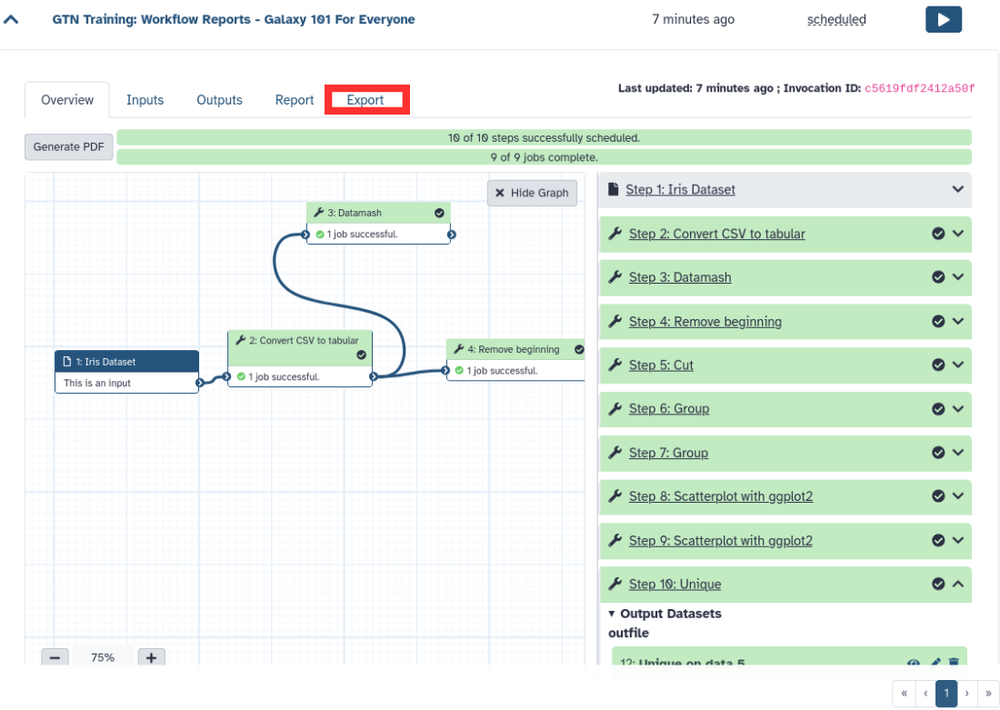
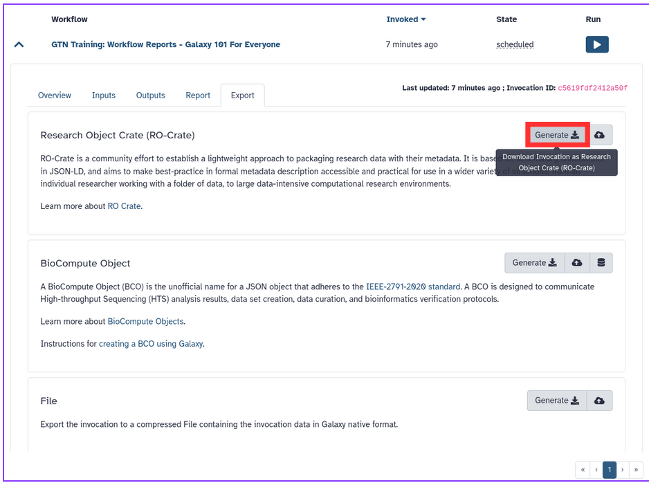

> <agenda-title></agenda-title>
>
> In this tutorial, you will learn how to create a git repo, and begin working with it.
>
> 1. TOC
> {:toc}
>
{: .agenda}


## Introduction

Requirements:

[Using Galaxy and Managing your Data](https://training.galaxyproject.org/training-material/topics/galaxy-interface/):
- [Creating, Editing and Importing Galaxy Workflows]() 
- [Extracting Workflows from Histories](https://training.galaxyproject.org/training-material/topics/galaxy-interface/tutorials/history-to-workflow/tutorial.html )


Workflows are a powerful Galaxy feature that allows you to scale up your analysis by performing an end-to-end analysis with a single click of a button. In order to keep provenance of the workflow invocation (an invocation of a workflow means one run or execution of the workflow) it can be exported from Galaxy in the form of a [Workflow Run Crate](https://w3id.org/ro/wfrun/workflow) RO-Crate profile.

Additionaly, the exported Workflow Run Crate allows for sharing workflow run provenance with those unfamiliar with Galaxy and its standard export format.

This tutorial will guide you through the steps of defining such a report for your workflow, .

This tutorial will show you how to generate Galaxy-based [Workflow Run RO-Crate](https://w3id.org/ro/crate/) after running the workflow. 


## Import an example workflow

For this tutorial, we will use the workflow from the [Galaxy 101 for everyone tutorial](). If you have not done this tutorial yet, the only thing you need to know is that this is a workflow that takes as input a table of data about different species of iris plants, this table is subsequently sorted and filtered, and some plots are made. The specifics of the workflow are not important for this tutorial, only that it outputs a number of different kinds of outputs (images, tables, etc).

We will start by importing this workflow into your Galaxy account:

> <hands-on-title>Import the workflow</hands-on-title>
>
> 1. **Import the workflow** into Galaxy
>    - Copy the URL (e.g. via right-click) of [this workflow](https://training.galaxyproject.org/training-material/topics/galaxy-interface/tutorials/workflow-reports/workflows/galaxy-101-everyone.ga) or download it to your computer.
>    - Import the workflow into Galaxy
>
>    
>
{: .hands_on}


## Run the workflow

Galaxy will produce several export options for any workflow. The default export gives us a serialization of the invocation data model while the RO-Crate export gives an Workflow Run Crate which includes the default export as well.

Let’s run the workflow and export the RO-Crate.

> <hands-on-title>Run the workflow</hands-on-title>
>
> 1. Import the file `iris.csv` via link
>
>    ```
>    https://zenodo.org/record/1319069/files/iris.csv
>    ```
>
>    Tip: Importing via links:
>
>    - Copy the link location
>    - Open the Galaxy Upload Manager (galaxy-upload on the top-right of the tool panel)
>    - Select Paste/Fetch Data
>    - Paste the link(s) into the text field
>    - Press Start
>    - Close the window
>
> 2. Run **GTN Training: Galaxy 101 For Everyone** workflow using the following parameters:
>    - *"Send results to a new history"*: `No`
>    - *"1: Iris Dataset""*: the `iris.csv` file we just uploaded
>
>    Tip: Running a workflow:
>    - Click on Workflow on the top menu bar of Galaxy. You will see a list of all your workflows.
>    - Click on the workflow-run (Run workflow) button next to your workflow
>    - Configure the workflow as needed
>    - Click the Run Workflow button at the top-right of the screen
>    - You may have to refresh your history to see the queued jobs
>
> 3. **View the workflow outputs** once the workflow has completed
>    - The workflow produces several text and tabular outputs, and two plot (image) outputs
>
{: .hands_on}

## Export the Workflow Run Crate

After the workflow has completed, we can export the RO-Crate. The crate does not appear in your history, but can be accessed from the **User -> Workflow Invocations** menu on the top bar.

> <hands-on-title>Export the Workflow Run Crate</hands-on-title>
>
> 1. In the top menu bar, go to **User -> Workflow Invocations**
>
> 2. Our latest workflow run should be listed at the top.
>    - Click on it to expand it:
>
>    
>
> 3. Click on the **Export** tab in the expanded view of the workflow invocation.
>
> 4. You should see a page like this. It contains:
>    - The different export options
>    - Location where the export should be sent to (Download locally or a remote location)
>
> 5. Click on the Download option
> 
>    
>
{: .hands_on}

Great work! You have created a Workflow Run Crate. This makes it easy to track the provenance of the executed workflow.
