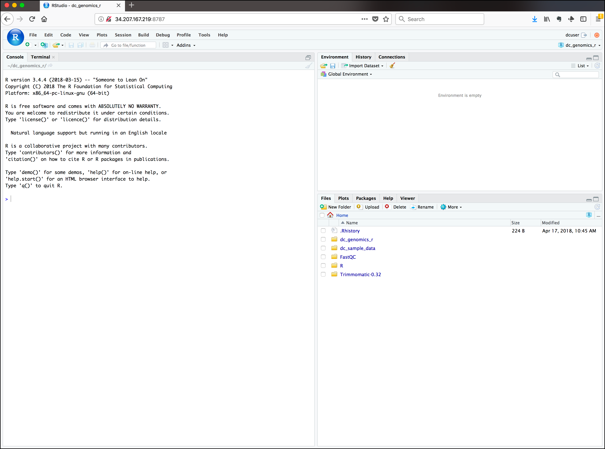
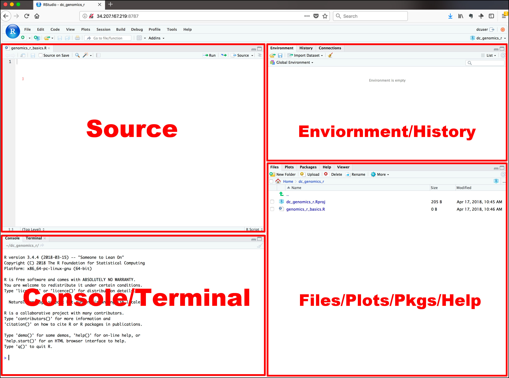
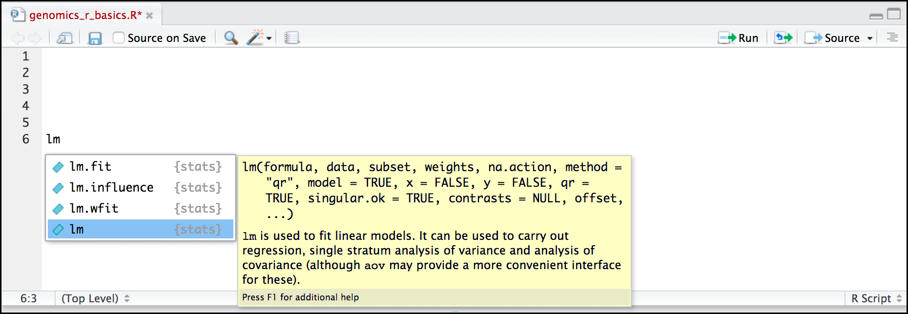
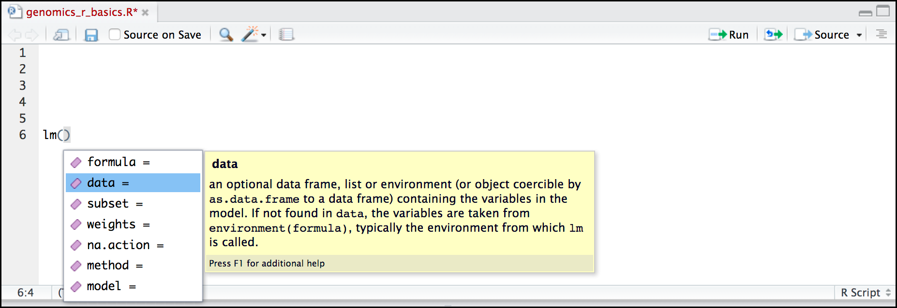

This tutorial will introduce you to how to run RStudio in Galaxy



[RStudio](https://www.rstudio.com/products/RStudio/) is an [Integrated Development Environment (IDE)](https://en.wikipedia.org/wiki/Integrated_development_environment). Like most IDEs, it provides a graphical interface to R, making it more user-friendly, and providing dozens of useful features. We will introduce additional benefits of using RStudio as you cover the lessons. In this case, we are specifically using [RStudio Server](https://www.rstudio.com/products/RStudio/#Server), a version of RStudio that can be accessed in your web browser. RStudio Server has the same features of the Desktop version of RStudio you could download as standalone software.

> <agenda-title></agenda-title>
>
> In this tutorial, we will cover:
>
> 1. TOC
> {:toc}
>
{: .agenda}

# RStudio

Opening up  in Galaxy is easy:



You should now be looking at a page with the RStudio interface:



## Creating your first R script

Now that we are ready to start exploring R, we will want to keep a record of the commands we are using. To do this we can create an R script.

> <hands-on-title>Create a R script</hands-on-title>
>
> 1. Click the **File** menu
> 2. Select **New File**
> 3. Click on **R Script**
{: .hands_on}

A new panel appears on the top left. Before we go any further, you should save your script.

> <hands-on-title>Save a R script</hands-on-title>
>
> 1. Click the  icon (**Save current document**) in the bar above the first line in the script editor
>
>    Alternatively, you can also:
>    - Click the **File** menu and select **Save**
>    - Type <kbd>CTRL</kbd>+<kbd>S</kbd> (<kbd>CMD</kbd>+<kbd>S</kbd> on OSX)
>
> 2. In the **Save File** window that opens, name your file `genomics_r_basics`
{: .hands_on}

The new script `genomics_r_basics.R` should appear under **Files** in the bottom right panel. By convention, R scripts end with the file extension `.R`.

## Overview and customization of the RStudio layout

Here are the major windows (or panels) of the RStudio environment:



- **Source**: This panel is where you will write/view R scripts

    Some outputs (such as if you view a dataset using `View()`) will appear as a tab here.

- **Console/Terminal**: This is actually where you see the execution of commands

    This is the same display you would see if you were using R at the command line without RStudio. You can work interactively (i.e. enter R commands here), but for the most part we will run a script (or lines in a script) in the source pane and watch their execution and output here.

- **Environment/History**: RStudio will show here you what datasets and objects (variables) you have created and which are defined in memory.

    You can also see some properties of objects/datasets such as their type and dimensions. The **History** tab contains a history of the R commands you've executed in R.

- **Files/Plots/Packages/Help**: This multipurpose panel will show you the contents of directories on your computer

    - **Files**: You can also use this tab to navigate and set the working directory
    - **Plots**: This tab will show the output of any plots generated
    - **Package**: In this tab you will see what packages are actively loaded, or you can attach installed packages
    - **Help**: It will display help files for R functions and packages.


All of the panels in RStudio have configuration options. For example, you can minimize/maximize a panel, or by moving your mouse in the space between panels you can resize as needed. The most important customization options for panel layout are in the **View** menu. Other options such as font sizes, colors/themes, and more are in the **Tools** menu under **Global Options**.

> <comment-title>Working with R at the terminal</comment-title>
> Although we won't be working with R at the terminal, there are lots of reasons to.
>
> For example, once you have written an RScript, you can run it at any Linux or Windows terminal without the need to start up RStudio. We don't want you to get confused - RStudio runs R, but R is not RStudio.
>
> For more on running an R Script at the terminal see the dedicated [Software Carpentry lesson](https://swcarpentry.github.io/r-novice-inflammation/05-cmdline/).
{: .comment}

## How to call functions in R, without needing to master them?

A function in R (or any computing language) is a short program that takes some input and returns some output.

> <hands-on-title>Calling a function in R</hands-on-title>
>
> 1. Type `date()` in the **Console** panel
> 2. Type <kbd>Enter</kbd>
> 2. Check what is displayed in the **Console** panel
>
{: .hands_on}

You should obtain something like:

```R
[1] "Tue Mar 26 15:12:24 2019"
```

> <comment-title>Display of function call in the tutorial</comment-title>
> Now in the tutorial, we will display the function call like this:
>
> ```R
> > date()
> [1] "Tue Mar 26 15:12:24 2019"
> ```
{: .comment}

The other way to execute these functions is to use the script we just created and then keep track of the functions.

> <hands-on-title>Running a function via a script</hands-on-title>
>
> 1. Type `date()` in the **Script** panel
> 2. Click on the **Run the current line or selection** or type <kbd>CTRL</kbd>+<kbd>Enter</kbd> (or <kbd>CMD</kbd>+<kbd>Enter</kbd>)
{: .hands_on}

You should see in the **Console** panel the same as when we run the function directly via the console.

We would like now to keep information about this function

> <hands-on-title>Comment in a script</hands-on-title>
>
> 1. Write on the line before `date()` a comment:
>
>    ```R
>    # Gives the current date
>    ```
>
> 2. Select both lines
> 3. Execute them
> 4. Check the output
{: .hands_on}

The comment line is displayed in the console but not executed.

> <question-title>What do these functions do?</question-title>
>
> Try the following functions by writing them in your script. See if you can
> guess what they do, and make sure to add comments to your script about your
> assumed purpose.
> 1. `dir()`
> 2. `sessionInfo()`
> 3. `Sys.time()`
>
> > <solution-title></solution-title>
> >
> > 1. `dir()` lists files in the working directory
> > 2. `sessionInfo()` gives the version of R and additional info including on attached packages
> > 3. `Sys.time()` gives the current time
> >
> {: .solution}
{: .question}

> <warning-title>Commands are case sensitive!</warning-title>
> In R, the commands are case sensitive. So be careful when you type them.
{: .warning}

You have hopefully noticed a pattern - an R function has three key properties:
1. A name (e.g. `dir`, `getwd`) first
2. A pair of `()` after the name
3. 0 or more arguments inside the parentheses

   An argument may be a specific input for your function and/or may modify the function's behavior. For example the function `round()` will round a number with a decimal:

   > <code-in-title></code-in-title>
   > ```R
   > # This will round a number to the nearest integer
   > > round(3.14)
   > [1] 3
   > ```
   {: .code_in}

## Getting help

What if you wanted to round to one significant digit, `round()` can do this, but you may first need to read the help to find out how.

To see the help you need enter a `?` in front of the function name. The **Help** tab (in the bottom-right panel) will show you information.

> <hands-on-title>Get help</hands-on-title>
>
> 1. Add a `?` in front of the function name to see the help
>
>    ```R
>    > ?round()
>    ```
>
> 2. Check the **Help** tab
>
{: .hands_on}

In R, this help is sometimes also called a "vignette". Often there is too much information. You will slowly learn how to read and make sense of them:

1. Checking the **Usage** or **Examples** headings is often a good place to look first
2. Under **Arguments**, we can also see what arguments we can pass to this function to modify its behavior

We can also see the arguments of a function without opening its help.

> <hands-on-title>Get the function arguments</hands-on-title>
>
> 1. Type `args()` to see the arguments of `round` function
>
>    ```R
>    > args(round)
>    function (x, digits = 0)
>    NULL
>    ```
>
{: .hands_on}

`round()` takes two arguments:

1. `x`: the number to be rounded
2. `digits`: integer indicating the number of decimal places to be used

    The `=` sign indicates that a default (in this case 0) is already set.

Since `x` is not set, `round()` requires we provide it, in contrast to `digits` where R will use the default value 0 unless you explicitly provide a different value.

We can explicitly set the digits parameter when we call the function.

> <hands-on-title>Call a function with several parameters</hands-on-title>
>
> 1. Call `round` with 2 arguments
>    - *x*: `3.14159`
>    - *digits*: `2`
>
>    ```R
>    > round(3.14159, digits = 2)
>    [1] 3.14
>    ```
>
> 2. Call `round` with 2 arguments
>    - 3.14159
>    - 2
>
>    ```R
>    > round(3.14159, 2)
>    [1] 3.14
>    ```
{: .hands_on}

R accepts what we call "positional arguments". If you pass a function arguments separated by commas, R assumes that they are in the order you saw when we used `args()`. In the case below that means that `x` is 3.14159 and `digits` is 2.

Finally, what if you are using `?` to get help for a function in a package not installed on your system, such as when you are running a script which has dependencies?

> <hands-on-title>Get help for a missing function</hands-on-title>
>
> 1. Ask help for `geom_point()`
> 2. Check the generated error
>
>
>    ```R
>    > ?geom_point()
>    Error in .helpForCall(topicExpr, parent.frame()) :
>      no methods for ‘geom_point’ and no documentation for it as a function
>    ```
>
> 3. Type `??geom_point()`
> 4. Check the **Help** tab
{: .hands_on}

Using the two question marks (here `??geom_point()`), R returns results from a search of the documentation for packages you have installed on your computer in the **Help** tab.

Finally, if you think there should be a function, for example a statistical test, but you aren't sure what it is called in R, or what functions may be available.

> <hands-on-title>Search for a function</hands-on-title>
>
> 1. Type `help.search('chi-Squared test')`
> 2. Check the **Help** panel
{: .hands_on}

A list of potential interesting function related to "chi-Squared test" are listed. You can click on one of them to see the help of it. Remember to put your search query in quotes inside the function's parentheses.

> <question-title>Search for R functions</question-title>
>
> Search the R functions for the following statistical
> functions
>
> 1. Student-t test
> 2. mixed linear model
>
> > <solution-title></solution-title>
> >
> > While your search results may return several tests, we list a few you might
> > find:
> > 1. Student-t test: `stats::TDist`
> > 2. mixed linear model: `stats::lm.glm`
> >
> {: .solution}
{: .question}

We will not discuss now, where to look for the libraries and packages that contain functions you want to use. For now, be aware that two important ones are:
1. [CRAN](https://cran.r-project.org/): the main repository for R
2. [Bioconductor](http://bioconductor.org/): a popular repository for bioinformatics-related R packages

## RStudio contextual help

Here is one last bonus we will mention about RStudio. It's difficult to remember all of the arguments and definitions associated with a given function.

> <hands-on-title>Search for a function</hands-on-title>
>
> 1. Type `lm` in the **Script** panel
> 2. Hit <kbd>Tab</kbd>
>
>    RStudio displays functions and associated help
>
>    
>
> 3. Select `lm` function using the arrows
> 4. Hit <kbd>Enter</kbd>
> 4. Hit <kbd>Tab</kbd> again inside the parantheses
>
>    RStudio shows the function's arguments and provide additional help for each of these arguments:
>
>    
>
{: .hands_on}


## Stopping RStudio

RStudio will keep running until you stop it, so you can always come back to your analysis later. However, once you are finished with your analysis,
you should save the work you did within RStudio by exporting any files you created back to your Galaxy history, as well as the log describing all the commands you ran.
Then you can safely shut down RStudio.




# Interaction between RStudio and Galaxy

Getting data in and out from Galaxy

## Import Data from the Galaxy History to RStudio

To import a dataset from the history into RStudio user needs to get the path to that file. To do so, the user can use `gx_get()` function with the dataset `id`. For example, if a user wants to import a dataset with ID 7 to their RStudio, they can get the path to the file by:

```
gx_get(7)
```

It is important to know that this is just a print path function and do not import anything. Users should use a proper R function to read the file. For example, they can pass the path to a function that reads tables such as `read_table` or `read_tsv`. Let's assume that dataset 7 in the history is a tab-separated table (TSV) and we want to read it into our RStudio. Users can do it as follows:
```
table_name <- read.table(gx_get(7))
```

## Export Data from the RStudio

Users can export the RHistory and all objects from RStudio to Galaxy as follows (`analysis_17.01.2025` is an arbitrary name):
```
gx_save(session_name = "analysis_17.01.2025")
```
This data object can be loaded to R.
