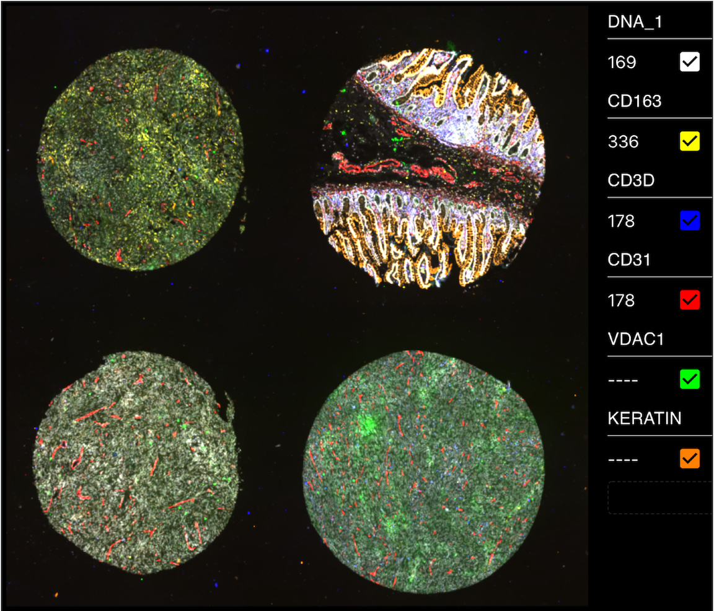
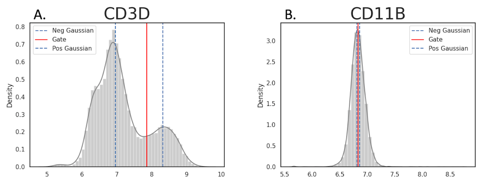
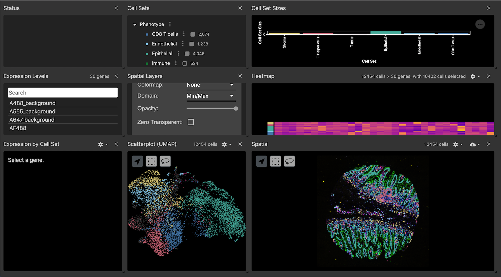
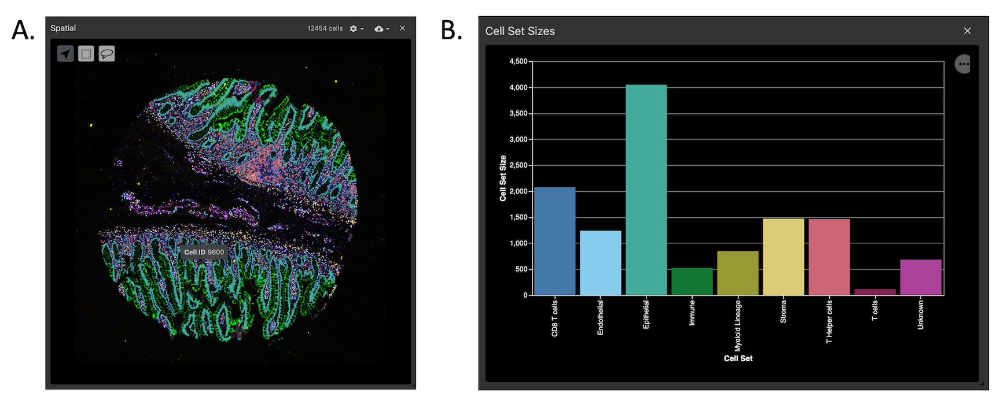

# Introduction
{:.no_toc}

Multiplex tissue images are large, multi-channel images that contain intensity data for numerous biomarkers. The methods for generating multiplex tissue images are diverse, and each method can require specialized knowledge for downstream processing and analysis. The MCMICRO () pipeline was developed to process multiplex images into single-cell data, and to have the range of tools to accomodate for different imaging methods. The tools used in the MCMICRO pipeline, in addition to tools for single-cell analysis, spatial analysis, and interactive visualization are available in Galaxy to facilitate comprehensive and accessible analyses of multiplex tissue images. The MCMICRO tools available in Galaxy are capable of processing Whole Slide Images (WSI) and Tissue Microarrays (TMA). WSIs are images in which a tissue section from a single sample occupies the entire microscope slide; whereas, TMAs multiplex smaller cores from multiple samples onto a single slide. This tutorial will demonstrate how to use the Galaxy multiplex imaging tools to process and analyze publicly available TMA test data provided by MCMICRO (Figure 1.).

Find a full example history at https://cancer.usegalaxy.org/u/watsocam/h/gtnexemplar002tma 

> ###  **Important Notice: Working on the cancer.usegalaxy.org instance**
> 
>  
> 
{: .warning}

> ### Agenda
>
> In this tutorial, we will cover:
>
> 1. TOC
> {:toc}
>
{: .agenda}

# Get data

Multiplex tissue images come in a variety of forms and file-types depending on the modality or platform used. For this tutorial, the Exemplar-002 data was imaged using Cyclic Immunofluorescence (CycIF) with a RareCyte slide scanner. Many of the steps in this workflow have platform-specific parameters, and the hands-on sections will show the best parameters for CycIF RareCyte images; however, notes will be made where critical differences may occur depending on the modality or platform throughout the tutorial.

The raw files for each round (10 in total) of the exemplar-002 data are available on https://cancer.usegalaxy.org under [Data Libraries](https://cancer.usegalaxy.org/libraries). Import the raw files into a new history as a **list collection**.

> ###  Hands-on: Data import to history
>
> 1. Create a new history for this tutorial
>
>    
>
> 2. Import the files for Exemplar-002 from the Shared Data Library to the new history
>
>    
>
{: .hands_on}

> ###  **Imaging platform differences**
> 
> The Exemplar-002 raw images are in *ome.tiff* format; however, commonly seen raw file-types are *ome.tiff*, *tiff*, *czi*, and *svs*. If your input images are not *ome.tiff* or *tiff*, you may have to edit the dataset attributes in Galaxy to allow tools to recognize them as viable inputs. 
>
{: .warning}

# Tile illumination correction with **BaSiC Illumination**

Commonly, microscopes output one image per round of imaging. These individual round images were imaged in tiles, and there can be slight variations in how each tile was illuminated across the course of imaging. Prior to tile stitching and image registration, the tiles have to undergo illumination correction with **BaSiC Illumination** () to account for this. Unlike many of the other tools in this workflow, BaSiC has no extra parameters to think about: Just input the collection of raw images and press *go*!

Two new list collections will appear in the history upon completion: 

  - BaSiC Illumination on Collection `X`: FFP (flat-field)
  - BaSiC Illumination on Collection `X`: DFP (deep-field)

> ###  Hands-on: Illumination correction
>
> 1.  with the following parameters:
>
>    -  *"Raw Cycle Images: "*: List collection of raw images
>
{: .hands_on}

# Stitching and registration with **ASHLAR**

After illumination is corrected across round tiles, the tiles must be stitched together, and subsequently, each round mosaic must be registered together into a single pyramidal OME-TIFF file. **ASHLAR** from MCMICRO provides both of these functions. 

> ###  Important detail: Marker File
>
> **ASHLAR** optionally reads a marker metadata file to name the channels in the output OME-TIFF image. This marker file will also be used in later steps. Make sure that the marker file is comma-separated and has the `marker_names` as the third column (Figure 2.). 
>
> 
>
{: .details}

> ###  Hands-on: Image stitching and registration
>
> 1.  with the following parameters:

>    -  *"Raw Images"*: List collection of raw images
>    -  *"Deep Field Profile Images"*: List collection of DFP images produced by **BaSiC Illumination**
>    -  *"Flat Field Profile Images"*: List collection of FFP images produced by **BaSiC Illumination**
>    - *"Flip X-axis"*: `No`
>    - *"Flip Y-axis"*: `No`
>    - *"Maximum allowed per-tile corrective shift"*: `30`
>    - *"Upgrade to BF6-Compliant OME-TIFF Pyramid"*: `Upgrade Pyramid`
>    -  *"Markers File (optional)"*: Comma-separated markers file with marker_names in third column
>
>    - In *"Advanced Options"*:
>        - *"Align Channel Number"*: `0` (Channel usually containing DAPI, hoescht, or other DNA marker)
>        - *"Sigma"*: `Not entered, left as default`
>        - *"Cyto mask channel"*: `Not entered, left as default`
>        - *"Flip output image horizontally"*: `No`
>        - *"Flip output image vertically"*: `No`
>        - *"Write output as a single pyramidal TIFF"*: `Yes`
>
{: .hands_on}

> ###  **Imaging platform differences**
> 
> ASHLAR, among other tools in the MCMICRO and Galaxy-MTI pre-processing tools have some parameters that are specific to the 
imaging patform used. By default, ASHLAR is oriented to work with images from RareCyte scanners. AxioScan scanners render images
in a different orientation. Because of this, when using ASHLAR on AxioScan images, it is important to select the **Flip Y-Axis**
parameter to *Yes*
> 
> ASHLAR will work for most imaging modalities; however, certain modalities require different tools to be registered. For example,
multiplex immunohistochemistry (mIHC) images must use an aligner that registers each moving image to a reference Hematoxylin image. 
For this, Galaxy-MTI inlcudes the alternative registration tool **PALOM**. 
>
{: .warning}

# TMA dearray with **UNetCoreograph**

Many downstream processing and analysis steps require each individual core from the TMA to be in a separate image file. To accomplish this from our now ASHLAR-registered ome.tiff image, we can use **UNetCoreograph** to detect and crop each core into separate files.

UNetCoreograph will output images (used for downstream steps), masks, and a preview image (Figure 3.).

> ###  Hands-on: TMA dearray
>
> 1.  with the following parameters:
>
>    -  *"Registered TIFF"*: The output of **ASHLAR** (registered, pyramidal OME-TIFF file)
>    - *"Downsample factor"*: `5`
>    - *"Channel"*: `0`
>    - *"Buffer"*: `2.0`
>    - *"Sensitivity"*: `0.3`
>    - *"Cluster"*: `No`
>    - *"Tissue"*: `No`
>
>    > ###  What about Whole Slide Images? 
>    >
>    > Whole slide images do not need to be dearrayed, so in most cases, this step can be skipped; however, UNetCoreograph has the *"Tissue"* option, which when selected, can act to separate the whole tissue from the background in a whole slide image which can be useful. In this case, it is important to toggle the *"Downsample factor"* as this often needs to be higher when extracting whole tissues.
>    {: .comment}
>
{: .hands_on}

# Nuclear segmentation with **Mesmer**

Cell segmentation is the basis for all downstream single-cell analyses. Different segmentation tools work highly variably depending on the imaging modality or platform used. Because of this, Galaxy-MTI has incorporated several cell segmentation tools so users may find the tool that works optimally for their data. 

Available segmentation tools in Galaxy-MTI:

  - Mesmer ()
  - UnMicst and s3segmenter ()
  - Cellpose ()
  - ilastik ()

In this tutorial, we use Mesmer because it tends to perform generally well on a diverse range of image types, and has a limited number of parameters to understand. 

> ###  Important detail: Batch mode
>
> Now that each image has been split into individual core images, downstream tools must be run on the images separately. Luckily, Galaxy makes this easy by including the option to run each tool in batch mode. Next to the input for the tool, select  (**Dataset collection**) as the input type, and pass the collection output by UNetCoreograph as input. 
>
{: .details}

> ###  Hands-on: Nuclear segmentation
>
> 1.  with the following parameters:
>    -  *"Image containing the nuclear marker(s) "*: Collection output of UNetCoreograph (images)
>    - *"The numerical index of the channel(s) from nuclear-image "*: `0`
>    - *"Compartment for segmentation prediction: "*: `Nuclear`
>    - *"Resolution of the image in microns-per-pixel"*: `0.65`
>    - *"Whether to np.squeeze the outputs before saving"*: `Yes`
>    - *"Segment with Cell Membrane"*: `No`
>
>    > ###  np.squeeze
>    >
>    > The **np.squeeze** parameter is very important to select as `Yes` to make the output compatible with next steps
>    {: .comment}
>
{: .hands_on}

> ###  **Imaging platform differences: Image resolution**
> 
> A crucial parameter for Mesmer and other segmentation tools is the **Image resolution**. This is reported in microns/pixel, and can vary depending on the imaging platform used and the settings at image acquisition. Mesmer accepts the resolution in microns/pixel; however, if using UNMICST, the resolution must be reported as a ratio of the resolution of UNMICST's training images (0.65). For example, when using UNMICST, if your images were captured at a resolution of 0.65, then the UNMICST value would be 1, but if your images were captured at 0.325 microns/pixel, then the value you would enter for UNMICST would be 0.5. 
>
{: .warning}

# Calculate single-cell features with **Quantification**

After generating a segmentation mask, the mask and the original registered image can be used to extract mean intensities for each marker in the panel, spatial coordinates, and morphological features for every cell. This step is performed by MCMICRO's **Quantification** module. 

Once again, as this is a TMA, we will be running this in batch mode for every core image and its segmentation mask. 

The quantification step will produce a CSV cell feature table for every image in the batch. 

> ###  Hands-on: Quantification
>
> 1.  with the following parameters:

>    -  *"Registered TIFF "*: Collection output of UNetCoreograph (images)
>    -  *"Primary Cell Mask "*: Collection output of Mesmer (or other segmentation tool)
>    -  *"Additional Cell Masks "*: `Nothing Selected` (Other tools may produce multiple mask types)
>
>    > ###  Mask metrics and Intensity metrics
>    >
>    > Leaving the *"mask metrics"* and *"intensity metrics"* blank will by default run all available metrics
>    >
>    {: .comment}
>
{: .hands_on}

# **Convert McMicro Output to Anndata**

Anndata () is a Python package and file format schema for working with annotated data matrices that has gained popularity in the single-cell analysis community. Many downstream analysis tools, including SciMap from MCMICRO, Scanpy (), and Squidpy () are built around anndata format files (h5ad). This tool splits the marker intensity data into a separate dataframe (`X`), and places all observational data (spatial coordinates, morphological features, etc.) in the cell feature table into a separate dataframe (`obs`) that shares the same indices as `X`. In downstream analyses, new categorical variables, such as phenotype assignments for each cell, are stored in the `obs` dataframe. 

> ###  Hands-on: Task description
>
> 1.  with the following parameters:
>
>    -  *"Select the input image or images"*: Collection output of Quantification (cellMaskQuant)
>    - In *"Advanced Options"*:
>        - *"Whether to remove the DNA channels from the final output"*: `No`
>        - *"Whether to log the data"*: `Yes`
>        - *"Name of the column that contains the CellID"*: `CellID` (Default)
>        - *"Whether to use unique name for cells/rows"*: `No`
>        - *"Column name to split the counts table and metadata"*: `X_centroid` (Default)
>
>    > ###  Important parameter: Unique names for cells/rows
>    >
>    > Setting *"Whether to use unique name for cells/rows"* to `No` to ensures that downstream interactive visualizations will be able to map observational features to the mask CellIDs. 
>    {: .comment}
>
{: .hands_on}

# SciMap: **Single Cell Phenotyping**

> ###  Hands-on: Task description
>
> 1.  with the following parameters:
>    - *"Save the GMM gates plots If True"*: `Yes`
>
>    ***TODO***: *Check parameter descriptions*
>
>    ***TODO***: *Consider adding a comment or tip box*
>
>    > ###  Comment
>    >
>    > 
>    > A comment about the tool or something else. This box can also be in the main text
>    {: .comment}
>
{: .hands_on}

# Interactive visualization of multiplex tissue images

## Converting UNetCoreograph images to OME-TIFF using the **Convert image** tool

> ###  Hands-on: Convert image
>
> 1.  with the following parameters:
>    - *"Output data type"*: `OME TIFF`
>    - *"Extract series"*: `All series`
>    - *"Extract timepoint"*: `All timepoints`
>    - *"Extract channel"*: `All channels`
>    - *"Extract z-slice"*: `All z-slices`
>    - *"Extract range"*: `All images`
>    - *"Extract crop"*: `Full image`
>    - *"Tile image"*: `Tile image`
>    - *"Pyramid image"*: `Generate Pyramid`
>
>    ***TODO***: *Check parameter descriptions*
>
>    ***TODO***: *Consider adding a comment or tip box*
>
>    > ###  Comment
>    >
>    > A comment about the tool or something else. This box can also be in the main text
>    {: .comment}
>
{: .hands_on}

## **Rename OME-TIFF Channels**

> ###  Hands-on: Rename channels
>
> 1.  with the following parameters:
>
>    ***TODO***: *Check parameter descriptions*
>
>    ***TODO***: *Consider adding a comment or tip box*
>
>    > ###  Comment
>    >
>    > A comment about the tool or something else. This box can also be in the main text
>    {: .comment}
>
{: .hands_on}

## Generating an interactive visualization dashboard with **Vitessce Visualization**

> ###  Hands-on: Vitessce visualization
>
> 1.  with the following parameters:
>    - *"Whether to do phenotyping"*: `Yes`
>        - *"Select an embedding algorithm for scatterplot"*: `UMAP`
>        - *"Input phenotyping keys"*: `Multiple choices`
>            - *"Select the key(s)"*: ``
>
>    ***TODO***: *Check parameter descriptions*
>
>    ***TODO***: *Consider adding a comment or tip box*
>
>    > ###  Comment
>    >
>    > A comment about the tool or something else. This box can also be in the main text
>    {: .comment}
>
{: .hands_on}

# Next steps: Compositional and spatial analyses

# Conclusion
{:.no_toc}

In this tutorial, we demonstrated a complete multiplex tissue imaging analysis workflow performed entirely in a web browser using Galaxy-MTI. Using an example tissue microarray imaged with cylic immunofluoresence provided by MCMICRO, we...

  - Corrected illumination between imaging tiles
  - stitched and registered input images to produce a single, pyramidal OME-TIFF image that is viewable in multiple built-in interactive viewing tools (Avivator, Vitessce)
  - Split the TMA into separate images for each core
  - Processed each core in parallel, beginning with nuclear segmentation
  - Quantified the mean marker intensities, morphological features, and spatial coordinates of each cell in each core
  - Converted the resulting tabular data to anndata format for convenient downstream anaylses and visualizations
  - Performed marker-based, automatically gated, phenotyping of cells
  - Prepared the dearrayed images and viewed them interactively in a dashboard combined with observational data

.")