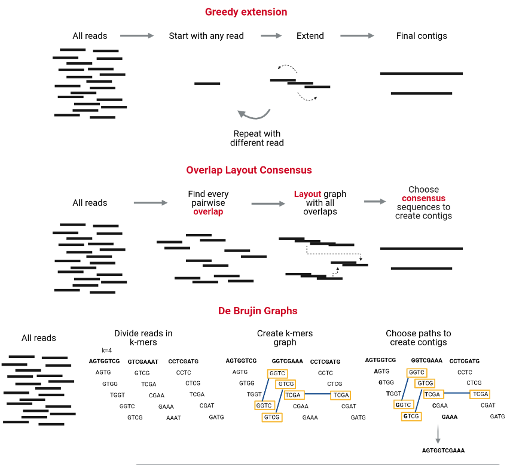
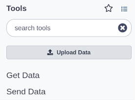
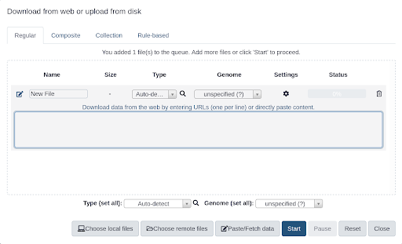
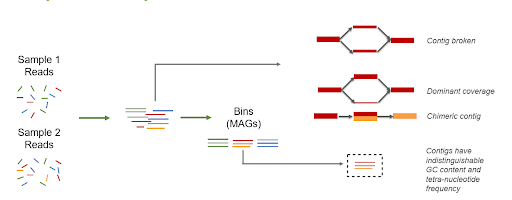

## Introduction
{:.no_toc}

Metagenomics involves the analysis of combined genomic DNA from entire environmental samples, which is a branch of conventional microbial genomics. Using metagenomic assemblers – computational programs that put together small fragments of sequenced DNA produced by sequencing instruments – the most critical step in analyzing metagenomic data is reconstructing the individual genes and genomes of microorganisms in the community.

Assembling seems intuitively similar to putting together a jigsaw puzzle. Essentially, it looks for reads "that work together," or more precisely, reads that overlap. Tasks like this are not straightforward, but rather complex. The genome is made up of millions of small pieces (reads), many of which look the same. Occasionally, there could be missing pieces (also referred to as "sequencing bias") since some parts are hard to sequence. It is also possible for some pieces to have errors in reads due to sequencing errors. 

In order to construct a whole chromosome's sequence (ideally), reads are assembled into contigs and contigs into scaffolds. The main strategies used for genome and metagenome assembly are Greedy extension, Overlap Layout Consensus and De Bruijn charts. The following figure illustrates these strategies in brief. The nice paper  on assemblers based on these algorithms will help you to better understand how they work.

{:width="70%"}

Image from 

Different assemblers have different computational characteristics. Their performance varies according to the microbiome. The preference of one assembler over another depends on the purpose at hand. It was proven by the first round of the Critical Assessment of Metagenome Interpretation initiative () and confirmed by the second round of the CAMI initiative (, ). Among the most popular are MetaSPAdes () and Megahit (). 

### Data

We will use the [Temporal shotgun metagenomic dissection of the coffee fermentation ecosystem](https://www.ebi.ac.uk/metagenomics/studies/MGYS00005630#overview).

Based on the real dataset of the coffee fermentation system, we generated mock datasets for this tutorial.

For an in-depth analysis of the structure and functions of the coffee microbiome, a temporal shotgun metagenomic study (six time points) was performed.

Real datasets are available for download in [ENA](https://www.ebi.ac.uk/ena/browser/view/PRJEB24129?show=reads), as well as metadata about samples. There are six samples of a coffee fermentation system sequenced with Illumina MiSeq utilizing whole genome sequencing. This dataset contains paired-end reads.

## Prepare Galaxy and data
First we need to get some data into our history. There are different ways to upload data into the Galaxy. You can upload files from your computer, or Galaxy can also fetch data directly from external sources.

In case of a not very large dataset it’s more convenient to upload data directly from your computer to Galaxy. In case of a large dataset, we can use FTP server or the [Galaxy Rule-based Uploader]().

> ###  Hands-on: Upload data into Galaxy
>
> 1. Create new history
>
>    
>
> 2. At the top of the Tools panel (on the left), click “Upload Data”
> {:width="40%"}
> This brings up a box:
> {:width="80%"}
> 
> 3. Click Paste/Fetch data and paste in the following URLs in the box that appears.
>  ```
> https://zenodo.org/record/6958893/files/ERR2231567_Read_1.fastqsanger.gz
> https://zenodo.org/record/6958893/files/ERR2231567_Read_2.fastqsanger.gz
> https://zenodo.org/record/6958893/files/ERR2231568_Read_1.fastqsanger.gz
> https://zenodo.org/record/6958893/files/ERR2231568_Read_2.fastqsanger.gz
> https://zenodo.org/record/6958893/files/ERR2231569_Read_1.fastqsanger.gz
> https://zenodo.org/record/6958893/files/ERR2231569_Read_2.fastqsanger.gz
> https://zenodo.org/record/6958893/files/ERR2231570_Read_1.fastqsanger.gz
> https://zenodo.org/record/6958893/files/ERR2231570_Read_2.fastqsanger.gz
> https://zenodo.org/record/6958893/files/ERR2231571_Read_1.fastqsanger.gz
> https://zenodo.org/record/6958893/files/ERR2231571_Read_2.fastqsanger.gz
> https://zenodo.org/record/6958893/files/ERR2231572_Read_1.fastqsanger.gz
> https://zenodo.org/record/6958893/files/ERR2231572_Read_2.fastqsanger.gz
>  ```
> 4. Click Start, and then Close
> 5. When they are ready, rename the datasets
{: .hands_on}

### Assembly
Co-assembly of short reads will be the focus of this tutorial. Later in this tutorial, we will also cover individual assembly. 
To accomplish our objectives, we will use the MetaSPAdes assembly tool. MetaSPADES is an NGS assembler designed specifically for large and complex metagenomics datasets. MetaSPAdes is part of the SPAdes toolkit, which has several assembly pipelines.

There are three challenges to metagenomics assembly: 1) differences in genome coverage between samples, resulting from differences in abundance, 2) the fact that different species often share conserved regions (), and 3) the presence of multiple strains of a single species (). Since SPAdes handles non-uniform coverage, it is useful for assembling simple communities, but metaSPAdes also handles other problems, allowing it to assemble complex communities' metagenomes.

#### Co-assembly

> ###  Hands-on: Assembly with MetaSPAdes
>
> > ###  Comment
> >
> > In the next steps we use **metaSPAdes** assembler. **MetaSPAdes** is a versatile metagenomic assembler (). As input for metaspades it can accept short reads. However, there is an option to use additionally long reads besides short reads to produce hybrid input.
> {: .comment} 
>
> 1. Name a new history with the name “Assembly with MetaSPAdes”
>
> 2. Run **MetaSPAdes** with parameters:
>     -  *"Pair-end reads input format"*: paired_interlaced
>     -  *"FASTQ file(s): interlaced"*: collection of short reads
>     -  *"Select k-mer detection option"*: manual
>     -  *"K-mer size values"*: 21,33,55,77
> 3. Rename output to “Output - assembly with MetaSPAdes”
{: .hands_on}

> ###  Output of MetaSPAdes
>
> **MetaSPAdes** outputs contigs and scaffolds.
> Scaffolds are segments of genome sequence reconstructed from end-sequenced whole-genome shotgun clones. Contigs and gaps make up scaffolds. Contigs are contiguous lengths of genomic sequences in which bases are known to a high degree of certainty. The gaps occur when reads from the two sequenced ends of at least one fragment overlap with other reads from two different contigs (as long as the arrangement is otherwise consistent with the contigs being adjacent). It is possible to estimate the number of bases between contigs based on fragment lengths.
>
{: .details}

> ###  Co-assembly
>
> We executed a so-called co-assembly. Let's learn a bit more about co-assembly. Basically, we performed the assembly on the bunch of samples taking reads from all samples simultaneously while assembling.
>
> {:width="60%"}
>
> Pros of co-assembly:
> - More data, better/longer assemblies
> - Access to lower abundant organisms
>
> Cons:
> - Higher computational overhead
> - Risk of shattering your assembly
> - Risk of increased contamination
>
> Co-assembly, however, is not always beneficial. Changes in strain can cause the assembly graph to collapse. Binned contigs are likely to be misclassified. MAGs must be treated as a population genome.
>
> {:width="80%"}
>
> In these cases, co-assembly is reasonable:
> - Same sample
> - Same sampling event
> - Longitudinal sampling of the same site
> - Related samples 
>
> Sometimes it is important to run tools both on individual samples and on all pooled samples.
> It is useful to use both approaches: individual assembly and co-assembly and benchmark them in order to get the intuition of more applicable techniques for the certain dataset. In case of individual assembly we have the possibility to de-replicate the genome after binning. Co-assembly is more commonly used than individual assembly and then de-replication after binning. Nevertheless, the de-replication approach should be taken into account while choosing the assembly method.
{: .comment}

##### Assessment of assembly

To determine the number of reads used to build an assembly, we want to know the percentage of reads that were used.

###### Extraction of % reads used in assemblies
We map input reads onto assemblies in order to extract this information.
In order to calculate the percentage of reads used for assembly, we use **Bowtie2** to map raw short-read data to the assembly we got using **MetaSPAdes**.

> ###  Hands-on: % reads used in assemblies
>
> > ###  Comment
> >
> > When using MetaSPAdes output, choose “Contigs” output preferably because contigs do not contain gaps represented with multiple-X letters.
> {: .comment} 
>
> 1. Run **Bowtie2** with parameters:
>     -  *"Is this single or paired library"*: paired_interleaved
>     -  *"Interleaved FASTQ file"*: raw dataset collection
>     -  *"Will you select a reference genome from your history or use a built-in index?"*: history
>     -  *"Select reference genome"*: MetaSPAdes output
>     -  *"Save the bowtie2 mapping statistics to the history"*: True
> 3. Inspect the generated output.
{: .hands_on}

###### Extraction of general metrics

There are different ways to analyze the quality of metagenomic assembly that was considered in detail in the CAMI1 () and the CAMI2 () challenge. Our recommendation for anyone interested in assembly quality assessment is to read the CAMI papers in depth. As part of our discussion of metagenomic assembly quality, we will review a few general metrics. 

**Genome fraction (%)**: % of reference bases covered by assembled contigs obtained by similarity-based mapping. In other words, genome fraction is the total number of aligned bases in the reference, divided by the genome size. A base in the reference genome is counted as aligned if at least one contig has at least one alignment to this base. Contigs from repeat regions may map to multiple places, and thus may be counted multiple times in this quantity.

**Mismatches per 100 kbp**: number of mismatched bases in the contig-reference alignment (average per 100 kb). 

**Duplication ratio**: total number of aligned bases / genome fraction * reference length.

**Number of misassemblies**: number of contigs which:
1) contain a gap of more than 1kb (number of positions in the assembled contigs where the left flanking sequence aligns over 1 kb away from the right flanking sequence on the reference); 
2) contain inserts of more than 1kb (they overlap by >1 kb); or 
3) align to different genomes (the flanking sequences align on opposite strands or different chromosomes). 

**N50**:  minimum contig length that contains 50% of the assembled bases. If all contigs in an assembly are ordered by length, the N50 is the minimum length of contigs that contains 50% of the assembled bases. For example, an N50 of 10 000 bp means that 50% of the assembled bases are contained in contigs of at least 10000 bp

Assemblies can be evaluated with **metaQUAST** (), metagenomics mode of **QUAST** ().

> ###  Hands-on: General metrics with metaQUAST
>
> 1. Run **Quast** with parameters:
>     -  *"Contigs/scaffolds file"*: outputs of the assemblies
>     -  *"Type of assembly"*: metagenome
>     -  *"Output files"*: history
>           - HTML report 
>           - PDF report 
>           - Tabular reports 
>           - Log file 
> 
{: .hands_on}

##### Aggregate all metrics

To complement already informative **metaQuast** reports, we will show you a stunning way to create a combined report.
Using **MultiQC** (), one can generate a nice report with all metrics combined. When you want to combine results and display them visually with different graphs, this tool is a good choice. Reports from **MultiQC** are combined into a webpage.

> ###  Hands-on: Aggregation of all metrics
>
> 1. Run **MultiQC** with parameters:
>    - In *"Results"*:
>        -  *"Insert Results"*
>            - *"Which tool was used generate logs?"*: `Quast`
>                -   *"Data"*: all outputs of Quast
>        -  *"Insert Results"*
>            - "Which tool used to generate report"*: Bowtie2
>                -  *"Data"*: all outputs of Bowtie2
> 
{: .hands_on}

#### Individual assembly
So far we performed co-assembly. For the assembly techniques with the de-replication involved, it is important to know how to do individual assembly. A corresponding hands-on section with steps of individual assembly of short reads samples is below.
We will use a Megahit assembler () for individual assembly. This is fortunate that Megahit can perform both options: individual and co-assembly.

> ###  De-replication
>
> De-replication is the process of identifying sets of genomes that are the “same” in a list of genomes, and removing all but the “best” genome from each redundant set. How similar genomes need to be to be considered “same”, how to determine which genome is “best”, and other important decisions are discussed in [Important Concepts](https://drep.readthedocs.io/en/latest/choosing_parameters.html).
>
> A common use for genome de-replication is the case of individual assembly of metagenomic data. If metagenomic samples are collected in a series, a common way to assemble the short reads is with a “co-assembly”. That is, combining the reads from all samples and assembling them together. The problem with this is assembling similar strains together can severely fragment assemblies, precluding recovery of a good genome bin. An alternative option is to assemble each sample separately, and then “de-replicate” the bins from each assembly to make a final genome set.
>
> {:width="80%"}
>
> If we have different samples, then we do an individual assembly for each sample. In the figure above we see that after individual assembly we have results for every individual assembly represented with pie charts. Different colours on these charts show different strains (organisms). Every chart has a different percentage of every strain which means that the assemblies contain different strains in different proportions in each sample. 
> Afterwards, we do the process of de-replication. We try to combine all the assemblies and try to identify which genomes are the most proper.
>
> Individual assembly is a good practice as well as co-assembly. They both have pros and cons and that are just different techniques. 
>
> Co-assembly is a more common practice. But in case of co-assembly the genome might be more fragmented afterwards (like it is shown in the figure)  and sometimes it can be less proper. However, it should be decided in every single case which approach to use (co- or individual). More comprehensive information about de-replication you can learn from paper  to get more intuition about how de-replication works.
>
> > ###  Hands-on: General list of actions for de-replication
> > 1. Create new history
> > 2. Assemble each sample separately using your favorite assembler
> > 3. Perform a co-assembly to catch low-abundance microbes
> > 4. Bin each assembly separately using your favorite binner
> > 5. Bin co-assembly using your favorite binner
> > 6. Pull the bins from all assemblies together
> > 7. rRun **dRep** on them
> > 8. Perform downstream analysis on the de-replicated genome list
> >
> {: .hands_on}
>
> We will perform steps from 1 to 3 in this tutorial a bit later while steps 4 - 8 will be considered in the following tutorial - Binning tutorial.
{: .details}

> ###  Hands-on: Individual assembly of short-reads samples with **MEGAHIT**
> 1. Create new history
>
>    
>
> 2. Name a new history "Individual assembly of short-reads samples with MEGAHIT"
> 3.  Run **MEGAHIT** with parameters:
>     -  *"Select your input option"*: paired-end collection
>     -  *"Run in batch mode?"*: Run individually
>     -  *"Select a paired collection"*: dataset collection
>     -  *"K-mer specification method"*: klim_method
>     -  *"Minimum kmer size"*: 21
>     -  *"Maximum kmer size"*: 91
>     -  *"Increment of kmer size of each iteration"*: 12
>
> > ###  Comment
> >
> > **MEGAHIT** produced a collection of output assemblies - one per sample - that can be proceeded further in binning step and then de-replication.
> {: .comment} 
>
{: .hands_on}


Well done! 