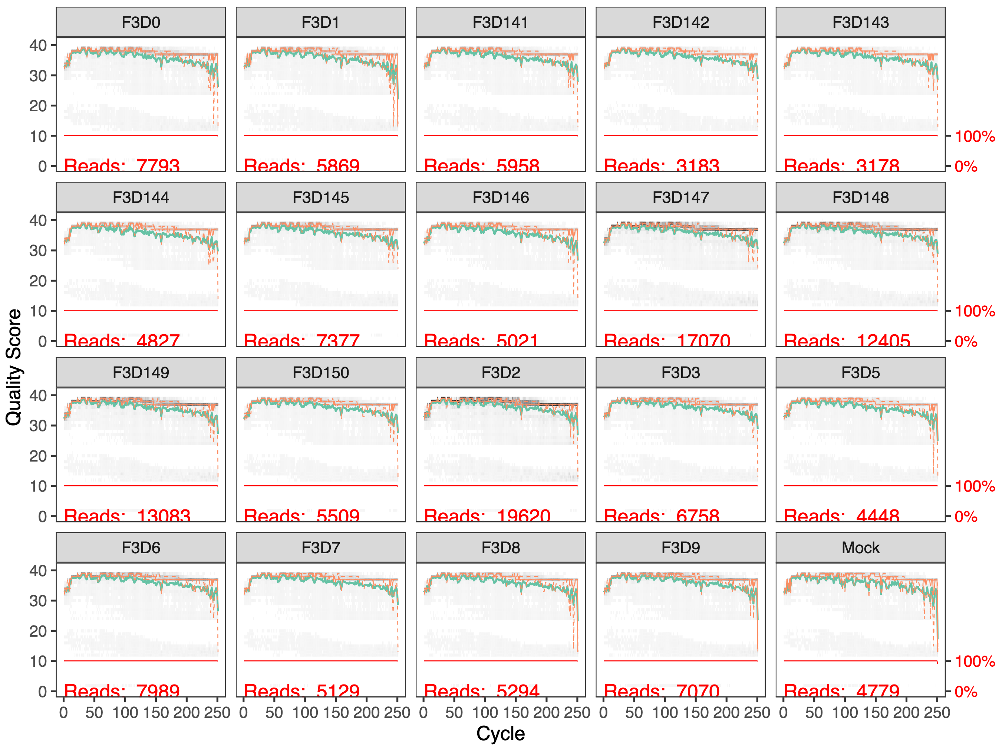
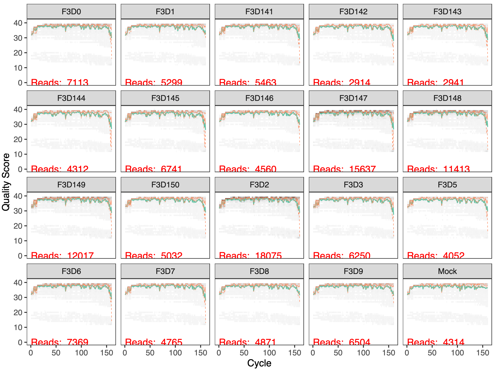
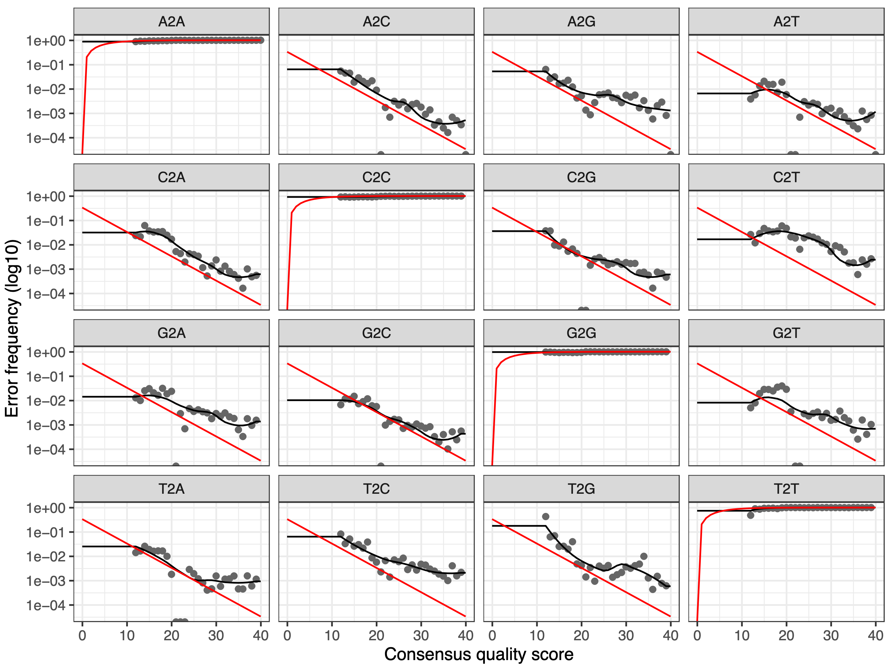
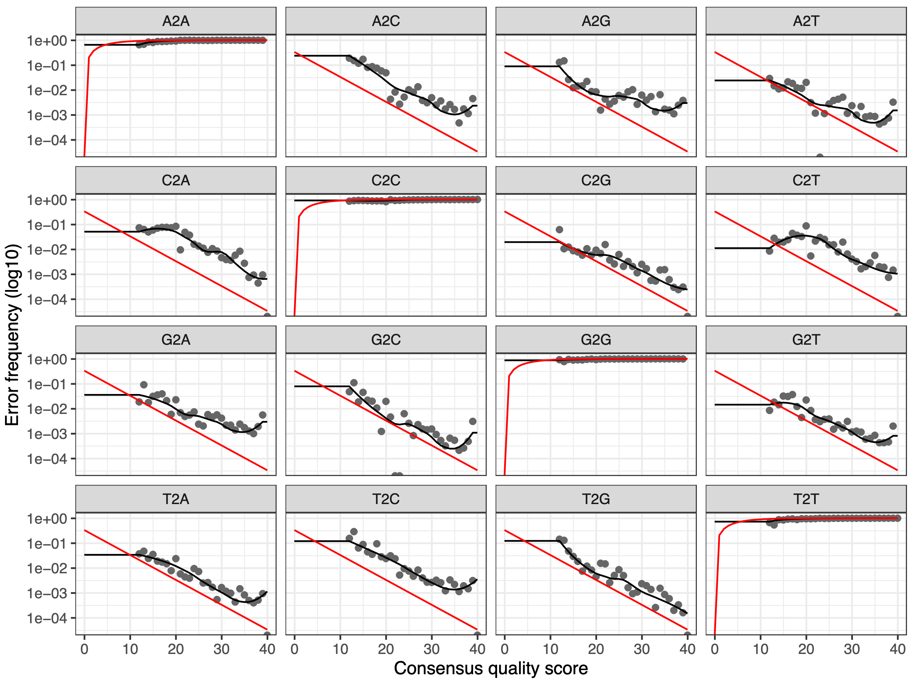
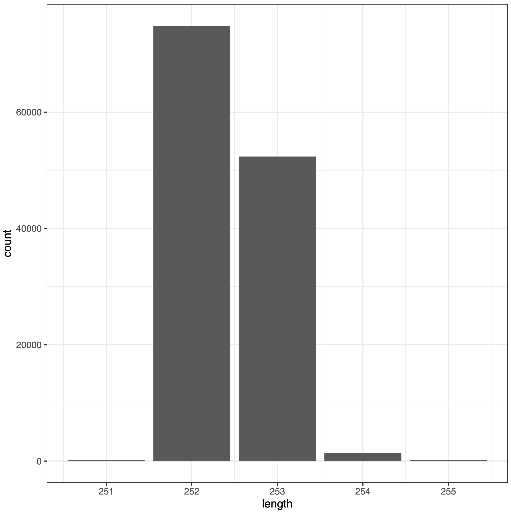
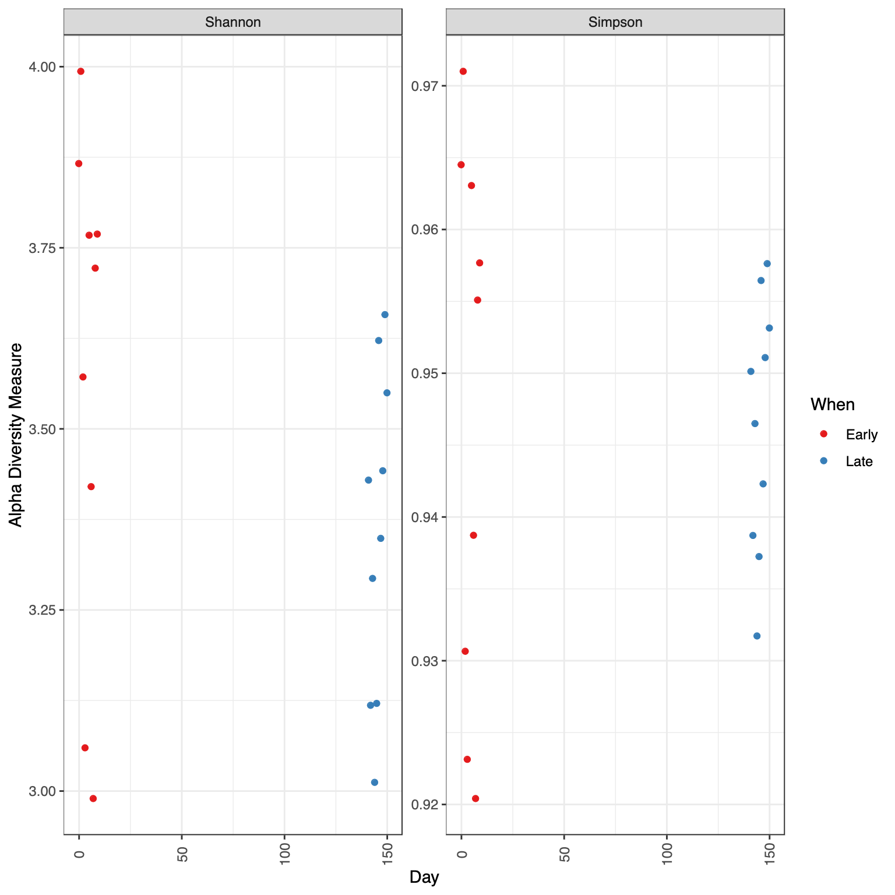
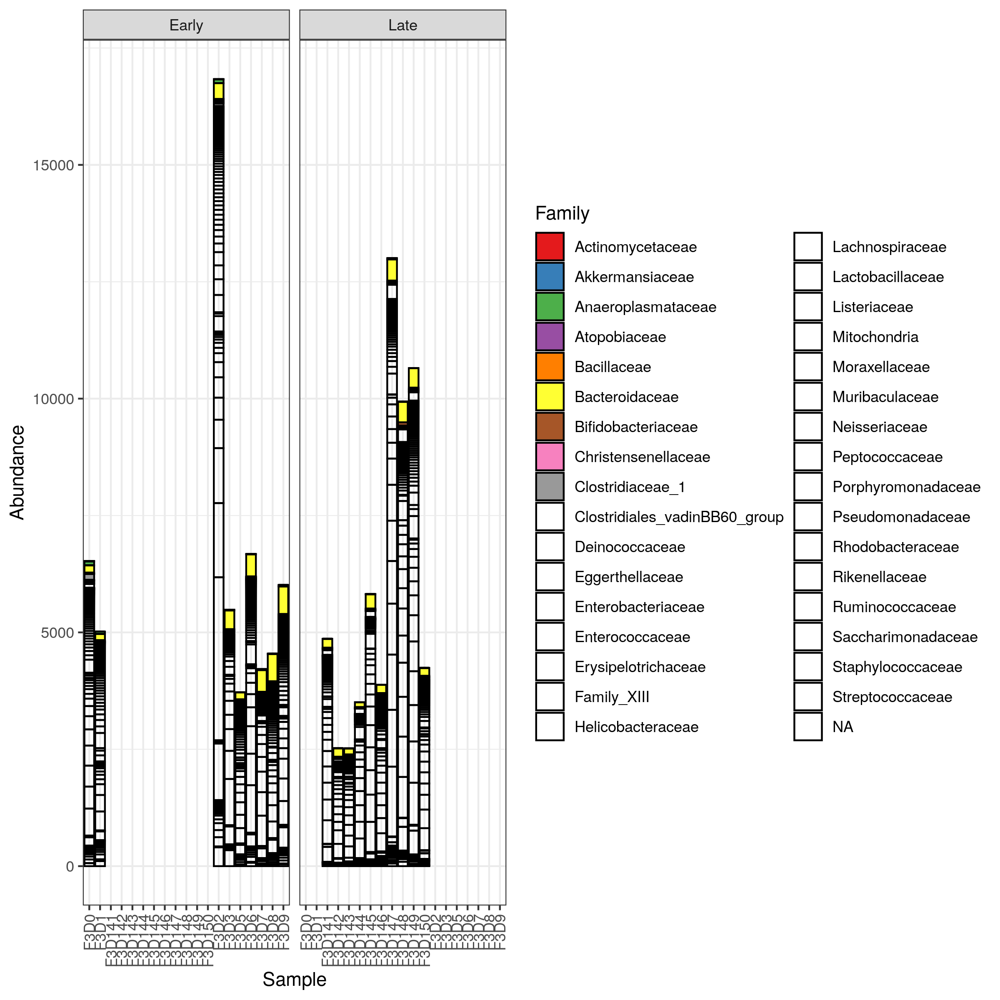
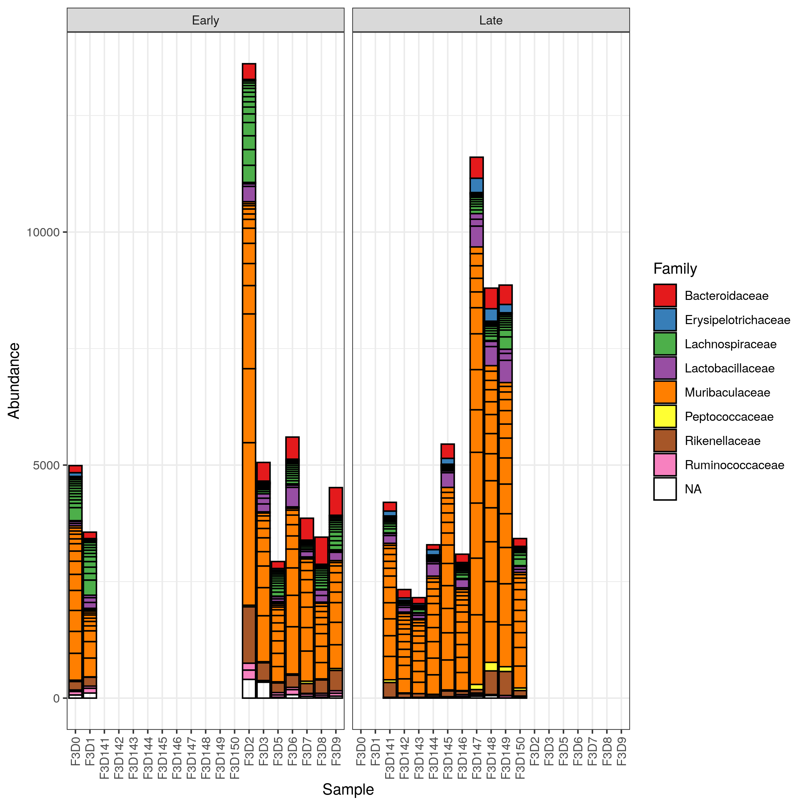

> <comment-title>Sources</comment-title>
>
> This tutorial is significantly based on [DADA2 Pipeline Tutorial](https://benjjneb.github.io/dada2/tutorial.html) and ["Introduction to dada2"](https://bioconductor.org/packages/devel/bioc/vignettes/dada2/inst/doc/dada2-intro.html)
>
{: .comment}

The investigation of environmental microbial communities and microbiomes has been revolutionized by the 
development of high-throughput amplicon sequencing. In amplicon sequencing a particular genetic locus, 
for example the 16S rRNA gene (or a part of it) in bacteria, is amplified from DNA extracted from the community of interest, 
and then sequenced on a next-generation sequencing platform. This technique removes the need to culture 
microbes in order to detect their presence, and cost-effectively provides a deep census of a microbial community.



To process 16S amplicon sequencing data, several tools exist: **QIIME2** (), **Mothur** (), **Lotus2** (), and **DADA2** (). All these tools can be used in Galaxy. In this tutorial we will use **DADA2**.

> <comment-title>Processing 16S amplicon data in Galaxy using other tools than DADA2</comment-title>
>
> Tutorials are available for the other tools in Galaxy:
> - [QIIME 2 Cancer Microbiome Intervention](https://docs.qiime2.org/jupyterbooks/cancer-microbiome-intervention-tutorial/index.html#)
> - [QIIME 2 Moving Pictures](https://docs.qiime2.org/2024.2/tutorials/moving-pictures-usage)
> - [16S Microbial Analysis with mothur]()
>
{: .comment}

The output of the dada2 pipeline is a feature table of amplicon sequence variants (an ASV table): A matrix with columms corresponding to samples and rows to ASVs, in which the value of each entry is the number of times that ASV was observed in that sample. This table is analogous to the traditional OTU table, except that one gets the actual sequences of the "true" sequence variants instead of rather anonymous and abstract entities called OTU1, OTU2, etc. 

The process of amplicon sequencing introduces errors into the sequencing data, and these errors 
severely complicate the interpretation of the results. **DADA2** implements a novel algorithm that models the errors introduced during amplicon sequencing, and uses that error model to infer the true sample composition. 

**DADA2** replaces the traditional "OTU-picking" step in amplicon sequencing workflows, producing instead higher-resolution tables of amplicon sequence variants (ASVs).



As seen in the paper introducing DADA2 () and in [further benchmarking](http://benjjneb.github.io/dada2/SotA.html), the **DADA2** method is more sensitive and specific than traditional OTU methods: DADA2 detects real biological variation missed by OTU methods while outputting fewer spurious sequences.

To illustrate the 16S amplicon data processing using **DADA2**, we will use dataset generated by the Schloss lab in their
[their mothur MiSeq SOP](https://www.mothur.org/wiki/MiSeq_SOP): FASTQ files generated by 2x250 Illumina Miseq amplicon sequencing of the V4 region of the 16S rRNA gene from gut samples collected longitudinally from a mouse post-weaning. They [describe the experiment](https://www.mothur.org/wiki/MiSeq_SOP#Logistics) as follows:

> *The Schloss lab is interested in understanding the effect of normal variation in the gut microbiome on host health. To that end,
> we collected fresh feces from mice on a daily basis for 365 days post weaning. During the first 150 days post weaning (dpw),
> nothing was done to our mice except allow them to eat, get fat, and be merry. We were curious whether the rapid change in
> weight observed during the first 10 dpw affected the stability microbiome compared to the microbiome observed between days
> 140 and 150.*
> 
{: .quote}

To speed up analysis for this tutorial, we will use only a subset of this data. We will look at a single mouse at 20 different time points (10 early, 10 late).

> <agenda-title></agenda-title>
>
> In this tutorial, we will cover:
>
> 1. TOC
> {:toc}
>
{: .agenda}

# Prepare Galaxy and data

Any analysis should get its own Galaxy history. So let's start by creating a new one:

> <hands-on-title>Data upload</hands-on-title>
>
> 1. Create a new history for this analysis
>
>    
>
> 2. Rename the history
>
>    
>
{: .hands_on}

The starting point for the **DADA2** pipeline is a set of demultiplexed FASTQ files corresponding to the samples in your amplicon sequencing study. That is, **DADA2** expects there to be an individual FASTQ file for each sample (or two FASTQ files, one forward and one reverse, for each sample). Demultiplexing is often performed at the sequencing center, but if that has not been done there are a variety of tools do accomplish this.

In addition, **DADA2** expects that there are no non-biological bases in the sequencing data. This may require pre-processing with outside software if, as is relatively common, your PCR primers were included in the sequenced amplicon region.

For this tutorial, we have 20 pairs of files. For example, the following pair of files:

- `F3D0_S188_L001_R1_001.fastq`
- `F3D0_S188_L001_R2_001.fastq`

The first part of the file name indicates the sample: `F3D0` here signifies that this sample was obtained from Female 3 on Day 0.

The rest of the file name is identical, except for `_R1` and `_R2`, this is used to indicate the forward and reverse reads respectively.

> <hands-on-title>Import datasets</hands-on-title>
>
> 1. Import the following samples via link from [Zenodo]({{ page.zenodo_link }}) or Galaxy shared data libraries:
>
>    > <solution-title>List of Zenodo URLs</solution-title>
>    > ```
>    > https://zenodo.org/record/800651/files/F3D0_R1.fastq
>    > https://zenodo.org/record/800651/files/F3D0_R2.fastq
>    > https://zenodo.org/record/800651/files/F3D141_R1.fastq
>    > https://zenodo.org/record/800651/files/F3D141_R2.fastq
>    > https://zenodo.org/record/800651/files/F3D142_R1.fastq
>    > https://zenodo.org/record/800651/files/F3D142_R2.fastq
>    > https://zenodo.org/record/800651/files/F3D143_R1.fastq
>    > https://zenodo.org/record/800651/files/F3D143_R2.fastq
>    > https://zenodo.org/record/800651/files/F3D144_R1.fastq
>    > https://zenodo.org/record/800651/files/F3D144_R2.fastq
>    > https://zenodo.org/record/800651/files/F3D145_R1.fastq
>    > https://zenodo.org/record/800651/files/F3D145_R2.fastq
>    > https://zenodo.org/record/800651/files/F3D146_R1.fastq
>    > https://zenodo.org/record/800651/files/F3D146_R2.fastq
>    > https://zenodo.org/record/800651/files/F3D147_R1.fastq
>    > https://zenodo.org/record/800651/files/F3D147_R2.fastq
>    > https://zenodo.org/record/800651/files/F3D148_R1.fastq
>    > https://zenodo.org/record/800651/files/F3D148_R2.fastq
>    > https://zenodo.org/record/800651/files/F3D149_R1.fastq
>    > https://zenodo.org/record/800651/files/F3D149_R2.fastq
>    > https://zenodo.org/record/800651/files/F3D150_R1.fastq
>    > https://zenodo.org/record/800651/files/F3D150_R2.fastq
>    > https://zenodo.org/record/800651/files/F3D1_R1.fastq
>    > https://zenodo.org/record/800651/files/F3D1_R2.fastq
>    > https://zenodo.org/record/800651/files/F3D2_R1.fastq
>    > https://zenodo.org/record/800651/files/F3D2_R2.fastq
>    > https://zenodo.org/record/800651/files/F3D3_R1.fastq
>    > https://zenodo.org/record/800651/files/F3D3_R2.fastq
>    > https://zenodo.org/record/800651/files/F3D5_R1.fastq
>    > https://zenodo.org/record/800651/files/F3D5_R2.fastq
>    > https://zenodo.org/record/800651/files/F3D6_R1.fastq
>    > https://zenodo.org/record/800651/files/F3D6_R2.fastq
>    > https://zenodo.org/record/800651/files/F3D7_R1.fastq
>    > https://zenodo.org/record/800651/files/F3D7_R2.fastq
>    > https://zenodo.org/record/800651/files/F3D8_R1.fastq
>    > https://zenodo.org/record/800651/files/F3D8_R2.fastq
>    > https://zenodo.org/record/800651/files/F3D9_R1.fastq
>    > https://zenodo.org/record/800651/files/F3D9_R2.fastq
>    > https://zenodo.org/record/800651/files/Mock_R1.fastq
>    > https://zenodo.org/record/800651/files/Mock_R2.fastq
>    > ```
>    {: .solution }
>
>    
>
>    
>
{: .hands_on}

40 files are a lot of files to manage. Luckily Galaxy can make life a bit easier by allowing us to create **dataset collections**. This enables us to easily run tools on multiple datasets at once.

Since we have **paired-end** data, each sample consist of two separate FASTQ files:
- one containing the forward reads, and 
- one containing the reverse reads.

We can recognize the pairing from the file names, which will differ only by `_R1` or `_R2` in the filename. We can tell Galaxy about this paired naming convention, so that our tools will know which files belong together. We do this by building a **List of Dataset Pairs**

> <hands-on-title>Organizing our data into a sorted paired collection</hands-on-title>
>
> 1. Create a paired collection named `Raw Reads`, rename your pairs with the sample name
>
>    
>
> 2.  with the following parameters:
>    -  *"Input Collection"*: `Raw Reads`
>
> 3. Rename output collection to `Sorted Raw Reads`
>
>    
>
{: .hands_on}

We can now start processing the reads using **DADA2**.



# Processing data using DADA2

Once demultiplexed FASTQ files without non-biological nucleotides are in hand, the **DADA2** pipeline proceeds as follows:

1. Prepare reads
   1. Inspect read quality profiles
   2. Filter and trim
   3. Learn the Error Rates
   4. Infer sample composition
   5. Merge forward/reverse reads

3. Construct sequence table
   1. Make sequence table
   2. Remove chimeras
  
4. Assign taxonomy
5. Evaluate accuracy

<div class="Workflow" markdown="1">



> <hands-on-title>Define DADA2 workflow parameters</hands-on-title>
>
> 1. Select following parameters:
>    -  *"Paired short read data"*: `Raw Reads`
>    - *"Read length forward read"*: `240`
>    - *"Read length reverse read"*: `160`
>    - *"Pool samples"*: `process samples individually`
>    - *"Cached reference database"*: `Silva version 132`
>
> 2. Run the workflow
{: .hands_on}

The workflow generates several outputs that we will inspect them given the step they correspond to.

</div>

# Prepare reads

The first step is to check and improve the quality of data.

## Inspect read quality profiles

We start by visualizing the quality profiles of the forward reads:

<div class="Step-by-step" markdown="1">

> <hands-on-title>Inspect read quality profiles</hands-on-title>
>
> 1.  with the following parameters:
>    - *"Processing mode"*: `Joint`
>        - *"Paired reads"*: `paired - in a data set pair`
>            -  *"Paired short read data"*: `Sorted Raw Reads`
>        - *"Aggregate data"*: `No`
>    - *"sample number"*: `10000000`
{: .hands_on}
</div>

**dada2: plotQualityProfile** generates 2 files with quality profiles per sample: 1 PDF for forward reads and 1 PDF for reverse reads.

> <hands-on-title>Inspect read quality profiles</hands-on-title>
>
> 1. Inspect **plotQualityProfile** forward read output
{: .hands_on}



In gray-scale is a heatmap of the frequency of each quality score at each base position. The mean quality score at each position is shown by the green line, and the quartiles of the quality score distribution by the orange lines. The red line shows the scaled proportion of reads that extend to at least that position (this is more useful for other sequencing technologies, as Illumina reads are typically all the same length, hence the flat red line).

> <question-title></question-title>
>
> 1. Are the forward reads good quality?
> 2. We generally advise trimming the last few nucleotides to avoid less well-controlled errors that can arise there. What would you recommend as threshold?
> 3. Are the reverse reads good quality?
> 4. What would you recommend as threshold for trimming?
>
> > <solution-title></solution-title>
> >
> > 1. The forward reads are good quality
> > 2. These quality profiles do not suggest that any additional trimming is needed. We will truncate the forward reads at position 240 (trimming the last 10 nucleotides).
> > 3. The reverse reads are of significantly worse quality, especially at the end, which is common in Illumina sequencing. This isn’t too worrisome, as DADA2 incorporates quality information into its error model which makes the algorithm robust to lower quality sequence, but trimming as the average qualities crash will improve the algorithm’s sensitivity to rare sequence variants.
> > 
> >    
> >    
> > 4. Based on the profiles, we will truncate the reverse reads at position 160 where the quality distribution crashes.
> > 
> {: .solution}
>
{: .question}

> <comment-title>Considerations for your own data</comment-title>
>
> Your reads must still overlap after truncation in order to merge them later! The tutorial is using 2x250 V4 (expected size, 270 bp–387 bp) sequence data, so the forward and reverse reads almost completely overlap and our trimming can be completely guided by the quality scores. If you are using a less-overlapping primer set, like V1-V2 or V3-V4, your truncated length must be large enough to maintain $$ 20 + biological.length.variation $$ nucleotides of overlap between them.
>
{: .comment}

## Filter and trim

<div class="Step-by-step" markdown="1">

Let's now trim and filter the reads:

> <hands-on-title>Filter and trim</hands-on-title>
>
> 1.  with the following parameters:
>    - *"Paired reads"*: `paired - in a data set pair`
>        -  *"Paired short read data"*: `Sorted Raw Reads`
>    - In *"Trimming parameters"*:
>        - *"Truncate read length"*: `240`
>    - In *"Filtering parameters"*:
>        - *"Remove reads by number expected errors"*: `2`
>
>          This parameter sets the maximum number of "expected errors" allowed in a read, which is [a better filter than simply averaging quality scores](https://academic.oup.com/bioinformatics/article/31/21/3476/194979).
>
>    - *"Separate filters and trimmers for reverse reads"*: `Yes`
>        - In *"Trimming parameters"*:
>            - *"Truncate read length"*: `160`
>        - In *"Filtering parameters"*:
>            - *"Remove reads by number expected errors"*: `2`
>
{: .hands_on}

> <comment-title>Speeding up downstream computation</comment-title>
> 
>  The standard filtering parameters are starting points, not set in stone. If you want to speed up downstream computation, consider tightening the *"Remove reads by number expected errors"* value. If too few reads are passing the filter, consider relaxing the value, perhaps especially on the reverse reads (e.g. *"Remove reads by number expected errors"* to `2` for forward and `5` for reverse), and reducing the *"Truncate read length"* to remove low quality tails. Remember though, when choosing *"Truncate read length"* for paired-end reads you must maintain overlap after truncation in order to merge them later. 
> 
{: .comment}

> <comment-title>ITS data</comment-title>
> 
> For ITS sequencing, it is usually undesirable to truncate reads to a fixed length due to the large length variation at that locus. That is OK, just leave out  *"Truncate read length"*. See the [DADA2 ITS workflow](https://benjjneb.github.io/dada2/ITS_workflow.html) for more information 
> 
{: .comment}

</div>

**dada2: filterAndTrim** generates 2 outputs:
- 1 paired-collection named `Paired reads` with the trimmed and filtered reads
- 1 collection with statistics for each sample

   > <question-title></question-title>
   >
   > 1. How many reads were in F3D0 sample before Filter and Trim?
   > 2. How many readsa are in F3D0 sample before Filter and Trim?
   >
   > > <solution-title></solution-title>
   > >
   > > In F3D0 element in the collection, we see:
   > > 1. `reads.in`: 7793
   > > 2. `reads.out`: 7113
   > >
   > {: .solution}
   >
   {: .question}

To better see the impact of filtering and trimming, we can inspect the read quality profiles and compare to the profiles before.

<div class="Step-by-step" markdown="1">

> <hands-on-title>Inspect read quality profiles after Filter And Trim</hands-on-title>
>
> 1.  with the following parameters:
>    - *"Processing mode"*: `Joint`
>        - *"Paired reads"*: `paired - in a data set pair`
>            -  *"Paired short read data"*: `Paired reads` output of **dada2: filterAndTrim**
>        - *"Aggregate data"*: `No`
>    - *"sample number"*: `10000000`
>
{: .hands_on}

</div>

> <question-title></question-title>
>
> Looking at outputs of **plotQualityProfile** for reverse reads before and after **dada2: filterAndTrim**
> 
> 
>
> 
>
> 
>
> How did trimming and filtering change the quality profiles for reverse reads?
>
> > <solution-title></solution-title>
> >
> > The reads have been trimmed making the profiles looking better. 
> >
> {: .solution}
>
{: .question}

## Learn the Error Rates

The DADA2 algorithm makes use of a parametric error model (`err`) and every amplicon dataset has a different set of error rates. The **dada2: learnErrors** method learns this error model from the data, by alternating estimation of the error rates and inference of sample composition until they converge on a jointly consistent solution. As in many machine-learning problems, the algorithm must begin with an initial guess, for which the maximum possible error rates in this data are used (the error rates if only the most abundant sequence is correct and all the rest are errors).

<div class="Step-by-step" markdown="1">

**dada2: learnErrors** tool expects as input one collection and not a paired collection. We then need to split to paired collection into 2 collections: one with forward reads and one with reverse reads.

> <hands-on-title> Unzip paired collection </hands-on-title>
>
> 1.  with the following parameters:
>    -  *"Paired input to unzip"*: `Paired reads` output of **dada2: filterAndTrim**
>
> 2. Tag the `(forward)` collection with `#forward`
>
>    
>
> 3. Tag the `(reverse)` collection with `#reverse`
{: .hands_on}

Let's now run **dada2: learnErrors** on both collections.

> <hands-on-title> Learn the Error Rate </hands-on-title>
>
> 1.  with the following parameters:
>    -  *"Short read data"*: `forward` output of **Unzip collection**
>   
> 3.  with the following parameters:
>    -  *"Short read data"*: `reverse` output of **Unzip collection**
>   
{: .hands_on}

</div>



The error rates for each possible transition (A->C, A->G, ...) are shown as a function of the associated quality score, the final estimated error rates (if they exist), the initial input rates, and the expected error rates under the nominal definition of quality scores. Points are the observed error rates for each consensus quality score. The black line shows the estimated error rates after convergence of the machine-learning algorithm. The red line shows the error rates expected under the nominal definition of the Q-score.

> <question-title></question-title>
>
> 1. Are the estimated error rates (black line) in a good fit to the observed rates (points) for the forward reads?
> 2. What about the reverse reads?
>
>    
>
> > <solution-title></solution-title>
> >
> > 1. The estimated error rates (black line) are a good fit to the observed rates (points), and the error rates drop with increased quality as expected. Everything looks reasonable and we proceed with confidence.
> > 2. Same
> >
> {: .solution}
>
{: .question}
 

## Infer Sample Composition 

In this step, the core sample inference algorithm () is applied to the filtered and trimmed sequence data.

<div class="Step-by-step" markdown="1">

> <hands-on-title> Sample Inference </hands-on-title>
>
> 1.  with the following parameters:
>    - *"Process samples in batches"*: `no`
>
>      > <comment-title>Process samples in batches or not</comment-title>
>      >
>      > Choosing `yes` for *"Process samples in batches"* gives identical results as `no` if samples are not pooled.
>      >
>      > - `no`: a single Galaxy job is started where the samples are processed sequentially
>      > - `yes`: a separate Galaxy job is started for each sample (given compute resources, this can be much faster)
>      >
>      > If `yes`, the sorting of the collection is not needed.
>      >
>      {: .comment}
>
>        -  *"Reads"*: output of **Unzip collection** with `#forward` tag
>        - *"Pool samples"*: `process samples individually`
>
>           > <comment-title>Sample pooling</comment-title>
>           >
>           > By default, the **dada2: dada** function processes each sample independently. However, pooling information across samples can increase sensitivity to sequence variants that may be present at very low frequencies in multiple samples. Two types of pooling are possible:
>           >
>           > - `pool sample`: standard pooled processing, in which all samples are pooled together for sample inference
>           > - `pseudo pooling between individually processed samples`: pseudo-pooling, in which samples are processed independently after sharing information between samples, approximating pooled sample inference in linear time.
>           >
>           {: .comment}
>
>    -  *"Error rates"*: output of **dada2: learnErrors** with `#forward` tag
>
> 3.  with the following parameters:
>    - *"Process samples in batches"*: `no`
>        -  *"Reads"*: output of **Unzip collection** with `#reverse` tag
>        - *"Pool samples"*: `process samples individually`
>    -  *"Error rates"*: output of **dada2: learnErrors** with `#reverse` tag
{: .hands_on}

</div>

We can look at the number of true sequence variants from unique sequences have been inferred by **DADA2**.

> <hands-on-title> Inspect number of true sequence variants from unique sequences </hands-on-title>
>
> 1. Click one output collection of **dada2: dada**
> 2. Click on  *Show Details*
> 2. Expant *Tool Standard Output*
{: .hands_on}

> <question-title></question-title>
>
> 1. How many unique sequences are in forward reads for sample F3D0?
> 2. How many true sequence variants from unique sequences have been inferred by DADA2 for this dataset?
>
> > <solution-title></solution-title>
> >
> > 1. 7113 reads in 1979 unique sequences
> > 2. 128 sequence variants were inferred from 1979 input unique sequences.
> >
> {: .solution}
>
{: .question}

## Merge paired reads

We now merge the forward and reverse reads together to obtain the full denoised sequences. Merging is performed by aligning the denoised forward reads with the reverse-complement of the corresponding denoised reverse reads, and then constructing the merged "contig" sequences. By default, merged sequences are only output if the forward and reverse reads overlap by at least 12 bases, and are identical to each other in the overlap region (but these conditions can be changed via tool parameters).

<div class="Step-by-step" markdown="1">

> <hands-on-title> Merge paired reads </hands-on-title>
>
> 1.  with the following parameters:
>    -  *"Dada results for forward reads"*: output of **dada2: dada** with `#forward` tag
>    -  *"Forward reads"*: output of **Unzip collection** with `#forward` tag
>    -  *"Dada results for reverse reads"*:  output of **dada2: dada** with `#reverse` tag
>    -  *"Reverse reads"*: output of **Unzip collection** with `#reverse` tag
>    - *"Concatenated rather than merge"*: `No`
>
>      > <comment-title>Non-overlapping reads</comment-title>
>      > 
>      > Non-overlapping reads are supported, but not recommended. In this case, *"Concatenated rather than merge"* should be `Yes`.
>      > 
>      {: .comment}
>
>    - *"Output detailed table"*: `Yes`
{: .hands_on}

</div>

Let's inspect the merged data, more specifically the table in `details` collection

> <question-title></question-title>
>
> 1. How many reads have been merged?
> 2. What are the different columns in the detail table for F3D0?
>
> > <solution-title></solution-title>
> >
> > 1. The detail table for F3D0 has 108 lines including a header. So 107 reads (over 128) have been merged
> > 2. The table contains:
> >    1. merged sequence,
> >    2. its abundance,
> >    3. the indices of the forward sequence variants that were merged
> >    4. the indices of the reverse sequence variants that were merged
> >    5. number of match in the alignment between forward and reverse
> >    6. number of mismatch in the alignment between forward and reverse
> >    7. number of indels in the alignment between forward and reverse
> >    8. prefer
> >    9. status to accept
> >   
> >    Paired reads that did not exactly overlap were removed by mergePairs, further reducing spurious output.
> >
> {: .solution}
>
{: .question}

> <comment-title>Not enough reads merged</comment-title>
> 
> Most of the reads should successfully merge. If that is not the case upstream parameters may need to be revisited: Did you trim away the overlap between your reads? 
> 
{: .comment}

# Make sequence table

In this step, we construct an amplicon sequence variant table (ASV) table, a higher-resolution version of the OTU table produced by traditional methods.

<div class="Step-by-step" markdown="1">

> <hands-on-title> Make sequence table </hands-on-title>
>
> 1.  with the following parameters:
>    -  *"samples"*: output of **dada2: mergePairs**
>    - *"Length filter method"*: `No filter`
>
{: .hands_on}

</div>

**dada2: makeSequenceTable** generates 2 outputs:
1. A sequence table: a matrix with rows corresponding to (and named by) the samples, and columns corresponding to (and named by) the sequence variants. 

   > <question-title></question-title>
   >
   > How many ASVs have been identified?
   >
   > > <solution-title></solution-title>
   > >
   > > The file contains 294 lines, including an header. So 293 ASVs have been identified.
   > >
   > {: .solution}
   >
   {: .question}

2. An image with sequence length distribution

   

   > <question-title></question-title>
   >
   > 1. What is the range of merged sequences?
   > 2. Does the range make sense given the type of amplicon?
   >
   > > <solution-title></solution-title>
   > >
   > > 1. The lengths of merged sequences are between 251 and 255bp
   > > 2. The range falls within the expected range for this V4 amplicon.
   > >
   > {: .solution}
   >
   {: .question}

   > <comment-title>Sequences too long or too shrot</comment-title>
   > 
   > Sequences that are much longer or shorter than expected may be the result of non-specific priming. Non-target-length sequences can be removed directly from the sequence table. This is analogous to "cutting a band" in-silico to get amplicons of the targeted length.
   > 
   {: .comment}

## Remove chimeras

The core DADA method corrects substitution and indel errors, but chimeras remain. Fortunately, the accuracy of sequence variants after denoising makes identifying chimeric ASVs simpler than when dealing with fuzzy OTUs. Chimeric sequences are identified if they can be exactly reconstructed by combining a left-segment and a right-segment from two more abundant "parent" sequences.

<div class="Step-by-step" markdown="1">

> <hands-on-title> Remove chimeras </hands-on-title>
>
> 1.  with the following parameters:
>    -  *"sequence table"*: output of **dada2: makeSequenceTable**
>
{: .hands_on}

</div>

> <question-title></question-title>
>
> How many non chimeric reads have been found?
>
> > <solution-title></solution-title>
> >
> > remaining nonchimeric:  96.40374 % (visible when expanding the dataset in history)
> >
> {: .solution}
>
{: .question}

The frequency of chimeric sequences varies substantially from dataset to dataset, and depends on on factors including experimental procedures and sample complexity. Here chimeras make up about 21% of the merged sequence variants, but when we account for the abundances of those variants we see they account for only about 4% of the merged sequence reads.

> <comment-title>Sequences too long or too short</comment-title>
> 
> Most of the **reads** should remain after chimera removal (it is not uncommon for a majority of **sequence variants** to be removed though). If most of the reads were removed as chimeric, upstream processing may need to be revisited. In almost all cases this is caused by primer sequences with ambiguous nucleotides that were not removed prior to beginning the DADA2 pipeline.
> 
{: .comment}

## Track reads through the pipeline

As a final check of our progress, we’ll look at the number of reads that made it through each step in the pipeline.

<div class="Step-by-step" markdown="1">

> <hands-on-title> Track reads through the pipeline </hands-on-title>
>
> 1.  with the following parameters:
>    - In *"data sets"*:
>        -  *"Insert data sets"*
>            -  *"Dataset(s)"*: output of **dada2: filterAndTrim**
>            - *"name"*: `FiltTrim`
>        -  *"Insert data sets"*
>            -  *"Dataset(s)"*: output of **dada2: dada** with `#forward` tag
>            - *"name"*: `Dada Forward`
>        -  *"Insert data sets"*
>            -  *"Dataset(s)"*: output of **dada2: dada** with `#reverse` tag
>            - *"name"*: `Dada Reverse`
>        -  *"Insert data sets"*
>            -  *"Dataset(s)"*: output of **dada2: mergePairs**
>            - *"name"*: `MakePairs`
>        -  *"Insert data sets"*
>            -  *"Dataset(s)"*: output of **dada2: makeSequenceTable**
>            - *"name"*: `SeqTab`
>        -  *"Insert data sets"*
>            -  *"Dataset(s)"*: output of **dada2: removeBimeraDenovo**
>            - *"name"*: `Bimera`
>
{: .hands_on}

</div>

> <question-title></question-title>
>
> 1. Have we kept the majority of the raw reads for F3D143?
> 2. Is there any over-large drop associated with any single step for any sample?
>
> > <solution-title></solution-title>
> >
> > 1. Answer for question1
> > 2. No
> >
> {: .solution}
>
{: .question}

> <comment-title>Sequences too long or too short</comment-title>
> 
> This is a great place to do a last sanity check. Outside of filtering, there should no step in which a majority of reads are lost. If a majority of reads failed to merge, you may need to revisit the truncLen parameter used in the filtering step and make sure that the truncated reads span your amplicon. If a majority of reads were removed as chimeric, you may need to revisit the removal of primers, as the ambiguous nucleotides in unremoved primers interfere with chimera identification.
> 
{: .comment}

# Assign taxonomy

It is common at this point, especially in 16S/18S/ITS amplicon sequencing, to assign taxonomy to the sequence variants. The DADA2 package provides a native implementation of the naive Bayesian classifier method () for this purpose. The **dada2: assignTaxonomy** function takes as input a set of sequences to be classified and a training set of reference sequences with known taxonomy, and outputs taxonomic assignments with at least `minBoot` bootstrap confidence.

DADA2 maintains [formatted training fastas for the RDP training set, GreenGenes clustered at 97% identity, and the Silva reference database](https://benjjneb.github.io/dada2/training.html), and additional trainings fastas suitable for protists and certain specific environments have been contributed. For fungal taxonomy, the General Fasta release files from the [UNITE ITS database](https://unite.ut.ee/repository.php) can be used as is. 
<div class="Step-by-step" markdown="1">

> <hands-on-title> Assign taxonomy </hands-on-title>
>
> 1.  with the following parameters:
>    -  *"sequences to be assigned"*: output of **dada2: removeBimeraDenovo**
>    - *"Select a reference dataset your history or use a built-in?"*: `Use a built-in reference`
>        - *"Select reference data set"*: `Silva version 132`
>    - *"Add genus-species binomials to the taxonomic table"*: `Yes`
>        - *"Select a reference dataset your history or use a built-in?"*: `Use a built-in reference`
>           - *"Select reference data set"*: `Silva version 132`
>       - *"reporting options"*: `only unambiguous identifications`
>
>       > <comment-title>Species level assignments based on **exact matching**</comment-title>
>       > 
>       > The method of DADA2 make [species level assignments is based on **exact matching**](https://benjjneb.github.io/dada2/assign.html#species-assignment) between ASVs and sequenced reference strains. Recent analysis suggests that exact matching (or 100% identity) is the only appropriate way to assign species to 16S gene fragments (). Currently, [species-assignment training fastas are available for the Silva and RDP 16S databases](https://benjjneb.github.io/dada2/training.html).
>       > 
>       {: .comment}
>
{: .hands_on}

</div>

**dada2: assignTaxonomy and addSpecies** generates a table with rows being the ASVs and columns the taxonomic levels. Let's inspect the taxonomic assignments.

> <question-title></question-title>
>
> 1. Which kingdom have been identified?
> 2. Which phyla have been identified? And how many ASVs per phylum?
> 3. How many ASVs have species assignements?
>
> > <solution-title></solution-title>
> >
> > 1. Only bacteria
> >    
> >    > <comment-title>Wrong kingdom</comment-title>
> >    > 
> >    > If your reads do not seem to be appropriately assigned, for example lots of your bacterial 16S sequences are being assigned as `Eukaryota`, your reads may be in the opposite orientation as the reference database. Tell DADA2 to try the reverse-complement orientation (*"Try reverse complement"*) with **dada2: assignTaxonomy and addSpecies** and see if this fixes the assignments.
> >    > 
> >    {: .comment}
> > 
> > 2. To get the identified phyla and the number of associated ASVs, we run  with the following parameters:
> >    -  *"Select data"*: output of **dada2: assignTaxonomy and addSpecies**
> >    - *"Group by column"*:`Column 3`
> >    -  *Insert Operation*
> >         - *"Type"*: `Count`
> >         - *"On column"*: `Column 3`
> >
> >     Phyla | Number of ASVs
> >     --- | ---
> >     Actinobacteria | 6
> >     Bacteroidetes | 20
> >     Cyanobacteria | 3
> >     Deinococcus-Thermus | 1
> >     Epsilonbacteraeota | 1
> >     Firmicutes | 185
> >     Patescibacteria | 2
> >     Phylum | 1
> >     Proteobacteria | 7
> >     Tenericutes | 6
> >     Verrucomicrobia | 1 
> >
> >     Unsurprisingly, the Bacteroidetes and Firmicutes are well represented among the most abundant taxa in these fecal samples.
> >
> > 3. 16/232 species assignments were made, both because it is often not possible to make unambiguous species assignments from subsegments of the 16S gene, and because there is surprisingly little coverage of the indigenous mouse gut microbiota in reference databases.
> >
> {: .solution}
{: .question}

# Exploration of ASVs with phyloseq

**phyloseq** () is a powerful framework for further analysis of microbiome data. It imports, stores, analyzes, and graphically displays complex phylogenetic sequencing data that has already been clustered into Operational Taxonomic Units (OTUs) or ASV, especially when there is associated sample data, phylogenetic tree, and/or taxonomic assignment of the OTUs/ASVs. 

## Prepare metadata table and launch phyloseq

To use phyloseq properly, the best is to provide it a metadata table. Here, we will also uses the small amount of metadata we have: the samples are named by the gender (G), mouse subject number (X) and the day post-weaning (Y) it was sampled (eg. GXDY).

We will construct a simple sample table from the information encoded in the filenames. Usually this step would instead involve reading the sample data in from a file. Here we will:

1. Extract element identifiers of a collection
2. Add information about gender, mouse subject number and the day post-weaning using the extracted element identifiers
4. Remove last line
5. Add extra column `When` to indicate if `Early` (days < 100) or `Late` (day > 100)
3. Add a header

> <hands-on-title>Prepare metadata table</hands-on-title>
> 1.  with the following parameters:
>    -  *"Dataset collection"*: output of **dada2: mergePairs**
>
>    We will now extract from the names the factors:
>
> 2. 
>      -  *"File to process"*: output of **Extract element identifiers** 
>      - In *"Replacement"*:
>         - In *"1: Replacement"*
>            - *"Find pattern"*: `(.)(.)D(.*)`
>            - *"Replace with"*: `\1\2D\3\t\1\t\2\t\3`
>
>    The given pattern `..D.` will be applied to the identifiers, where `.` will match any single character and `.*` any number of any character. The additional parentheses will record the matched character such that it can be used in the replacement (e.g. `\1` will refer to the content that matched the pattern in the 1st pair of parentheses)
>     This step creates 3 additional columns with the gender, the mouse subject number and the day post-weaning
>
> 3. Change the datatype to `tabular`
>
>    
>
> 5.  to remove the last line
>    -  *"File to select"*: output of **Replace Text**
>    - *"Operation"*: `Remove last lines`
>    - *"Number of lines"*: `1`
>
> 6.  on rows with the following parameters:
>    -  *"Input file"*: output of **Select first lines**
>    - *"Input has a header line with column names?"*: `No`
>    - In *"Expressions"*:
>      - *"Add expression"*: `bool(c4>100)`
>      - *"Mode of the operation?"*: `Append`
> 
> 7.  on rows with the following parameters:
>    -  *"File to process"*: output of **Compute**
>    - In *"Replacement"*:
>      - In *"1: Replacement"*
>        - *"in column"*: `Column: 5`
>        - *"Find pattern"*: `True`
>        - *"Replace with"*: `Late`
>      -  *"Insert Replacement"*
>      - In *"2: Replacement"*
>        - *"in column"*: `Column: 5`
>        - *"Find pattern"*: `False`
>        - *"Replace with"*: `Early`
>      -  *"Insert Replacement"*
>      - In *"3: Replacement"*
>        - *"in column"*: `Column: 2`
>        - *"Find pattern"*: `F`
>        - *"Replace with"*: `Female`
>      -  *"Insert Replacement"*
>      - In *"4: Replacement"*
>        - *"in column"*: `Column: 2`
>        - *"Find pattern"*: `M`
>        - *"Replace with"*: `Male`
>
> 4. Create a new file (`header`) from the following (header line of the metadata table)
>
>    ```text
>    Sample	Gender	Mouse	Day	When
>    ```
>
>    
>
> 5.  to add this header line to the **Replace Text** output:
>    -  *"Concatenate Dataset"*: the `header` dataset
>    - *"Dataset"*
>       -  *"Insert Dataset"*
>         -  *"select"*: output of **Replace Text**
>
> 6. Rename the output to `Metadata table`
{: .hands_on}

We have now a metadata table with five columns:
1. Sample
2. Gender
3. Mouse subject
4. Day post-weaning 
5. When

We now construct a phyloseq object directly with it and the DADA2 outputs and launch Shiny-phyloseq () to explore the phyloseq object.

> <hands-on-title> Create phyloseq object and launch phyloseq exploration </hands-on-title>
>
> 1.  with the following parameters:
>    -  *"Sequence table"*: output of **dada2: removeBimeraDenovo**
>    -  *"Taxonomy table"*: output of **dada2: assignTaxonomy and addSpecies**
>    -  *"Sample table"*: `Metadata table`
>
> 2.  with the following parameters:
>    -  *"Phyloseq R object"*: output of **Create phyloseq object from dada2**
>
>    
>
{: .hands_on}

A new page will be launched with Shiny-phyloseq ready to explore the phyloseq object.

## Visualize alpha-diversity

A **diversity index** is a quantitative measure that is used to assess the level of diversity or variety within a particular system, such as a biological community, a population, or a workplace. It provides a way to capture and quantify the distribution of different types or categories within a system.

Related to ecology, the term **diversity** describes the number of different species present in one particular area and their relative abundance. More specifically, several different metrics of diversity can be calculated. The most common ones are α, β and γ diversity.

The **α diversity** describes the diversity within a community. It considers the number of different species in an environment (also referred to as species **richness**). Additionally, it can take the abundance of each species into account to measure how evenly individuals are distributed across the sample (also referred to as species **evenness**).

There are several different indices used to calculate α diversity because different indexes capture different aspects of diversity and have varying sensitivities to different factors. These indexes have been developed to address specific research questions, account for different ecological or population characteristics, or highlight certain aspects of diversity. 


Here we will plot the **α diversity** for the samples given the Days using 2 measures:

- The **Shannons** index, which calculates the uncertainty in predicting the species identity of an individual that is selected from a community ().

- The **Simpsons** index, which calculates the probability that two individuals selected from a community will be of the same species. Obtains small values in datasets of high diversity and large values in datasets of low diversity ().

> <hands-on-title> Plot α diversity </hands-on-title>
>
> 1. Click on **Alpha Diversity** tab
> 2. Select the following parameters:
>    - *"X"*: `Day`
>    - *"Color"*: `When`
>    - *"alpha Measures"*: `Shannon`, `Simpson`
{: .hands_on}



> <question-title></question-title>
>
> Is there any obvious systematic difference in alpha-diversity between early and late samples?
>
> > <solution-title></solution-title>
> >
> > No
> >
> {: .solution}
>
{: .question}

## Plot Ordination

Ordination refers to a set of multivariate techniques used to analyze complex ecological data. It involves summarizing large datasets, such as species abundance across different samples, by projecting them onto a low-dimensional space. This visualization makes it easier to identify patterns and relationships within the data, such as how species distributions correspond to environmental gradients. Ordination helps understand the underlying factors that structure ecological communities and the relative importance of different environmental variables.

Phyloseq offers several ordination methods:

1. **MDS (Multidimensional Scaling)**: MDS is a technique that visualizes the level of similarity or dissimilarity of individual cases of a dataset by positioning them in a low-dimensional space.

2. **PCoA (Principal Coordinates Analysis)**: PCoA is a distance-based ordination method that transforms a distance matrix into a set of coordinates, allowing the visualization of the relationships between samples in a reduced dimensional space.

3. **DCA (Detrended Correspondence Analysis)**: DCA is an ordination method that removes the arch effect in Correspondence Analysis, providing a more accurate representation of ecological gradients.

2. **CCA (Canonical Correspondence Analysis)**: CCA is a direct gradient analysis technique that relates species composition data to measured environmental variables, highlighting the influence of these variables on community structure.

3. **RDA (Redundancy Analysis)**: RDA is a linear ordination method that combines features of regression and PCA, allowing the analysis of relationships between multiple response variables (e.g., species data) and explanatory variables (e.g., environmental data).

4. **DPCoA (Double Principle Coordinate Analysis)**: DPCoA is a multivariate technique that combines distance-based methods with correspondence analysis to account for phylogenetic or functional diversity among species.

5. **NMDS (Non-metric Multidimensional Scaling)**: NMDS is an ordination technique that aims to represent the pairwise dissimilarities between samples in a low-dimensional space, emphasizing the rank order of dissimilarities rather than their exact values.

Here we will plot **NMDS**.

> <hands-on-title> Plot NMDS Ordination plot </hands-on-title>
>
> 1. Click on **Ordination** tab
> 2. Select the following parameters:
>    - *"Display"*: `Samples`
>    - *"Method"*: `NMDS`
>    - *"Transform"*: `Prop`
>    - *"Color"*: `When`
{: .hands_on}


> <question-title></question-title>
>
> Is there a clear separation between the early and late samples?
>
> > <solution-title></solution-title>
> >
> > Yes
> >
> {: .solution}
>
{: .question}

## Plot abundance stacked barplot

Abundance barplots are graphical tools that display the relative abundance of different species or groups in a dataset, allowing for easy comparison and visualization of community composition and distribution patterns across samples.

Let's plot an abundance stacked barplot at the family level.

> <hands-on-title> Plot abundance stacked barplot </hands-on-title>
>
> 1. Click on **Bar** tab
> 2. Select the following parameters:
>    - *"X-axis"*: `Samples`
>    - *"Color"*: `Family`
>    - *"Facet Col"*: `When`
> 3. Click on **(Re)Build Graphic**
{: .hands_on}



The barplot is hard to read here: many families are in white because the color palette is reduced and we can not distinguish them. We need to filter to data to display only the most abundant families. We will select only taxa with more than 500 counts.

> <hands-on-title> Filter and Plot abundance stacked barplot </hands-on-title>
>
> 1. Click on **Filter** tab
> 2. Select the following parameters:
>    - *" Taxa Min."*: `500`
> 3. Click on **Execute Filter**
> 4. Click on **Bar** tab
> 5. Select the following parameters:
>    - *"X-axis"*: `Samples`
>    - *"Color"*: `Family`
>    - *"Facet Col"*: `When`
> 6. Click on **(Re)Build Graphic**
{: .hands_on}



> <question-title></question-title>
>
> Is there an obvious change in taxonomy between the early and late samples?
>
> > <solution-title></solution-title>
> >
> > Not really
> >
> {: .solution}
>
{: .question}

> <comment-title>Using ampvis2 for heatmap instead of a barplot</comment-title>
>
> ampvis2 () team suggests [not using stacked bar charts but heatmaps to represent community diversity](http://albertsenlab.org/ampvis2-heatmap/). You can do that in Galaxy as ampvis2 is available as a tool.
>
{: .comment}

# Conclusion

Constructing an Amplicon Sequence Variant (ASV) table from 16S data using DADA2 provides a robust and accurate method for analyzing microbial communities. This tutorial has guided you through the key steps, including quality filtering, dereplication, error rate learning, sample inference, and chimera removal, culminating in the generation of a high-resolution ASV table and visualization using Phyloseq. By following these steps, you can ensure that your microbial diversity analyses are based on precise and reproducible sequence variants, allowing for more reliable ecological and evolutionary insights.
