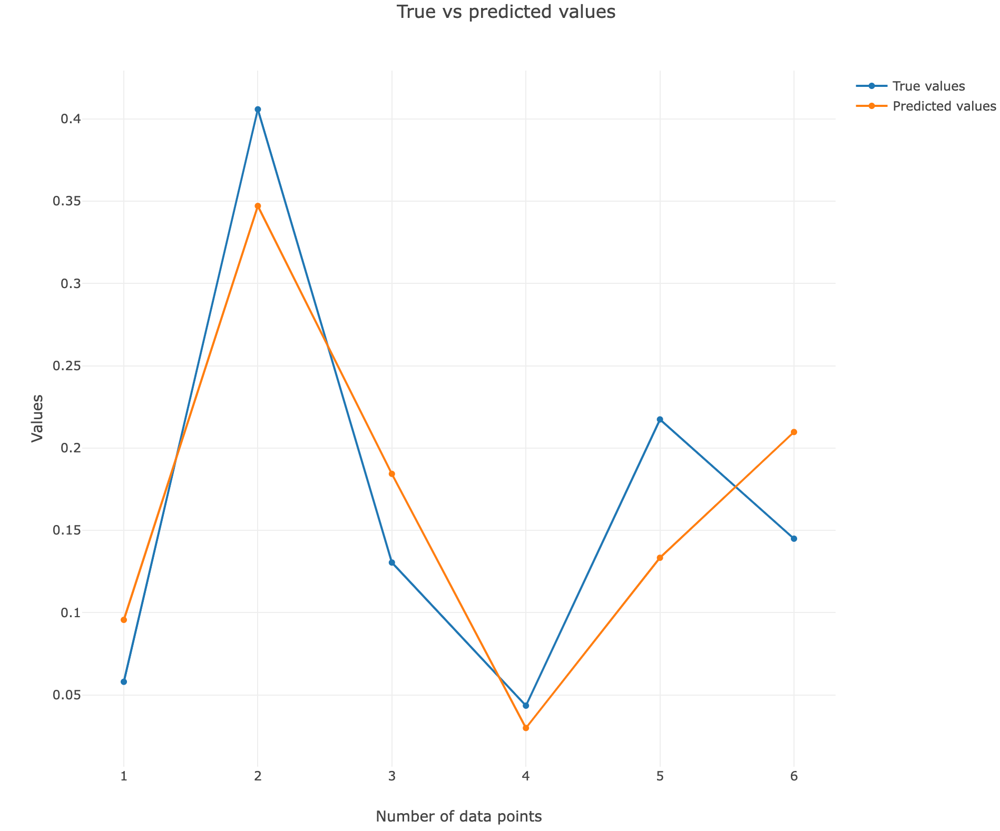
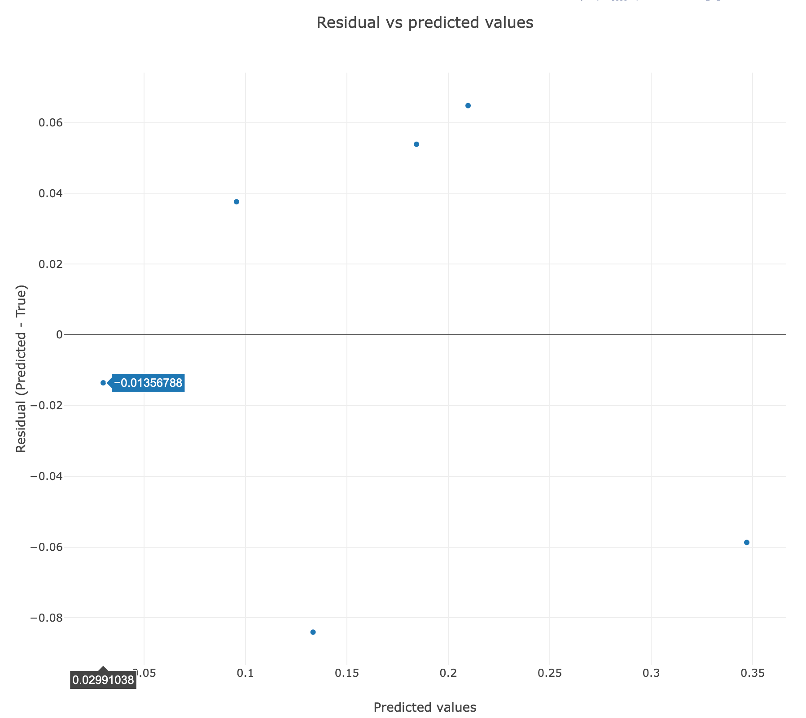
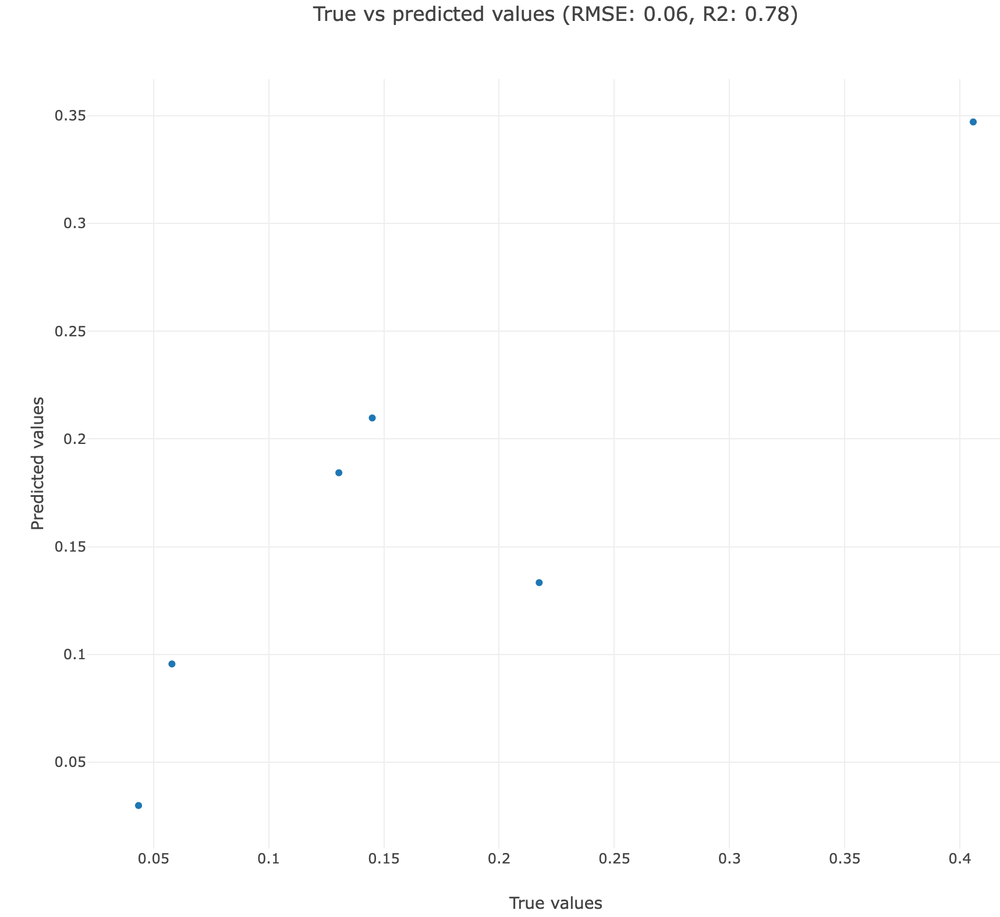
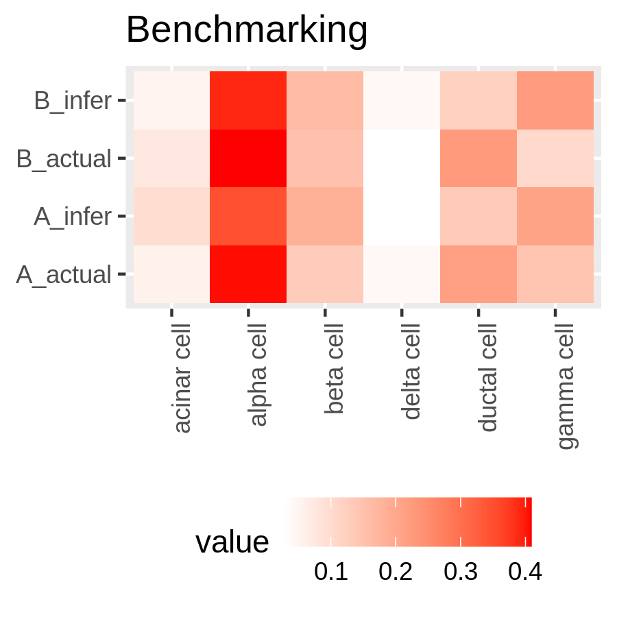
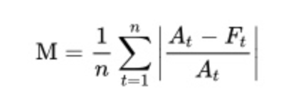
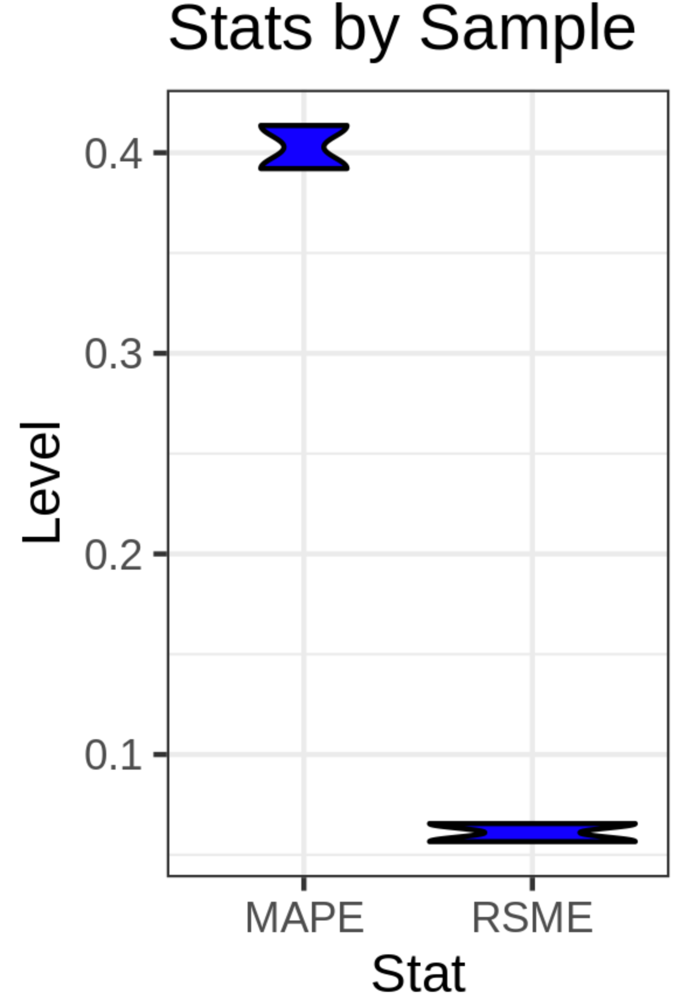

# Introduction

So you want to do some deconvolution, but how accurate is it likely to be? Is your reference good enough? Is the MuSiC () algorithm itself good enough? Well, we can't answer these questions specifically, but we can give you a good indication of how well the deconvolution is working in a given situation.

To do this, we will generate pseudobulk matrices from our single cell reference, wherein we sum all the transcripts in a random sample of genes to create a 'bulk' sample. This strategy, and some of our downstream statistics (specifically the use of RSME, the root square mean error), parallel current benchmarking strategies in deconvolution ().

 ")

> <comment-title></comment-title>
> - We will not be running tool by tool in this tutorial. The reason is, none of the tools are new for this tutorial, and mostly involve a lot of data manipulation (you can do a [tutorial on data manipulation]() if you like!)
> - Therefore, instead, we've gone through the hard work of generating reusable workflows that you can simply run. We'll focus on data inputs, outputs, and interpretation, rather than running tool by tool.
{: .comment}

> <agenda-title></agenda-title>
>
> In this tutorial, we will cover:
>
> 1. TOC
> {:toc}
>
{: .agenda}

# Data

We previously retrieved a pancreas single cell dataset () from the [single cell expression atlas](https://www.ebi.ac.uk/gxa/sc/experiments) and manipulated it into an Expression Set object. As a reminder, these cells come from 6 healthy individuals and 4 individuals with Type II diabetes, and we combined all 10 samples into a single Expression Set object. To do this, we made a metadata file with details about each cell (including cell type), and a cell x gene matrix with cells as rows and genes as columns. We'll need all these files to generate our pseudobulks and test them against their reference.

# Generating pseudobulks

Our first goal is to make pseudobulk matrices, with a list of gene expressions for a single 'pseudobulk' sample that we generate from the expression of known single cells. We also need to generate a list of those known single cells, which we'll use later to see how good our deconvolution was. To do this, we need two files:

 - Metadata file (which label each cell barcode with an author-declared cell type)
 - Matrix file (which has cells as rows and genes as columns)

## Get data

> <comment-title></comment-title>
> - You can either import files using Zenodo (see below) or you can import the [**Input History**](https://usegalaxy.eu/u/wendi.bacon.training/h/deconvolution-benchmarking--1---scrna-matrix-to-pseudobulk-input)
> - Rename the datasets according to the samples
{: .comment}

> <hands-on-title>Data upload</hands-on-title>
>
> 1. Create a new history for this tutorial *"Deconvolution: Benchmarking Part 1"*
> 2. Import the files from [Zenodo]({{ page.zenodo_link }})
>
>      ```
>    {{ page.zenodo_link }}/files/sc_metadata.tabular
>    {{ page.zenodo_link }}/files/sc_matrix.tabular
>      ```
>
>    
>
> 3. Rename the datasets
>
>    
>
{: .hands_on}

Let's look at the datasets.

> <hands-on-title>Inspect metadata</hands-on-title>
> Inspect  the `Metadata` file in your Galaxy history.
>
{: .hands_on}

> <question-title></question-title>
>
> 1. How many cells are in your sample?
>
> > <div id="solution-1" class="box-title"><button type="button" aria-controls="solution-1-contents" aria-expanded="true" aria-label="Toggle solution box: "><i class="far fa-eye" aria-hidden="true"></i><span class="visually-hidden"></span> Solution<span role="button" class="fold-unfold fa fa-minus-square"></span></button></div>
> >
> > 1. If you look at the dataset in the Galaxy window, you'll find that it has 2915 lines. One of those is a header, so you have 2914 cells. Each row has a cell barcode identifying it as a cell.
> >
> {: .solution}
{: .question}

> <hands-on-title>Inspect matrix</hands-on-title>
> Now check the `Matrix` file in your Galaxy history - do not inspect  it as it is a massive file!
>
{: .hands_on}

> <question-title></question-title>
>
> 1. How are the genes labelled in your matrix, by gene symbol or Ensembl ID?
>
> > <div id="solution-1" class="box-title"><button type="button" aria-controls="solution-1-contents" aria-expanded="true" aria-label="Toggle solution box: "><i class="far fa-eye" aria-hidden="true"></i><span class="visually-hidden"></span> Solution<span role="button" class="fold-unfold fa fa-minus-square"></span></button></div>
> >
> > 1. If you look at the dataset in the Galaxy window, you'll find that the rows correspond to the metadata file as cell barcodes, while the columns contain long ENSG##### names. These are Ensembl IDs and will have to be changed in the workflow to gene symbols.
> >
> {: .solution}
{: .question}

Ultimately, we'll use both these files to generate our pseudbulks.


## Get the workflow & run it

> <hands-on-title>Generate pseudobulk populations using workflow</hands-on-title>
>
> 1. Import this [workflow](https://usegalaxy.eu/u/wendi.bacon.training/w/deconvolution-benchmarking--1---scrna-matrix-to-pseudobulks).
>
>    
>
> 2. Run the workflow on your sample with the following parameters:
>    - *"Formatted metadata"*:  `sc_metadata`
>    - *"Formatted metadata"*:  `sc_matrix`
>    - *"Cell Sample Expr"*: `table.sample(100)` (This makes pseudobulks of 100 cells, although you could change this to suit your needs)
>    - *"Label the second sample"*: `BEGIN { print "column\tB_infer" { print $0 }` (This labels the second sample B}
>    - *"Organism"*: `Hs` (This stipulates your organism for the Ensembl ID collapsing.)
>    - *"Label the first sample"*: `BEGIN { print "column\tA_infer" { print $0 }` (This labels the first sample A}
>
>    
>
{: .hands_on}

Now go stare at something other than a screen while this runs...

## Inspect outputs

> <warning-title>Danger: Your samples will look different!</warning-title>
> Because you're randomly generating pseudobulk samples, your data will look different from what is in this tutorial. We'll catch this up in the next section by giving you our inputs, but you're also welcome to have a go with your own datasets with slightly altered numbers.
{: .warning}

Now we've largely tried to hide the datasets created at each step within the code to make histories not too painful. The important outputs to inspect  from this workflow are:
 - `A_actual` - which contains two columns, one of each cell type and the second the proportion of those cells used in the `A` pseudobulk
 - `B_actual` - which is identical but for the second sample
 - `A_pseudobulk matrix` - which contains two columns, one of for each gene and another for the gene counts in that pseudbulk
 - `B_pseudobulk matrix` - which is identical but for the second sample

 > <comment-title>Answer Key</comment-title>
 > You can see our example [Answer Key for this matrix and cell proportion generation](https://usegalaxy.eu/u/wendi.bacon.training/h/deconvolution-benchmarking--1---scrna-matrix-to-pseudobulk-answer-key)
 {: .comment}

Now, onto the next part!

# Inferring cellular proportions

Now that we have our two 'pseudobulk' samples, we will combine them into a single matrix and apply deconvolution using the single cell reference to infer pseudobulk cell proportions. Deconvolution will **not work** if you do not have at least two samples in the matrix.

## Get data

You can either start with the outputs from the first part - and just import the ESet single cell reference you created in the previous tutorial - or you can import our inputs and even set up a new history. Your choice!

> <comment-title></comment-title>
> - You can either import files using Zenodo (see below) or you can import the [**Input History**](https://usegalaxy.eu/u/wendi.bacon.training/h/deconvolution-benchmarking--2---pseudobulk-to-inferrence---input)
> - Rename the datasets according to the samples
{: .comment}

> <hands-on-title>Data upload</hands-on-title>
>
> 1. (Optional) Create a new history for this tutorial *"Deconvolution: Benchmarking Part 2"*
> 2. Import the files from [Zenodo]({{ page.zenodo_link }})
>
>    * Actual tables and pseudobulk proportions
>      ```
>    {{ page.zenodo_link }}/files/A_actual.tabular
>    {{ page.zenodo_link }}/files/B_actual.tabular
>    {{ page.zenodo_link }}/files/A_pseudobulk_matrix.tabular
>    {{ page.zenodo_link }}/files/B_pseudobulk_matrix.tabular
>      ```
>    * Single cell reference Expression Object.rdata
>      ```
>    {{ page.zenodo_link }}/files/ESet_sc_combined.rdata
>      ```
>
>    
>
> 3. Rename the datasets
>
{: .hands_on}

## Get the workflow & run it

> <hands-on-title>Infer cell proportions using workflow</hands-on-title>
>
> 1. Import this [workflow](https://usegalaxy.eu/u/wendi.bacon.training/w/imported-deconvolution-benchmarking--2---pseudobulks-to-inferred-tables).
>
> 2. Run the workflow on your sample with the following parameters:
>    - *"Subsample_B - matrix"*:  `B_pseudobulk_matrix`
>    - *"Subsample_A - matrix"*:  `A_pseudobulk_matrix`
>    - *"ESet Reference scRNA-seq"*:  `ESet_sc_combined`
>    - *"B_actuals"*:  `B_actual`
>    - *"A_actuals"*:  `A_actual`
>
{: .hands_on}

Now go have a snack while this runs...

## Inspect outputs

You have two important outputs here - the `A_proportions_actual-infer` and the `B_proportions_actual-infer`.

> <hands-on-title>Inspect cell proportion tables</hands-on-title>
> Inspect  both outputs.
>
{: .hands_on}

You'll find `Actual` proportions in a column alongside the `Infer` proportions. Do they look pretty close? Or are they wildly off? In the next section, you'll get to assess this in a variety of ways. Bring on the statistics!

> <comment-title>Answer Key</comment-title>
> You can see our example [Answer Key for part 2](https://usegalaxy.eu/u/wendi.bacon.training/h/deconvolution-benchmarking--2---pseudobulk-to-inferrence---answer-key)
{: .comment}

# Statistical analysis

Now here's the fun bit! You have your tables, so you can already kind of assess how good the deconvolution was. In our hands, for pseudobulk A, we found:

| |A_actual |	A_infer |
|acinar cell |	0.058	| 0.096|
|alpha cell	| 0.406	| 0.347|
|beta cell	| 0.130	| 0.184|
|delta cell	| 0.043	| 0.030|
|ductal cell	| 0.217	| 0.133|
|gamma cell	| 0.145 |	0.210|

> <question-title></question-title>
>
> How good was the deconvolution for pseudobulk A?
>
> > <div id="solution-1" class="box-title"><button type="button" aria-controls="solution-1-contents" aria-expanded="true" aria-label="Toggle solution box: "><i class="far fa-eye" aria-hidden="true"></i><span class="visually-hidden"></span> Solution<span role="button" class="fold-unfold fa fa-minus-square"></span></button></div>
> >
> > Just visually inspecting this shows that it's pretty accurate for the rarer cell types (acinar cells & delta cells). Moving on up, alpha cells are also pretty darn close, and they were the most common cell type. The cell types in the middle - beta cells, ductal cells, and gamma cells - are a little more off.
> >
> {: .solution}
{: .question}


## Get data

> <comment-title></comment-title>
> - You can either import files using Zenodo (see below) or you can import the [**Input History**](https://usegalaxy.eu/u/wendi.bacon.training/h/deconvolution-benchmarking--3---statistics---input)
> - Rename the datasets according to the samples
{: .comment}

> <hands-on-title>Data upload</hands-on-title>
>
> 1. (Optional) Create a new history for this tutorial *"Deconvolution: Benchmarking Part 2"*
> 2. Import the files from [Zenodo]({{ page.zenodo_link }})
>
>    * Actual tables and pseudobulk proportions
>      ```
>    {{ page.zenodo_link }}/files/A_proportions_actual-infer.tabular
>    {{ page.zenodo_link }}/files/B_proportions_actual-infer.tabular
>      ```
>
>    
>
> 3. Rename the datasets
>
{: .hands_on}

## Get the workflow & run it

> <hands-on-title>Evaluate deconvolution accuracy</hands-on-title>
>
> 1. Import this [workflow](https://usegalaxy.eu/u/wendi.bacon.training/w/deconvolution-benchmarking--3---statistics).
>
> 2. Run the workflow on your sample with the following parameters:
>    - *"Cell proportions B"*:  `B_proportions_actual-infer`
>    - *"Cell proportions A"*:  `A_proportions_actual-infer`
>
{: .hands_on}

Now go have a snack while this runs...

## Inspect outputs

You have two sets of data for this - individual data that visualises each pseudobulk independently, and then statistical outputs that analyse the deconvolution by combining the pseudobulks. Let's start with the individual outputs.

### Individual evaluation

We'll again evaluate pseudobulk A, but this time with some visualisation tools.

> <hands-on-title>Inspect actual v predicted curves</hands-on-title>
> Inspect  the  **Actual vs predicted curves** for `#A`.
>
{: .hands_on}



Plotting the values actually looks pretty good with the exception of datapoints 5 and 6, which are the ductal and gamma cells. Even if the other points don't overlap fully, they do show the same trends (i.e. higher / lower) than the other cell types.

> <hands-on-title>Inspect residual plots</hands-on-title>
> Inspect  the  **Residual plot** for `#A`.
>
{: .hands_on}



This is a way of visualising the residuals - the closer to the middle `0` line, the better, as this means the difference between the predicted and actual values are close to 0.

> <hands-on-title>Inspect scatter plot</hands-on-title>
> Finally, inspect  the  **Scatter plot of actual and predicted values** for `#A`.
>
{: .hands_on}



In this final plot, we can see a calculated sample RMSE value of 0.06 (the smaller this particular value is, the better - more on that later!) and the R-squared value of 0.78. The closer to 1 the R-squared value is, the better the correlation.

> <question-title></question-title>
>
> Which deconvolution was better, A or B?
>
> > <div id="solution-1" class="box-title"><button type="button" aria-controls="solution-1-contents" aria-expanded="true" aria-label="Toggle solution box: "><i class="far fa-eye" aria-hidden="true"></i><span class="visually-hidden"></span> Solution<span role="button" class="fold-unfold fa fa-minus-square"></span></button></div>
> >
> > By looking at the **Scatter plot of actual and predicted values** alone, both numerically the R-squared value is closer to 1 for the A sample, and also visually the trend of actual vs predicted is stronger in the A sample.
> >
> > 
> {: .solution}
{: .question}

### Combined evaluation

Finally, there are three different evaluations of the combined deconvolution, looking more generally at the deconvolution success.

Let's first examine the visualisation.

> <hands-on-title>Inspect heatmap</hands-on-title>
> Inspect  the  **Heatmap** plot.
>
{: .hands_on}



The heatmap looks pretty good - largely the same trends in both deconvolution, with issues in the ductal and gamma cells. This is important, as you might consider that any new trends identified that involve ductal and gamma cells may not be correct.

Can we quantify how well the deconvolution is working in general? Let's start with the RSME value (**Root-mean squared error). In general, low RSME values are good, as they indicate little difference between actual and inferred value.

> <details-title>More details on the RSME</details-title>
>
> The RSME value is calculated by first squaring the difference between the predicted and actual cell proportions in each sample. This is then averaged across the cell types.
>
>
{: .details}

Another statistical value is the MAPE (**Mean Absolute Percentage Error**), where again, low numbers are best.

> <details-title>More details on the MAPE</details-title>
>
> The MAPE value is calculated by dividing the difference between the predicted and actual cell proportions by their actual cell proportions. The average is then taken across the cell types.
>
>
{: .details}

Let's examine the MAPE and RSME across the samples.

> <hands-on-title>Inspect Violin</hands-on-title>
> Inspect  the  **Violin plot with ggplot2** plot.
>
{: .hands_on}



Here you can find a very low RSME - which is great! - but a reasonably high MAPE - which is a bit bigger. However, RSME is the standard often used in the field (), and the fact that it is so low is particularly good.

> <comment-title>Answer Key</comment-title>
> You can see our example [Answer Key for this statistical workflow](https://usegalaxy.eu/u/wendi.bacon.training/h/deconvolution-benchmarking--3---statistics---answer-key)
{: .comment}

So, this is great! How exciting!

But just for kicks, what if we wanted to do this a bit more at scale? Or even, what if we wanted to compare - statistically - the different reference datasets we examined in the [previous tutorial on comparing variables with deconvolution]() comparing healthy and T2D patients?

# Doing this... at scale!

FIXME

## Get data

## Get the workflow & run it

## Inspect outputs

> <comment-title>Answer Key</comment-title>
> You can see our example [Answer Key for this megaworkflow]()
{: .comment}

Can also do one where we share a history of running this using the 3 ESet objects and then compare them with the violin plots :)

# Conclusion

#FIXME

This tutorial is part of the [https://singlecell.usegalaxy.eu](https://singlecell.usegalaxy.eu) portal ().
