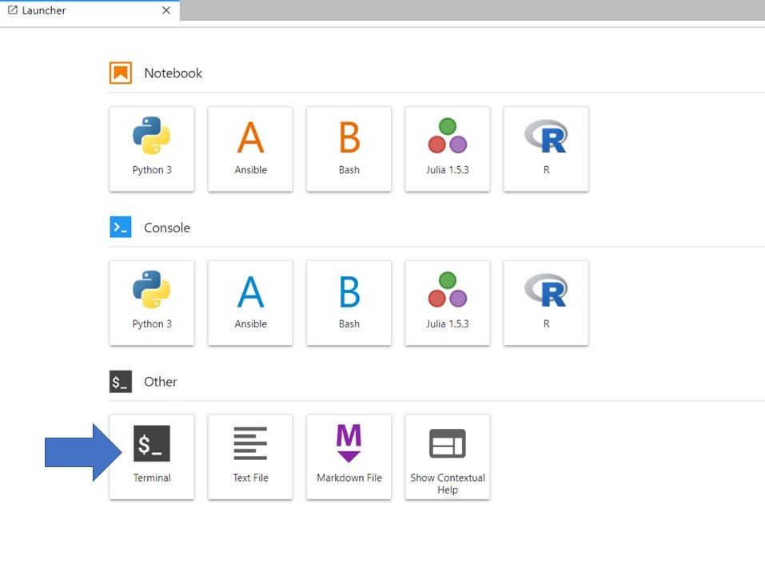

# Introduction

This tutorial is the next one in the [Single-cell RNA-seq: Case Study]() series. This tutorial also focuses on trajectory analysis using [monocle3](https://cole-trapnell-lab.github.io/monocle3/), similarly to the [previous one](), but instead using Galaxy buttons, we will have a look what’s happening behind, in the code – we will be using R programming language. Sometimes you might encounter some limitations when working with Galaxy tools or you might want to make a wee modification that has to be done manually – it is useful then to be able to switch between RStudio and Galaxy smoothly. If you are not feeling confident enough with using R, [this tutorial]() is a good place to start. However, our tutorial is quite straightforward to follow and at the end you will feel like a programmer! On the other hand, if you are not confident with the biological or statistical theory behind trajectory analysis, check out the [slide deck](). With those resources (including the previous case study tutorials) you are well-equipped to go through this tutorial with ease. Let’s get started! 

> <comment-title></comment-title>
> This tutorial is significantly based on the [Monocle3 documentation](https://cole-trapnell-lab.github.io/monocle3/docs/introduction/). 
{: .comment}

## Get data
In the [previous tutorial](), we showed that Monocle3 works great with annotated data, but what if your data is not annotated yet? Is it still possible to use Monocle? The answer is yes, Monocle also allows annotating cells according to their type and it will be shown in this tutorial. First, we need to get appropriate data to work with. We will continue to work on the case study data from a mouse model of fetal growth restriction  (see [the study in Single Cell Expression Atlas](https://www.ebi.ac.uk/gxa/sc/experiments/E-MTAB-6945/results/tsne) and [the project submission](https://www.ebi.ac.uk/arrayexpress/experiments/E-MTAB-6945/)). We will use the filtered AnnData object, before normalisation and annotation, generated in the [filtering tutorial](). You can simply go to the history of this tutorial, find step `20: Filtered Object` and download it. For ease of use, that was already done for you and you can import the file from Zenodo below. 

><hands-on-title>Data upload</hands-on-title>
>
> 1. Create a new history for this tutorial
> 2. Import the files from [Zenodo]({{ page.zenodo_link }}) or from
>    the shared data library (`GTN - Material` -> `{{ page.topic_name }}`
>     -> `{{ page.title }}`):
>
>    ```
>    {{ page.zenodo_link }}/files/AnnData_filtered.h5ad
>    ```
>
>    
>
> 3. Check that the datatype is `h5ad`
>
>    
>
{: .hands_on}


## Preparing the files
Monocle uses cell_data_set class to hold expression data; it requires three input files: `expression_matrix`, `cell_metadata` and `gene_metadata`. We will extract that information from our AnnData object. 

><hands-on-title>Extract and download the input files</hands-on-title>
>
> 1.  with the following parameters:
>    -  *"Annotated data matrix"*: `AnnData_filtered`
>    - *"What to inspect?"*: `Key-indexed observations annotation (obs)`
> 2. Rename  the observations annotation `Cell metadata (obs)`
>
> 3.  with the following parameters:
>    -  *"Annotated data matrix"*: `AnnData_filtered`
>    - *"What to inspect?"*: `Key-indexed annotation of variables/features (var)`
> 4. Rename  the annotation of variables `Gene metadata (var)`
>
> 5.  with the following parameters:
>    -  *"Annotated data matrix"*: `AnnData_filtered`
>    - *"What to inspect?"*: `The full data matrix`
> 6. Rename  the output `Expression matrix`
>
> 7. Download the generated files from your history. To do so, just click on the  save icon for `Cell metadata (obs)`, `Gene metadata (var)` and `Expression matrix`. We will need those later!
>
{: .hands_on}

There are several ways in which you can complete this tutorial – check the  Tip boxes below and choose your option!

 

 

We will now present the workflow following using JupyterLab, but there will be advice for those using RStudio as well. 
So let's get our JupyterLab instance up and running and crack on! 

## Installation

If you followed the  tip above, you should already have your JupyterLab instance open. Before we start working on the tutorial notebook, we need to install required packages. 

><hands-on-title>Installing the packages</hands-on-title>
>
> 1. Nawigate to JupyterLab window. You will see the Launcher tab. 
> 2. Find the `Terminal` and click on that.
> 
> 3. In the Terminal tab open, write the following, preferably one line at a time:
> ```
>conda install -c conda-forge -c bioconda r-monocle3
>conda install -c conda-forge r-viridislite
>conda install -c conda-forge bioconductor-biomart
>```
> 4. If you are asked at any point `Proceed ([y]/n)?`, type `y` - surely we want to proceed!
>
{: .hands_on}


Installation will take a while, so in the meantime, when it's running, you can upload the files you downloaded: the notebook and three data files - cell annotations, gene annotations and unprocessed expression matrix.

><tip-title>Installation for RStudio users</tip-title>
>
> Monocle 3 runs in the R statistical computing environment. You will need R version 4.1.0 or higher, Bioconductor version 3.14, and monocle3 1.2.7 or higher to have access to the latest features. Here is the original code that you should run to install BiocManager and monocle3. 
>```r
># Install Bioconductor and some of its dependencies
>if (!requireNamespace("BiocManager", quietly = TRUE))
>install.packages("BiocManager")
>BiocManager::install(version = "3.14")
>BiocManager::install(c('BiocGenerics', 'DelayedArray', 'DelayedMatrixStats',
                       'limma', 'lme4', 'S4Vectors', 'SingleCellExperiment',
                       'SummarizedExperiment', 'batchelor', 'HDF5Array',
                       'terra', 'ggrastr'))
>
># Install monocle3 through the cole-trapnell-lab GitHub:
>install.packages("devtools")
>devtools::install_github('cole-trapnell-lab/monocle3')
>library(monocle3)
>```
>
{: .tip}
